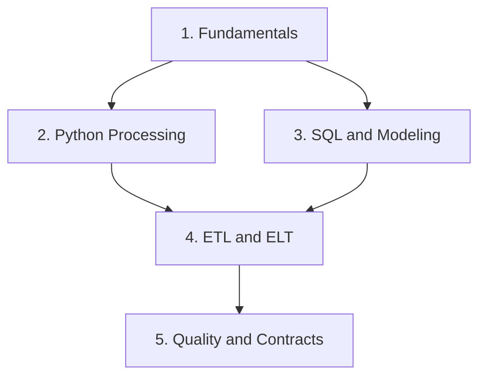

# 🧱 Phase 1: Data Engineering Foundations

**Build reliable data pipelines with Python, SQL, repeatable loads, and explicit data contracts**

*Fundamentals • Python Processing • SQL & Modeling • ETL & ELT • Data Quality*

*Part of the [ULTIMATE CYBERSECURITY MASTER GUIDE](../../README.md)*

**[Data Engineering Overview](../README.md) · [Start with Fundamentals](./data_engineering_fundamentals.md)**

---

_Index reviewed: 2026-09-11. Guide names and file links checked against the repository. Lab verification details belong to each guide's Verification Record; this index does not represent a new execution of those labs._

## 🎯 Purpose

Provide a practical starting point for learning how data moves from a source into a trustworthy, usable destination. Phase 1 establishes the vocabulary, programming patterns, database design, and validation practices needed before adding distributed platforms or orchestration tools.

## ⚙️ Function

Connect five foundation guides into a learning path: define the pipeline's requirements, process records with Python, model and query them with SQL, make repeated loads recoverable, and enforce the expectations shared by producers and consumers.

## 🏆 Goal

Help practitioners build pipelines whose results can be explained and checked: where records came from, how they changed, why some were rejected, what happens on a rerun, and whether the destination is complete.

## 📋 When to Use

- Beginning data engineering study from an IT, security, or analytics background.
- Converting manual file processing into a repeatable workflow.
- Designing a destination for inventory, application records, or operational telemetry.
- Troubleshooting duplicates, missing rows, malformed records, or stale results.
- Preparing for the applied [Secure Data Pipelines & Security Automation](../data_pipelines.md) guide.

---

## 📋 Table of Contents

- [Audience & Prerequisites](#prerequisites)
- [Published Guides](#guides)
- [Recommended Learning Path](#learning-path)
- [Lab Workflow](#lab-workflow)
- [Core Engineering Habits](#engineering-habits)
- [Completion Checklist](#completion-checklist)
- [Next Steps](#next-steps)
- [Contributing](#contributing)
- [Quick Links & Section Status](#quick-links)

---

## 🧰 Audience & Prerequisites

This section is for IT practitioners, security engineers, analysts, and developers who want to understand and build dependable data processing workflows.

| Requirement | What you need |
| --- | --- |
| **Terminal and editor** | Comfort navigating directories, editing text files, and running commands |
| **Python** | Python 3.10 or later; the Python guide recommends 3.11+ for the timestamp parsing behavior it discusses |
| **Programming basics** | Familiarity with functions, dictionaries, and basic control flow for the Python processing guide |
| **SQL basics** | Basic `SELECT` familiarity for the SQL guide |
| **SQLite** | SQLite 3.25 or later for the SQL guide's window functions; Python's `sqlite3` module is used throughout the labs |
| **Practice workspace** | A local directory for synthetic fixtures, scripts, databases, logs, and rejected records |

The core examples use the Python standard library and SQLite. No database server or cloud account is required. The Python guide also covers creating a local editable install of your own package; follow its environment and packaging instructions for that exercise.

> [!NOTE]
> These are Markdown guides with embedded examples and lab instructions. Create the files described inside each guide as you work through it; the subsection is not a preassembled application or a single installable lab bundle.

---

## 📚 Published Guides

| # | Guide | Main topics | Practical lab |
| --- | --- | --- | --- |
| **1** | 🧱 [Data Engineering Fundamentals](./data_engineering_fundamentals.md) | Data lifecycle, requirements, terminology, batch versus streaming, record identity, and source-to-destination design | CSV-to-SQLite loader with validation, quarantine, idempotent upserts, and run logging |
| **2** | 🐍 [Python for Data Processing](./python_data_processing.md) | Iterators, bounded-memory processing, encoding, CSV, JSON Lines, timestamps, logging, packaging, and tests | Build an `assetpipe` package with a console entry point and a `unittest` suite |
| **3** | 🗃️ [SQL & Data Modeling](./sql_data_modeling.md) | Keys, constraints, NULL handling, joins, aggregates, window functions, transactions, indexes, and dimensional modeling | Build inventory and telemetry tables, then a star schema with an enforced grain |
| **4** | 🔄 [ETL & ELT Pipeline Design](./etl_elt_pipeline_design.md) | Raw and staging layers, incremental extraction, watermarks, overlap windows, merge writes, checkpoints, backfills, and reconciliation | Run an incremental pipeline, repeat it without duplicates, repair a gap, and reconcile results |
| **5** | ✅ [Data Quality & Schema Contracts](./data_quality_schema_contracts.md) | Quality dimensions, field rules, batch expectations, nulls, duplicates, schema evolution, quarantine, and ownership | Build a contract-driven validator and a compatibility checker for breaking schema changes |

---

## 🧭 Recommended Learning Path

Start with Fundamentals, then complete Python and SQL in either order. Bring those skills together in ETL & ELT before working through Data Quality & Schema Contracts.

Already working on a specific problem? Use the matching guide as a reference and return to its prerequisites when needed.

| Your immediate question | Start here |
| --- | --- |
| What should this pipeline promise its consumers? | [Fundamentals](./data_engineering_fundamentals.md) |
| Why does this script fail on larger files or inconsistent timestamps? | [Python Processing](./python_data_processing.md) |
| How do I prevent duplicate rows or incorrect query results? | [SQL & Data Modeling](./sql_data_modeling.md) |
| How do I rerun, resume, or repair a load? | [ETL & ELT](./etl_elt_pipeline_design.md) |
| How do I define valid data and detect breaking changes? | [Quality & Contracts](./data_quality_schema_contracts.md) |

---

## 🧪 Lab Workflow

1. **Read the requirements.** Check the guide's prerequisites and Verification Record before starting.
2. **Create a separate working directory.** Keep each guide's fixtures and databases separate so repeated filenames do not collide.
3. **Build the documented example.** Follow the guide's file creation and execution steps using the supplied synthetic data.
4. **Inspect the results.** Compare destination rows, reject reasons, logs, and test output with the documented expectations.
5. **Exercise the failure cases.** Try the guide's malformed inputs, duplicates, reruns, or schema changes and observe the result.
6. **Record your evidence.** Save the command, environment version, result, and any differences before adapting the example.

> [!TIP]
> A successful process exit is only one check. Inspect the data itself: accepted and rejected records, duplicate keys, missing rows, and the destination state after a rerun.

---

## 🛠️ Core Engineering Habits

| Habit | What it means in practice |
| --- | --- |
| **Define identity** | Decide what one record represents and which fields uniquely identify it |
| **Preserve meaning** | Handle types, encodings, timestamps, missing fields, and null values explicitly |
| **Validate deliberately** | Separate field-level validity from expectations about an entire batch |
| **Keep rejected records explainable** | Quarantine invalid data with reasons so it can be inspected and corrected |
| **Make reruns predictable** | Use suitable keys, merge rules, and transactions to avoid duplicate or partial results |
| **Track progress durably** | Design checkpoints and watermarks around what has actually committed |
| **Prove completeness** | Reconcile source and destination records instead of assuming that no exception means no loss |
| **Manage schema changes** | Define compatibility expectations and coordinate changes with consumers |

These habits apply to security telemetry, asset inventories, application exports, and business datasets. The examples use small local systems so the behavior remains visible; adapting them to another database or larger workload requires checking that environment's semantics and limits.

---

## ✅ Completion Checklist

Use these as learning milestones, supported by your own lab results:

- [ ] Describe a pipeline's source, destination, record identity, expected freshness, and failure behavior.
- [ ] Process CSV or JSON Lines with explicit encoding and timestamp handling.
- [ ] Explain which processing operations retain state and can grow in memory.
- [ ] Package a small Python processor and run its fixture-based tests.
- [ ] Use SQL constraints to enforce identity and relationships.
- [ ] Explain how joins, NULL values, and aggregation affect query results.
- [ ] Compare ETL and ELT for a specific workload.
- [ ] Demonstrate a rerun that does not duplicate destination records.
- [ ] Explain checkpoint behavior and demonstrate a backfill with reconciliation.
- [ ] Distinguish record validation from batch-level quality checks.
- [ ] Quarantine invalid records with actionable reasons.
- [ ] Identify a breaking contract change and explain its consumer impact.

---

## 🚀 Next Steps

Apply the foundations to [Secure Data Pipelines & Security Automation](../data_pipelines.md), which connects security telemetry processing with TLS, SSH, Git, caching, Kafka, and Ansible.

For the broader learning roadmap, return to the [Data Engineering overview](../README.md). That index distinguishes published material from proposed future documents. Phase 2 and Phase 3 are identified there as proposed; they are not prerequisites for completing this section.

---

## 🤝 Contributing

Useful contributions include clearer explanations, corrected examples, reproducible failure cases, and documented portability differences.

- Identify the affected guide and section.
- Include a small synthetic example that reproduces the issue.
- State the Python or database version and the command used.
- Separate expected behavior from the observed result.
- Update verification details when changing runnable examples.
- Keep customer data, credentials, and private telemetry out of examples and reports.

---

## 🔗 Quick Links & Section Status

| Resource | Purpose |
| --- | --- |
| [Data Engineering Overview](../README.md) | Parent section, published resources, and future roadmap |
| [Data Engineering Fundamentals](./data_engineering_fundamentals.md) | First guide in the learning path |
| [Secure Data Pipelines & Security Automation](../data_pipelines.md) | Applied security pipeline project |
| [ULTIMATE CYBERSECURITY MASTER GUIDE](../../README.md) | Repository home |

| Detail | Status |
| --- | --- |
| **Phase** | 1 — Foundations |
| **Published guides** | Five |
| **Primary lab technologies** | Python standard library and SQLite |
| **Example data** | Synthetic fixtures |
| **Lab verification** | See each guide's Verification Record for executed checks and limitations |
| **Index review date** | 2026-09-11 |

---

**[⬆ Back to Contents](#contents) · [← Data Engineering Overview](../README.md)**
