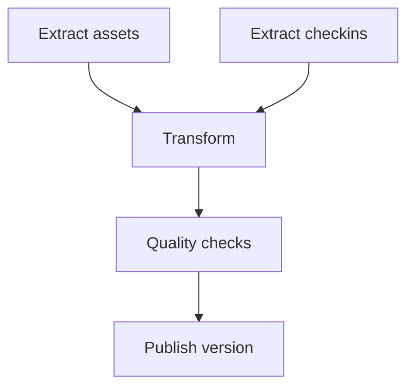

# ⚙️ Workflow Orchestration

<div align="center">

**Run the right work for the right interval with explicit dependencies and controlled recovery**

*Schedules • Dependencies • Retries • Concurrency • Parameters • Backfills*

*Part of the [ULTIMATE CYBERSECURITY MASTER GUIDE](../../README.md)*


**[Phase 2 Index](README.md) · [Data Engineering Overview](../README.md)**

</div>

---

_Reviewed: 2026-09-11. The local lab was executed with Python 3.12.14 and SQLite 3.53.1. External systems and optional integrations were not exercised; see the Verification Record._


---

<a id="purpose"></a>

## 🎯 Purpose, Function & Goal

**Purpose:** Explain how schedules and dependencies turn processing code into a repeatable operational workflow.

**Function:** Separate scheduling from transformation logic, define logical intervals and task state, bound retries and concurrency, parameterize runs, and plan backfills. Demonstrate these concepts with a small local dependency runner.

**Goal:** Be able to answer which interval a job processed, what it depended on, which attempts ran, why publication was allowed or blocked, and how to retry safely.

**When to use:** Replacing ad hoc scripts, coordinating multiple source extracts, preventing overlapping runs, or rebuilding historical data.

**Prerequisites:** [ETL & ELT](../Phase1/etl_elt_pipeline_design.md), [Quality & Contracts](../Phase1/data_quality_schema_contracts.md), and [API & File Ingestion](./api_file_ingestion.md).

---

<a id="contents"></a>

## 📋 Table of Contents

- [🧩 1. Orchestration Is Separate from Processing](#separation)
- [🕐 2. Schedules, Timezones & Logical Intervals](#schedules)
- [🔗 3. Dependencies & Publication Gates](#dependencies)
- [🔁 4. Retries, Timeouts & Side Effects](#retry)
- [🚦 5. Concurrency & Ownership](#concurrency)
- [♻️ 6. Parameters, Backfills & Reproducibility](#backfills)
- [🧪 7. Lab: Dependency Runner with Failure Gates](#lab)
- [📊 8. Operate the Workflow](#operations)
- [✅ Verification Record](#verification)
- [Contributing & Related Guides](#related)

---

<a id="separation"></a>

## 🧩 1. Orchestration Is Separate from Processing

Processing decides how records become results. Orchestration decides when that processing may run, with which inputs, under which resource budget, and what happens after failure.

| Processing owns | Orchestration owns |
| --- | --- |
| Parse, normalize, validate, join, aggregate | Schedule and logical interval |
| Record identity and write semantics | Dependencies and readiness |
| Schema and output contract | Attempt tracking and retry policy |
| Data-level reconciliation | Concurrency, execution timeout, alert routing |

Keep the transformation callable with explicit inputs outside the scheduler. A developer should be able to reproduce a failed interval from its parameters without starting the production control plane.

Avoid passing entire datasets through scheduler metadata. Pass an immutable input location, batch ID, checksum, schema version, and output reference. Keep bulk data in the storage layer.

An illustrative job contract might contain `job`, `interval_start`, `interval_end`, `source_snapshot`, `code_version`, `schema_version`, and `output_version`. Record the actual resolved values, not only the configuration template.

---

<a id="schedules"></a>

## 🕐 2. Schedules, Timezones & Logical Intervals

The execution time is when a worker ran. The logical interval is which data the work covers. A job launched Friday may process Wednesday's missing data.

Use half-open intervals such as `[2026-09-09T00:00:00Z, 2026-09-10T00:00:00Z)`. A boundary record belongs to exactly one adjacent interval. For business-local days, derive timezone-aware boundaries; daylight-saving transitions can make a local day shorter or longer than 24 hours.

| Trigger | Suitable for | Design responsibility |
| --- | --- | --- |
| Fixed interval | Predictable polling cadence | Handle overlap and delayed runs |
| Calendar schedule | Daily or business-calendar reporting | Specify timezone and daylight-saving behavior |
| Data arrival | Work that requires a completed upstream export | Deduplicate notifications and verify completion |
| Manual parameterized run | Recovery or a selected backfill | Validate parameters and preserve normal controls |

Airflow models scheduled work with data intervals and distinguishes the logical date from actual execution time. Its manual-trigger interval behavior depends on the timetable and trigger path; check the version's documented semantics rather than assuming a manually supplied date automatically defines the desired data window. [Airflow Dag Runs](https://airflow.apache.org/docs/apache-airflow/stable/core-concepts/dag-run.html)

Do not calculate the target day from `now()` inside every task. Resolve the interval once, record it, and pass it to all tasks. Decide explicitly whether missed intervals should be caught up, skipped, or queued for review.

---

<a id="dependencies"></a>

## 🔗 3. Dependencies & Publication Gates

A dependency graph is useful when independent extracts can run together but later tasks need both results.



Dependency success should mean a validated output is available, not merely that a process exited. Downstream tasks must reference the exact upstream version for their own logical interval.

| Task state | Meaning |
| --- | --- |
| Pending | Waiting for readiness or a worker |
| Running | A specific attempt owns execution |
| Retry waiting | A retryable failure occurred; delay and budget remain |
| Success | Required output and postconditions passed |
| Failed | No permitted attempt can currently complete |
| Blocked | A required dependency did not succeed |

Define trigger rules intentionally. A final cleanup task may run after failure, but its success must not make a failed data publication look successful. Keep cleanup and business-success reporting separate.

The local lab waits for each ready wave before scheduling the next. It demonstrates dependencies clearly but is not an efficient general-purpose scheduler for large graphs.

---

<a id="retry"></a>

## 🔁 4. Retries, Timeouts & Side Effects

Retry a temporary source outage; do not repeatedly retry an invalid schema as if time would fix it. Establish attempt count, delay, total elapsed budget, and escalation policy.

The hardest case is an unknown outcome: a write succeeded, but the worker died before reporting success. Recovery must check a durable output identity or safely repeat the write. A task-state database alone cannot guarantee that an external email, payment, or append happened only once.

Use deterministic output identities, idempotent upserts, or destination-supported idempotency keys. For cross-system notifications, consider a durable outbox and idempotent delivery. A request to rerun the data job must not blindly repeat unrelated external side effects.

Set both task-level and operation-level deadlines. A future timeout does not necessarily stop the underlying task, and cancelling a running thread is not a reliable way to terminate blocked code. The Python futures API provides execution and cancellation primitives, not a durable scheduler or universal process-kill mechanism. [Python concurrent futures](https://docs.python.org/3/library/concurrent.futures.html)

Choose worker isolation and termination behavior appropriate to the platform. When a task can outlive its lease, use ownership checks or fencing at the destination so an old attempt cannot overwrite a newer result.

---

<a id="concurrency"></a>

## 🚦 5. Concurrency & Ownership

Concurrency is a budget, not just a performance setting.

| Scope | Control to define |
| --- | --- |
| Entire workflow | Maximum active logical runs |
| Source API | Shared rate limit and request concurrency |
| Destination | Writer count, transaction pressure, competing partitions |
| Task type | CPU, memory, connection, or license pool |
| Logical output | One authorized publisher or conflict detection |

Two workers processing different days may still contend for the same current-state table. A partitioned output layout reduces some conflicts but does not automatically solve them.

For production multi-host work, use the scheduler's durable coordination mechanism or a suitable lease service. A lease needs owner identity, expiry, renewal, recovery behavior, and protection against stale writers. Do not simply delete an apparently old lock while the original worker may still be alive.

The lab uses exclusive local file creation to reject an already-claimed interval and caps its thread pool at two workers. A process crash can leave its lock behind; operator recovery is required. It provides no distributed lock, lease renewal, task heartbeat, fencing, or automatic restart recovery.

---

<a id="backfills"></a>

## ♻️ 6. Parameters, Backfills & Reproducibility

Parameterize the logical interval and immutable source version. Include the code/schema version in output metadata so two transformations of the same day remain distinguishable.

For a backfill:

1. Identify the affected intervals and why they need rebuilding.
2. Confirm source history, schemas, and encryption keys are still available.
3. Freeze the transformation version and input selection.
4. Choose a separate output version or an explicit replacement procedure.
5. Bound concurrency so the backfill does not starve current ingestion.
6. Reconcile the rebuilt output before publishing.
7. Record which downstream results must be refreshed.

Do not use today's mutable source as though it were yesterday's snapshot. If the historical source is unavailable, label the result as a reconstruction with known limitations.

The lab's run identity combines day and code version, and its two backfill days run sequentially. Each task writes a deterministic fixture artifact. A production identity should also pin source/configuration versions and publication semantics. Repeating an interval can be safe without skipping it; skipping requires a trusted success record plus confirmation that its output still exists and is valid.

---

<a id="lab"></a>

## 🧪 7. Lab: Dependency Runner with Failure Gates

This local runner executes two independent extract tasks, retries one synthetic transient error, waits for dependencies, blocks publication on a quality failure, and refuses a preclaimed interval. Its tasks write metadata fixtures rather than processing real datasets.

**Requirements:** Python 3.10+ with `sqlite3` available for the database labs. Only Python 3.12.14 was executed for this revision. No credentials, server, network requests, or third-party packages are used.

Save the following as `orchestration_lab.py` in a practice directory. It creates a temporary workspace and removes that workspace on completion. Run without Python's `-O` flag so assertions remain enabled.

```python
"""Local dependency/retry demo, not a durable distributed scheduler."""
import json
import tempfile
import threading
from concurrent.futures import ThreadPoolExecutor
from pathlib import Path


class Retryable(Exception):
    pass


def run_interval(root, day, code_version='v1', fail_quality=False):
    # The caller supplies a logical day; tasks never infer it from wall-clock now.
    key = day + '-' + code_version
    folder = root / key
    folder.mkdir(exist_ok=True)
    lock = folder / 'run.lock'
    try:
        fd = lock.open('x')  # One host/filesystem only; not a distributed lease.
    except FileExistsError:
        raise RuntimeError('interval already claimed')
    fd.close()
    events, attempts = [], {}
    deps = {'assets': set(), 'checkins': set(),
            'transform': {'assets', 'checkins'},
            'quality': {'transform'}, 'publish': {'quality'}}
    states = {name: 'pending' for name in deps}
    guard = threading.Lock()
    active = 0
    peak = 0
    rendezvous = threading.Barrier(2)

    def task(name):
        nonlocal active, peak
        with guard:
            active += 1
            peak = max(peak, active)
            attempts[name] = attempts.get(name, 0) + 1
            attempt = attempts[name]
        try:
            if name in ('assets', 'checkins') and attempt == 1:
                rendezvous.wait(timeout=5)
            if name == 'assets' and attempt == 1:
                raise Retryable('temporary source error')
            if name == 'quality' and fail_quality:
                raise ValueError('quality threshold failed')
            result = {'task': name, 'logical_day': day, 'code_version': code_version}
            # These fixture outputs are deterministic replacements, not append side effects.
            target = folder / (name + '.json')
            temp = folder / (name + '.tmp')
            temp.write_text(json.dumps(result, sort_keys=True), encoding='utf-8')
            temp.replace(target)
        finally:
            with guard:
                active -= 1

    def execute(name):
        for attempt in range(2):
            try:
                task(name)
                return 'success'
            except Retryable:
                if attempt == 1:
                    return 'failed'
                # No delay in the fixture. Production adds a bounded retry delay.
            except ValueError:
                return 'failed'

    try:
        with ThreadPoolExecutor(max_workers=2) as pool:
            while any(s == 'pending' for s in states.values()):
                for name in deps:
                    if states[name] == 'pending' and any(
                        states[d] in ('failed', 'blocked') for d in deps[name]
                    ):
                        states[name] = 'blocked'
                ready = [n for n in deps if states[n] == 'pending' and
                         all(states[d] == 'success' for d in deps[n])]
                if not ready:
                    if any(s == 'pending' for s in states.values()):
                        raise RuntimeError('cycle or unsatisfied dependency')
                    break
                futures = {n: pool.submit(execute, n) for n in ready}
                for name, future in futures.items():
                    states[name] = future.result()
                    events.append({'task': name, 'state': states[name],
                                   'attempts': attempts[name]})
        (folder / 'run.json').write_text(json.dumps(events), encoding='utf-8')
        return states, attempts, peak
    finally:
        lock.unlink()


def run(root):
    for day in ('2026-09-09', '2026-09-10'):  # Two sequential backfill intervals.
        states, attempts, peak = run_interval(root, day)
        assert set(states.values()) == {'success'}
        assert attempts['assets'] == 2 and peak == 2
        original = (root / (day + '-v1') / 'publish.json').read_bytes()
        run_interval(root, day)
        assert (root / (day + '-v1') / 'publish.json').read_bytes() == original
    states, _, _ = run_interval(root, '2026-09-11', fail_quality=True)
    assert states['quality'] == 'failed' and states['publish'] == 'blocked'
    assert not (root / '2026-09-11-v1' / 'publish.json').exists()
    (root / '2026-09-12-v1').mkdir()
    (root / '2026-09-12-v1' / 'run.lock').write_text('other owner', encoding='utf-8')
    try:
        run_interval(root, '2026-09-12')
    except RuntimeError as exc:
        assert str(exc) == 'interval already claimed'
    else:
        raise AssertionError('overlap accepted')
    print('PASS: dependencies; retry=2 attempts; concurrency=2; 2 backfill days; repeatable outputs; quality blocks publish; overlap refused')


if __name__ == '__main__':
    with tempfile.TemporaryDirectory(prefix='phase2-orchestration-') as folder:
        run(Path(folder))
```

Run:

```bash
python3 orchestration_lab.py
```

On Windows, use `py -3 orchestration_lab.py` if that is how Python is installed. The Windows launcher was not tested here.

**Actual output from this revision:**

```text
PASS: dependencies; retry=2 attempts; concurrency=2; 2 backfill days; repeatable outputs; quality blocks publish; overlap refused
```

---

<a id="operations"></a>

## 📊 8. Operate the Workflow

Record run ID, logical interval, source/output versions, task state, attempt count, queue wait, execution time, row counts, quality results, and final publication identity. Route alerts by ownership and severity. A failed historical experiment should not page the same way as a production freshness breach.

| Symptom | Likely investigation |
| --- | --- |
| Schedule fires but data is stale | Task queue, source freshness, wrong interval, publish gate |
| Duplicate output after retry | Unknown write outcome and missing idempotency |
| Backfill harms current jobs | Shared source/destination budget exhausted |
| Cleanup says success after failure | Incorrect overall success rule |
| Lock survives a crash | Missing lease or operator recovery procedure |

Choose an orchestration system based on durable state, deployment model, dependency needs, operational ownership, and recovery requirements. A system timer may be sufficient for one idempotent job; a multi-source dependency graph needs more coordination. This guide does not prescribe a particular managed service or claim a tested Airflow deployment.

**Self-check:** Which date does a rerun use? What proves upstream completion? Does retry repeat an external side effect? What prevents overlapping publishers? Can a stale worker still write?

---

<a id="verification"></a>

## ✅ Verification Record

| Check | Result |
| --- | --- |
| Independent tasks precede dependent processing | Passed |
| Synthetic transient failure succeeds on second attempt | Passed |
| Peak active tasks is two | Passed; a barrier makes the overlap observable |
| Two historical intervals and repeated output equality | Passed |
| Quality failure blocks publication | Passed |
| Existing interval claim is refused | Passed |
| Durable distributed scheduling, heartbeat, lease recovery | Not implemented |
| Worker termination, restart recovery, real calendar schedule, Airflow deployment | Not executed |

The runner keeps task states in memory and records its final event list locally. It is an educational example, not a replacement for a production orchestrator. Its local lock is intentionally left for explicit recovery after a hard process crash.

---

<a id="related"></a>

## 🤝 Contributing & Related Guides

For a correction, include the section, a synthetic reproducer, your runtime versions, expected behavior, and observed output. Update the Verification Record only for checks you actually perform. Keep credentials and customer records out of examples.

- [🗄️ Data Storage & File Formats](./data_storage_file_formats.md)
- [📥 API & File Ingestion](./api_file_ingestion.md)
- [🌊 Streaming & Change Data Capture](./streaming_cdc.md)
- [Phase 2 Index](README.md)
- [Phase 1 Fundamentals](../Phase1/data_engineering_fundamentals.md)
- [Data Engineering Overview](../README.md)
- [Repository Home](../../README.md)

**[⬆ Back to Contents](#contents)**
