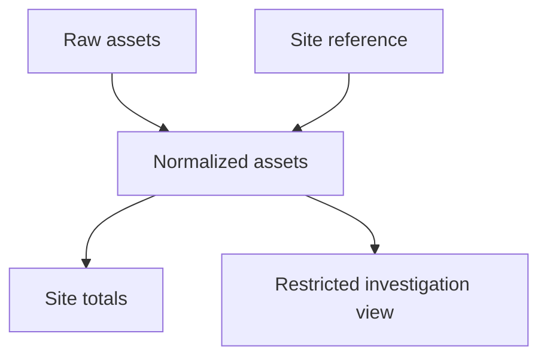

# 🔐 Data Governance, Lineage & Access

<div align="center">

**Make ownership, sensitive fields, lineage, access, retention, and audit decisions explicit**

*Part of the [ULTIMATE CYBERSECURITY MASTER GUIDE](../../README.md)*


**[Phase 3 Index](README.md) · [Data Engineering Overview](../README.md)**

</div>

_Last reviewed: 2026-09-11. Local lab executed on Python 3.12.14 and SQLite 3.53.1 where used. The
Verification Record limits the claim to the checks performed._

Terms are defined at first use; see also the repository [Glossary](../../GLOSSARY.md).


---

<a id="purpose"></a>

## 🎯 Purpose, Function & Goal

**Purpose:** Make responsibility and data-handling decisions visible throughout the pipeline lifecycle.

**Function:** Define ownership, classification, lineage, access boundaries, secret handling, retention,
deletion, and audit evidence. Model a catalog, field grants, lineage impact, retention candidates, and tamper
detection locally.

**Goal:** Be able to explain who owns a dataset, where it came from, who may use which fields, and how its
copies and lifecycle are controlled.

**When to use:** Onboarding a new dataset, sharing internal analytics, investigating a leaked field, planning
deletion, or reviewing a pipeline's privileges.

**Prerequisites:** [Quality & Contracts](../Phase1/data_quality_schema_contracts.md), [Storage & File
Formats](../Phase2/data_storage_file_formats.md), and [API & File Ingestion](../Phase2/api_file_ingestion.md).

---

<a id="contents"></a>

## 📋 Table of Contents

- [👥 1. Ownership & the Dataset Record](#ownership)
- [🏷️ 2. Sensitive Fields & Minimization](#classification)
- [🧭 3. Dataset, Run & Column Lineage](#lineage)
- [🔑 4. Access Boundaries & Enforcement](#access)
- [🗝️ 5. Secrets & Operational Identities](#secrets)
- [🗓️ 6. Retention & Deletion](#retention)
- [🧾 7. Audit Trails & Evidence Integrity](#audit)
- [🧪 8. Lab: Catalog, Grants, Lineage & Audit](#lab)
- [✅ Verification Record & Self-Check](#verification)
- [Contributing & Related Guides](#related)

---

<a id="ownership"></a>

## 👥 1. Ownership & the Dataset Record

A dataset needs an accountable owner, not just the name of the person who first wrote its loader.

| Responsibility | Decision it owns |
| --- | --- |
| Dataset owner | Purpose, permitted uses, quality expectations, lifecycle |
| Producer owner | Source contract and upstream changes |
| Pipeline operator | Execution, monitoring, incident response and recovery |
| Access administrator | Enforced grants, reviews and revocation |
| Consumer owner | Downstream interpretation and migration readiness |

Small teams may assign several responsibilities to one person, but the decisions still need names and backup coverage.

Record dataset identity, description, owner, source, grain, keys, schema version, sensitivity, approved uses,
freshness expectation, consumers, access groups, retention policy reference, and recovery requirements. Prefer
stable team ownership over a personal account that may disappear.

The catalog should distinguish a logical dataset from a particular version or run. A single table name does
not explain which input snapshot or transformation produced yesterday's report.

---

<a id="classification"></a>

## 🏷️ 2. Sensitive Fields & Minimization

Classify at the dataset and field levels. Raw logs, rejects, extracts, caches, and test artifacts can carry
the same sensitive values as a main table.

| Example field | Handling question |
| --- | --- |
| Email or user identifier | Does this consumer need the value or only a count? |
| IP address or device serial | Can it identify a person, customer, or internal asset? |
| Free-text error message | Could it contain credentials or customer input? |
| Token, key, or session secret | Why is it entering the dataset at all? |
| Location or detailed timestamp | Could a combination reveal sensitive activity? |

Collect only needed fields, define allowed uses, and minimize diagnostic copies. A hash of a predictable
identifier is not automatically anonymous; linkage and dictionary attacks can remain possible. Masking a
display does not remove access to its underlying source.

A derived aggregate may require fewer privileges than raw records, but aggregation alone does not establish
that it is safe to share. Check small groups, drill-down paths, joinability, and inference risk. The lab's
`summary` dataset is fictional internal data, not an anonymization demonstration.

Classification can change through joins. Preserve or reassess protection when combining datasets, rather than
labeling every derived output “internal” by default.

---

<a id="lineage"></a>

## 🧭 3. Dataset, Run & Column Lineage

Lineage is the record of how data was produced. It supports impact analysis, investigation, replay, and
lifecycle decisions.

| Level | Example |
| --- | --- |
| Dataset | Raw export feeds normalized assets, which feeds a dashboard |
| Run/version | Report version R used input snapshot S and code revision C |
| Column | `region` came from a site lookup joined on `site_id` |
| Row/event | A result traces to an event ID, input file position, or source key |

OpenLineage describes jobs, runs, and datasets, with extensible metadata attached to them. Those concepts are
useful when choosing an interoperable lineage representation. The lab is a small custom graph and does not
emit OpenLineage events. [OpenLineage object model](https://openlineage.io/docs/spec/object-model/)

Record transformation and reference-data versions, not only direct input paths. A lookup table or timezone
rule can change a result without changing its source row. Manual exports and spreadsheet edits also create
lineage and may otherwise become blind spots.



Before a source field change or deletion, find downstream datasets, materializations, exports, and consumers.
An automatically collected graph can be incomplete; label coverage and capture uninstrumented dependencies
explicitly.

For a production lineage graph, validate references, cycles, schema versions, and ownership. The lab only
validates owner presence and known parent references, then traverses a known acyclic fixture.

---

<a id="access"></a>

## 🔑 4. Access Boundaries & Enforcement

Access decisions belong at every path by which data can be reached: database, object storage, catalog, export,
dashboard, backup, and operator tooling.

| Boundary | Control to establish |
| --- | --- |
| Dataset | Grant only the required tables, objects, or views |
| Field | Restrict sensitive columns or serve a deliberately reduced representation |
| Row/tenant | Enforce the relevant scope where the system supports it |
| Environment | Separate production from development and test identities |
| Operation | Distinguish read, write, publish, administer, and delete |
| Time | Expiry and review for temporary or exceptional access |

Prefer explicit grants and default denial. Authenticate the actor before evaluating policy. A role string
supplied by a caller is not proof of identity. Keep permission changes reviewable and test revocation as well
as initial access.

A view that hides a column is not a boundary if its consumer can query the underlying table directly.
Likewise, a dashboard filter does not restrict a downloadable raw export. Test the actual identity against
every reachable path.

The lab's function checks a fictional role/dataset/field allowlist. It performs no authentication, database
grants, row-level security, or object-store policy changes. It demonstrates policy expectations that a real
system must enforce independently.

---

<a id="secrets"></a>

## 🗝️ 5. Secrets & Operational Identities

Keep secrets outside source code, fixtures, manifests, and ordinary logs. Separate service identities by
responsibility and environment so a compromised test runner does not inherit production access.

Use the deployment environment's secret facility, scoped credentials, and rotation process. Avoid copying a
developer's personal token into an unattended job. Document the identity owner, permissions, expiry, renewal,
revocation, and recovery path without recording the secret value.

Test a credential rotation before expiry becomes an incident. Check dependent workers, caches, and rollback
versions; an older deployment may still expect an obsolete secret. Restrict diagnostic endpoints and exception
output that could reveal headers or connection strings.

Exceptional access should have an owner, scope, expiry, and audit record. Recovery procedures may need
separate credentials and keys; store them so they remain available during the failure you are planning for,
while preserving access control.

---

<a id="retention"></a>

## 🗓️ 6. Retention & Deletion

Retention is a declared lifecycle decision. Its duration depends on business requirements and applicable
obligations; this guide does not prescribe a universal legal retention period.

Separate raw inputs, rejected records, normalized tables, derived outputs, exports, logs, and backups. Define
the retention clock: event time, ingest time, finalization, supersession, or another approved trigger. Record
holds and exceptions before running expiry logic.

| Deletion stage | Evidence to retain |
| --- | --- |
| Resolve scope | Which dataset, keys, versions and copies are affected? |
| Check authority and holds | Who authorized the action; what exceptions apply? |
| Find descendants | Which caches, extracts and reports require action? |
| Execute in supported systems | Operation ID, status, scope and failures |
| Verify | Queries or provider evidence showing the intended result |
| Prevent reintroduction | Replay and restore suppression or another defined control |

A deletion request is not complete merely because one table row disappeared. Backups may have a separate
expiry or restricted-restore policy. When a retained backup must be restored, reapply authorized deletion
state before releasing data to consumers.

Do not write sensitive payloads into the deletion audit. Preserve enough identifiers and evidence for
accountability under the audit policy. A retention report can list proposed candidates without deleting
anything; the lab does exactly that and excludes held or currently referenced objects.

Lifecycle controls should account for legal or operational holds, current references, and recovery horizons. A
hold is not the same as an unlimited permission to use the data for every purpose.

---

<a id="audit"></a>

## 🧾 7. Audit Trails & Evidence Integrity

A useful audit event identifies who acted, what operation was requested, which dataset/scope was affected,
when it occurred, the decision or result, the policy version, and a correlation ID. Keep business audit events
distinguishable from debug logs.

Protect audit storage from the identities performing ordinary data mutations. Define access, retention, time
synchronization, collection failure behavior, and export integrity. A missing audit collector should be
detectable.

The lab chains event hashes and verifies them against a separately retained expected head hash. It detects an
edited event and a truncated suffix. **A hash chain is not by itself an immutable or authenticated audit
system.** Someone who can rewrite the chain and its trusted head can construct a new valid chain. Production
evidence may need independently protected anchors, signatures, immutable retention, and separate
administrative control.

Decide which operations fail closed when audit recording fails. Reading a public dataset and deleting a
regulated production dataset may require different behavior. Make that distinction part of the system design
rather than an incidental exception handler.

---

<a id="lab"></a>

## 🧪 8. Lab: Catalog, Grants, Lineage & Audit

Model a three-dataset catalog, explicit field permissions, downstream impact, retention candidates, and an
audit hash chain. The fixture generates no real access changes and performs no deletion.

**Requirements:** Python 3.10+; the testing and recovery labs also use Python's `sqlite3` module. This
revision was executed on Python 3.12.14 and SQLite 3.53.1 only. All data is synthetic; no server, credentials,
network calls, or third-party dependencies are required.

Save as `governance_lab.py` and run without Python's `-O` flag, because the standalone drills use assertions.
File-based fixtures use temporary directories that are removed on completion.

```python
"""Policy/lineage model only: no real authorization or deletion is performed."""
import copy
import hashlib
import json


CATALOG = {
    'raw': {'owner': 'data-operations', 'parents': [],
            'fields': {'asset_id': 'internal', 'site': 'internal', 'email': 'sensitive'}},
    'summary': {'owner': 'reporting', 'parents': ['raw'],
                'fields': {'site': 'internal', 'count': 'internal'}},
    'dashboard': {'owner': 'reporting', 'parents': ['summary'],
                  'fields': {'site': 'internal', 'count': 'internal'}},
}
GRANTS = {'analyst': {'summary': {'site', 'count'}},
          'operator': {'raw': {'asset_id', 'site'}}}


def allowed(role, dataset, fields):
    if dataset not in CATALOG or not fields:
        return False
    requested = set(fields)
    return (requested <= set(CATALOG[dataset]['fields']) and
            requested <= GRANTS.get(role, {}).get(dataset, set()))


def descendants(dataset):
    found, todo = set(), [dataset]
    while todo:
        parent = todo.pop()
        for name, spec in CATALOG.items():
            if parent in spec['parents'] and name not in found:
                found.add(name)
                todo.append(name)
    return found


def retention_plan(objects, now_day):
    # Integer days and fictional policies: candidates only; never deletes.
    return [o['id'] for o in objects
            if now_day >= o['expires_day'] and not o['hold'] and not o['referenced']]


def encode(value):
    return json.dumps(value, sort_keys=True, separators=(',', ':')).encode()


def append_audit(log, event):
    previous = log[-1]['hash'] if log else '0' * 64
    entry = {'event': event, 'previous': previous}
    entry['hash'] = hashlib.sha256(encode(entry)).hexdigest()
    log.append(entry)


def verify(log, trusted_head):
    previous = '0' * 64
    for entry in log:
        body = {'event': entry['event'], 'previous': entry['previous']}
        if entry['previous'] != previous or hashlib.sha256(encode(body)).hexdigest() != entry['hash']:
            return False
        previous = entry['hash']
    return previous == trusted_head


def run():
    assert all(spec['owner'] for spec in CATALOG.values())
    assert all(p in CATALOG for spec in CATALOG.values() for p in spec['parents'])
    assert allowed('analyst', 'summary', ['site', 'count'])
    assert not allowed('analyst', 'raw', ['email'])
    assert not allowed('operator', 'raw', ['email'])
    assert not allowed('unknown', 'summary', ['site'])
    assert not allowed('analyst', 'summary', ['secret'])
    assert descendants('raw') == {'summary', 'dashboard'}
    objects = [
        {'id': 'expired', 'expires_day': 10, 'hold': False, 'referenced': False},
        {'id': 'held', 'expires_day': 10, 'hold': True, 'referenced': False},
        {'id': 'active', 'expires_day': 10, 'hold': False, 'referenced': True},
        {'id': 'young', 'expires_day': 20, 'hold': False, 'referenced': False},
    ]
    assert retention_plan(objects, 15) == ['expired']
    log = []
    append_audit(log, {'actor': 'analyst', 'dataset': 'summary', 'decision': 'allow'})
    append_audit(log, {'actor': 'analyst', 'dataset': 'raw', 'decision': 'deny'})
    trusted_head = log[-1]['hash']
    assert verify(log, trusted_head)
    tampered = copy.deepcopy(log)
    tampered[0]['event']['decision'] = 'deny'
    assert not verify(tampered, trusted_head)
    assert not verify(log[:-1], trusted_head)
    print('PASS: catalog ownership; explicit field grants; unknown denied; 2 descendants; retention excludes holds/references; edit/truncation detected')


if __name__ == '__main__':
    run()
```

```bash
python3 governance_lab.py
```

On Windows, `py -3 governance_lab.py` may be the appropriate launcher. Windows execution was not tested here.

**Actual summary output:**

```text
PASS: catalog ownership; explicit field grants; unknown denied; 2 descendants; retention excludes holds/references; edit/truncation detected
```

---

<a id="verification"></a>

## ✅ Verification Record & Self-Check

| Check | Result |
| --- | --- |
| Owners and known parent references | Passed for fixture catalog |
| Allowed fields accepted; unknown roles and fields denied | Passed |
| Raw source has two downstream descendants | Passed |
| Retention excludes held, referenced and unexpired objects | Passed |
| Audit event edit and suffix truncation | Detected against retained head |
| IAM, authentication, row/column enforcement, key rotation | Not implemented or tested |
| Real deletion, immutable audit storage, legal compliance | Not assessed or performed |

**Self-check:** Who approves a new consumer? Can a restricted field be reached through an export? What
metadata makes a run reproducible? Does restoring a backup reintroduce deleted records? Who can change the
audit evidence and its anchor?

---

<a id="related"></a>

## 🤝 Contributing & Related Guides

For corrections, provide a synthetic reproducer, runtime versions, expected behavior, and actual results.
Update verification claims only for checks performed. Keep secrets and customer records out of examples.

- [📊 Pipeline Observability & Reliability](./pipeline_observability.md)
- [🧪 Pipeline Testing & CI/CD](./pipeline_testing_cicd.md)
- [♻️ Backup, Replay & Disaster Recovery](./data_recovery_replay.md)
- [Phase 3 Index](README.md)
- [Phase 2 Storage & Integration](../Phase2/README.md)
- [Data Engineering Overview](../README.md)

---

[⬆ Back to Contents](#contents) | [⬅️ Master Index](../../README.md) | [🎯 Role
Navigation](../../START_HERE.md) | [Legal Notice](../../LEGAL.md)
