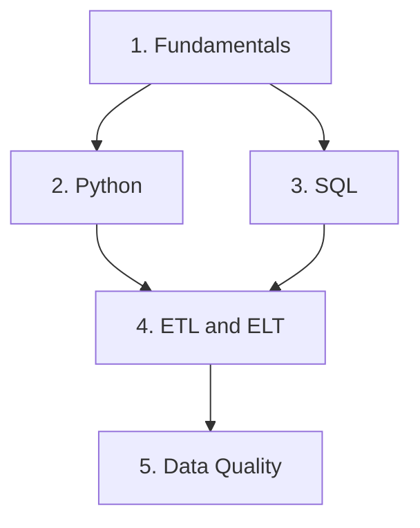

# 🗄️ Data Engineering & Pipeline Infrastructure

**Data ingestion, transformation, storage, streaming, quality, and repeatable infrastructure**

*General data engineering foundations with practical applications to cybersecurity and operational telemetry*

*Part of the [ULTIMATE CYBERSECURITY MASTER GUIDE](../README.md)*

---

_Index reviewed: 2026-09-11. The learning path contains 13 guides organized in `Phase1/`, `Phase2/`, and `Phase3/`.
Phase 2 and Phase 3 documentation has been prepared with local verification records. Add those phase packages alongside
this index; links to newly prepared documents become live when they are uploaded. This index does not assert a tested
production deployment or new execution of the existing Phase 1 labs._

## 🎯 Purpose

Provide a central learning and reference section for building systems that collect, move, transform, store, and deliver useful data. The scope includes application records, API responses, database extracts, operational metrics, and security logs.

## ⚙️ Function

Organize data engineering knowledge across the full data lifecycle, link to relevant guides already in the repository, and connect a three-phase learning path. Security telemetry provides the first practical pipeline example, while the broader learning path extends to databases, analytical storage, data quality, and workflow orchestration.

## 🏆 Goal

Help practitioners build understandable, reliable, secure, and maintainable data pipelines—and explain where data came from, how it changed, whether it is complete, and how to recover when processing fails.

## 📋 When to Use

- Learning data engineering fundamentals alongside cybersecurity and infrastructure work.
- Moving data from files, APIs, applications, or databases into a central destination.
- Cleaning inconsistent records and designing a reusable event or dataset schema.
- Building batch jobs, event streams, or log aggregation pipelines.
- Replacing manual deployment and processing steps with repeatable workflows.
- Investigating missing records, stale data, duplicates, failed jobs, or unexpected storage growth.

---

## 📋 Table of Contents

- [Overview & Scope](#overview)
- [Start Here: Choose Your Entry Point](#start-here)
- [Phase 1: Foundations](#phase-1)
- [Secure Data Pipelines](#secure-pipelines)
- [Existing Repository Resources](#existing-resources)
- [Core Data Engineering Categories](#categories)
- [Phase 2: Storage & Integration](#phase-2)
- [Phase 3: Operations & Governance](#phase-3)
- [Learning Path & Folder Organization](#future-documents)
- [Learning & Implementation Workflow](#workflow)
- [Data Handling & Operational Practices](#data-handling)
- [Contributing](#contributing)
- [Quick Links](#quick-links)
- [Section Status](#section-status)

---

## 🎯 Overview & Scope

Data engineering makes data usable by other systems and people. A pipeline may be a small scheduled file import or a distributed stream processing system; the appropriate design depends on the data, latency requirements, failure tolerance, and operating budget.

This section treats cybersecurity as one application of data engineering. The same foundations also support inventory reporting, application analytics, service monitoring, business reporting, and internal automation.

| Area | Main Question |
| --- | --- |
| **Data engineering** | How do we deliver trustworthy data to its destination reliably? |
| **Analytics** | What does the prepared data tell us about an activity or outcome? |
| **Detection engineering** | Which patterns in telemetry should trigger a security investigation? |
| **Infrastructure engineering** | How do we deploy, secure, and operate the systems doing the work? |

These areas overlap. Use this section for the data pipeline foundations and the [Incident Response section](../IncidentResponse/README.md) for security investigations and response procedures.

---

## 🚀 Start Here: Choose Your Entry Point

Choose an entry point based on the work you need to do.

| If you want to… | Start with | Why |
| --- | --- | --- |
| **Learn data engineering from the beginning** | [Phase 1 foundations](#phase-1) | Lifecycle, Python, SQL, ETL/ELT, and quality — each with a runnable lab requiring no server or third-party package |
| **Add storage and integrations** | [Phase 2](#phase-2) | Storage formats, ingestion recovery, orchestration, and change streams |
| **Operate and govern an existing pipeline** | [Phase 3](#phase-3) | Reliability, testing, access, lineage, backup and replay |
| **Build a secure security-telemetry pipeline now** | [Secure Data Pipelines](#secure-pipelines) | TLS, SSH, Git, parsing, caching, Kafka, and Ansible in one applied project |

**Recommended combined path:** Complete Phase 1 foundations, extend them through Phase 2 storage and integration,
then use Phase 3 to plan operation and governance. Apply the relevant concepts to `data_pipelines.md` as you go.
The applied guide remains a separate security-telemetry project.

---

## 🟢 Phase 1: Foundations

Five published guides in [`Phase1/`](./Phase1/). Each is self-contained, states its prerequisites, and ends with a **Verification Record** listing the checks actually performed and what remains unverified.

| # | Guide | Coverage | Lab |
| --- | --- | --- | --- |
| 1 | 🧱 [Data Engineering Fundamentals](./Phase1/data_engineering_fundamentals.md) | Lifecycle, terminology, requirements template, batch/streaming decisions, source-to-destination design | CSV → SQLite loader with validation, quarantine, idempotent upserts, and a run log |
| 2 | 🐍 [Python for Data Processing](./Phase1/python_data_processing.md) | Bounded-memory iteration, encoding, CSV and JSON Lines, timestamps, logging, packaging, tests | Installable `assetpipe` package with a `unittest` suite and a console entry point |
| 3 | 🗃️ [SQL & Data Modeling](./Phase1/sql_data_modeling.md) | Keys, constraints, NULL semantics, joins, aggregates, window functions, transactions, indexes, query plans | Inventory and telemetry schema, then a star schema with an enforced grain |
| 4 | 🔄 [ETL & ELT Pipeline Design](./Phase1/etl_elt_pipeline_design.md) | ETL versus ELT, staging layers, watermarks, overlap windows, merge writes, checkpoints, backfills | Incremental pipeline demonstrating idempotent reruns, a backfill repair, and reconciliation |
| 5 | ✅ [Data Quality & Schema Contracts](./Phase1/data_quality_schema_contracts.md) | Quality dimensions, record and batch validation, nulls, duplicates, schema evolution, quarantine, producer/consumer obligations | Contract-driven validator and a compatibility gate that fails a build on breaking changes |

### 📘 Reading order and dependencies

Guides 2 and 3 can be read in either order. Guide 4 assumes both. Guide 5 assumes guide 4's load structure.

### 🧰 Shared characteristics

| Property | Detail |
| --- | --- |
| **Dependencies** | Core labs use Python standard library and SQLite; the Python guide also covers a local package install |
| **Data** | Synthetic fixtures throughout; nothing contacts a network service |
| **Verification** | Existing Phase 1 guides report their executed checks and limitations in their own Verification Records |
| **Failure handling** | Each guide covers what breaks, how it presents, and which check detects it |

> [!NOTE]
> The labs use SQLite to avoid requiring a database server; confirm that your Python installation includes `sqlite3`. Each guide flags where the patterns differ on PostgreSQL, MySQL, or SQL Server, and the Verification Record states which engine was actually tested.

---

## 🛡️ Secure Data Pipelines

### 🔐 [Secure Data Pipelines & Security Automation](./data_pipelines.md)

The applied security guide in this section connects six practical capabilities in one document:

| Capability | Covered Topics | Jump to Guide Section |
| --- | --- | --- |
| 🔐 **Protect data in transit** | TLS certificates, hostname verification, SSH identities, and administrative access | [TLS](./data_pipelines.md#3-encrypt-and-authenticate-with-tls) · [SSH](./data_pipelines.md#4-secure-administration-with-ssh) |
| 🗃️ **Version code and configuration** | Git branches, staged review, commits, and rollback concepts | [Git workflow](./data_pipelines.md#5-manage-code-and-configuration-with-git) |
| 🧹 **Transform messy logs** | Python parsing, JSON Lines, timestamps, validation, and quarantine | [Structured events](./data_pipelines.md#6-transform-messy-logs-into-structured-events) |
| 🧠 **Enrich records with context** | Redis and Memcached lookup caches, expiry, misses, and outage handling | [Cached threat intelligence](./data_pipelines.md#7-enrich-events-with-redis-and-memcached) |
| 📡 **Stream and centralize events** | Kafka topics, partitions, consumer groups, replay, and delivery considerations | [Kafka](./data_pipelines.md#8-stream-and-centralize-events-with-kafka) |
| ⚙️ **Automate deployment** | Ansible inventory, templates, validation, and idempotence | [Ansible](./data_pipelines.md#9-automate-deployments-with-ansible) |

**Suggested first project:** Follow the guide's synthetic SSH-log exercise, trace each accepted event through parsing and enrichment, and then work through the Kafka and deployment milestones.

**Foundations behind this guide:** its parsing and quarantine approach is explained generally in [Data Quality & Schema Contracts](./Phase1/data_quality_schema_contracts.md), its event-identity and replay handling in [Data Engineering Fundamentals](./Phase1/data_engineering_fundamentals.md), and its Python patterns in [Python for Data Processing](./Phase1/python_data_processing.md).

> [!NOTE]
> The guide distinguishes runnable local exercises, configuration templates, and further integration work. Read its [verification record](./data_pipelines.md#verification-record) for the checks performed and the deployment steps that remain unverified.

---

## 📚 Existing Repository Resources

These documents already exist elsewhere in the repository. Link to them for their established subject areas rather than duplicating their content here.

### 📊 Ingestion, Logs & Search

| Existing Resource | Relevance to Data Engineering |
| --- | --- |
| [Log Aggregation & Visibility](../IncidentResponse/log_agg.md) | Log-source collection and forwarding into centralized security tooling. |
| [Linux Auditd & Syslog](../IncidentResponse/Endpoint-Visibility/Linux/auditd_syslog.md) | Linux audit sources, logging configuration, and forwarding considerations. |
| [SIEM Deployment Index](../IncidentResponse/SIEM/README.md) | Entry point to the repository's security information and event management platform guides. |
| [ELK Stack Guide](../IncidentResponse/SIEM/elk_stack.md) | Logstash processing, Elasticsearch indexing, and Kibana visualization in a security logging context. |
| [Graylog Guide](../IncidentResponse/SIEM/graylog.md) | Inputs, stream routing, processing pipelines, and log retention topics. |

### 🔐 Security & Supporting Infrastructure

| Existing Resource | Relevance to Data Engineering |
| --- | --- |
| [Applied Cryptography](../Cryptography/applied-crypto.md) | Transport protection, key management, and authentication foundations. |
| [Container Image & Runtime Security](../ContainerSecurity/containers.md) | Image and runtime security considerations for containerized pipeline components. |
| [Cybersecurity Homelab](../Homelab/README.md) | Lab infrastructure and isolation planning before experimenting with services and data flows. |

**Scope of this index review:** Repository file paths were checked and existing resource descriptions retained.
This does not certify every command, dependency version, or deployment claim inside those separate documents.

---

## 🗂️ Core Data Engineering Categories

| Category | Learning Focus | Starting Point |
| --- | --- | --- |
| 🧱 Foundations | Lifecycle, requirements, latency and failure boundaries | [Fundamentals](./Phase1/data_engineering_fundamentals.md) |
| 🧹 Transformation & modeling | Python, SQL, identity, constraints and reusable transforms | [Python](./Phase1/python_data_processing.md) · [SQL](./Phase1/sql_data_modeling.md) |
| ✅ Quality & contracts | Validity, completeness, compatibility and rejects | [Quality & Contracts](./Phase1/data_quality_schema_contracts.md) |
| 🗄️ Storage | Storage patterns, formats, partitions, publication and retention | [Storage & File Formats](./Phase2/data_storage_file_formats.md) |
| 📥 Ingestion | APIs, files, pagination, retries and progress | [API & File Ingestion](./Phase2/api_file_ingestion.md) |
| ⚙️ Orchestration | Schedules, dependencies, concurrency and backfills | [Workflow Orchestration](./Phase2/workflow_orchestration.md) |
| 📡 Streaming | Change capture, event time, ordering and replay | [Streaming & CDC](./Phase2/streaming_cdc.md) |
| 🧠 Enrichment | Lookup freshness, expiry and authoritative data | [Redis and Memcached](./data_pipelines.md#7-enrich-events-with-redis-and-memcached) |
| 📊 Reliability | Freshness, lag, error budgets, alerting and reconciliation | [Observability & Reliability](./Phase3/pipeline_observability.md) |
| 🧪 Change control | Tests, dependencies, review gates and staged releases | [Testing & CI/CD](./Phase3/pipeline_testing_cicd.md) |
| 🔐 Governance | Ownership, lineage, access, secrets and lifecycle | [Governance, Lineage & Access](./Phase3/data_governance_lineage.md) |
| ♻️ Recovery | Backup, restore, replay and recovery objectives | [Backup, Replay & Disaster Recovery](./Phase3/data_recovery_replay.md) |

**Useful distinction:** Deployment automation configures services. Workflow orchestration coordinates data jobs.
The [Ansible material](./data_pipelines.md#9-automate-deployments-with-ansible) and the orchestration guide address
different responsibilities.

---

## 🟡 Phase 2: Storage & Integration

Four completed guides belong in [`Phase2/`](Phase2/README.md). The supplied phase package contains the files
linked below; they are no longer proposed document outlines.

| # | Guide | Coverage | Lab |
| --- | --- | --- | --- |
| 1 | [Data Storage & File Formats](./Phase2/data_storage_file_formats.md) | Relational, object and analytical storage; CSV, JSON Lines, Parquet; partitioning, compression, retention | Round trips, partitioned files, SQL checks, and corruption detection |
| 2 | [API & File Ingestion](./Phase2/api_file_ingestion.md) | Authentication, pagination, rate limits, retries, watermarks, changed files and incomplete downloads | Simulated pages, transactional restart, replay and partial files |
| 3 | [Workflow Orchestration](./Phase2/workflow_orchestration.md) | Schedules, dependencies, retries, concurrency, parameterized jobs and backfills | Local dependency runner, quality gate and overlap refusal |
| 4 | [Streaming & Change Data Capture](./Phase2/streaming_cdc.md) | Snapshots, ordering, duplicates, event time, late records, replay and consumer compatibility | One-partition CDC simulation with transactional state and progress |

**Suggested order:** Storage → ingestion → orchestration → streaming. Core labs are local and synthetic;
the Parquet extension requires PyArrow and is marked unexecuted. HTTP and CDC examples simulate transport behavior.
The orchestration exercise is a teaching runner, not a deployed scheduling service.

---

## 🔵 Phase 3: Operations & Governance

Four completed guides belong in [`Phase3/`](Phase3/README.md), extending the earlier foundations into
day-to-day operation and recovery.

| # | Guide | Coverage | Lab |
| --- | --- | --- | --- |
| 1 | [Pipeline Observability & Reliability](./Phase3/pipeline_observability.md) | Freshness, throughput, lag, service levels, error budgets, alerting, reconciliation, runbooks, and recovery drills | Synthetic monitoring and budget calculation; stale/unknown detection; equal-count mismatch |
| 2 | [Pipeline Testing & CI/CD](./Phase3/pipeline_testing_cicd.md) | Unit and integration tests, synthetic fixtures, schema checks, dependency pinning, review gates, and staged releases | Eight unit/integration tests and a deliberate mutation; optional GitHub Actions example |
| 3 | [Data Governance, Lineage & Access](./Phase3/data_governance_lineage.md) | Ownership, source lineage, sensitive fields, access boundaries, secrets, retention, deletion, and audit trails | Catalog, field-policy model, lineage impact, retention candidate report, and audit-chain checks |
| 4 | [Backup, Replay & Disaster Recovery](./Phase3/data_recovery_replay.md) | Backups versus replication, restore exercises, replay boundaries, recovery objectives, deduplication, and rebuilding derived data | SQLite backup, isolated restore, replay, deletion protection, and derived rebuild |

**Suggested order:** Observability → testing → governance → recovery. Four local labs were executed.
Live monitoring, remote CI, real access policies, deletion, offsite recovery, and production recovery targets
remain deployment-specific validation work, not claims made by these exercises.

---

## 🧭 Learning Path & Folder Organization

| Phase | Folder | Guides | Outcome |
| --- | --- | --- | --- |
| 1 — Foundations | [`Phase1/`](./Phase1/) | 5 | Understand and build correct local processing |
| 2 — Storage & Integration | [`Phase2/`](Phase2/README.md) | 4 | Store, collect and coordinate data across boundaries |
| 3 — Operations & Governance | [`Phase3/`](Phase3/README.md) | 4 | Observe, test, control and recover the pipeline |

**Total:** 13 phase guides, plus the separate [Secure Data Pipelines & Security Automation](./data_pipelines.md)
applied guide.

**Placement convention:** All phase documents live in their corresponding `Phase1/`, `Phase2/`, or `Phase3/`
folder. This general README and `data_pipelines.md` remain directly under `Data-Engineering/`.
Inside a phase, use `./` for siblings, `../PhaseN/` for another phase, and `../../` for repository-level resources.
Keep the existing index capitalization: Phase 1 uses `README.md`; Phases 2 and 3 use `readme.md`.

Future additions should fill a demonstrated gap, include observable success and failure cases,
and state exactly what was verified. The original three-phase document list is now covered.

---

## 🚀 Learning & Implementation Workflow

| Step | Action | Deliverable | Related Guide |
| --- | --- | --- | --- |
| **1. Define the purpose** | Identify the source, consumer, sensitivity, expected volume, and acceptable delay. | Short requirements and ownership record. | [Requirements before code](./Phase1/data_engineering_fundamentals.md#4-requirements-before-code) |
| **2. Build a small path** | Move a synthetic sample from one source to one destination. | Reproducible working example. | [File-to-database lab](./Phase1/data_engineering_fundamentals.md#7-lab-file-to-database-pipeline) |
| **3. Establish the contract** | Define field types, event identity, timestamps, and rejected-record handling. | Schema and accepted/rejected fixtures. | [What a contract contains](./Phase1/data_quality_schema_contracts.md#2-what-a-contract-contains) |
| **4. Protect access** | Configure verified transport, least-privilege identities, and secret handling. | Documented access and trust configuration. | [TLS and SSH](./data_pipelines.md#3-encrypt-and-authenticate-with-tls) |
| **5. Make writes repeatable** | Decide how incremental loads, retries, and duplicate records behave. | Replay and reconciliation checks. | [Idempotent writes and merge](./Phase1/etl_elt_pipeline_design.md#4-idempotent-writes-and-merge) |
| **6. Automate execution** | Version configuration, deploy consistently, and schedule jobs where needed. | Reviewed configuration and run procedure. | [Git](./data_pipelines.md#5-manage-code-and-configuration-with-git) and [Ansible](./data_pipelines.md#9-automate-deployments-with-ansible) |
| **7. Observe failures** | Test unavailable sources, bad records, destination failures, and stale data. | Metrics, alerts, and troubleshooting notes. | [Failure drills](./Phase1/data_engineering_fundamentals.md#8-failure-drills) and [failure modes](./Phase1/etl_elt_pipeline_design.md#9-failure-modes) |
| **8. Expand deliberately** | Measure bottlenecks before introducing new services or partitions. | Capacity notes and tested recovery plan. | [Indexes and query plans](./Phase1/sql_data_modeling.md#8-indexes-and-query-plans) |

### 🛠️ Operational Continuation

- Define freshness and reconciliation checks with [Observability & Reliability](./Phase3/pipeline_observability.md).
- Add review and release evidence with [Testing & CI/CD](./Phase3/pipeline_testing_cicd.md).
- Record owners, access boundaries and lineage with [Governance](./Phase3/data_governance_lineage.md).
- Rehearse an isolated restore and replay with [Recovery](./Phase3/data_recovery_replay.md).

### 🧪 Suggested Practice Projects

- **Inventory reporting:** Import synthetic asset CSV files into a relational database, validate serial-number uniqueness, and produce a queryable current inventory. Implemented as the [file-to-database lab](./Phase1/data_engineering_fundamentals.md#7-lab-file-to-database-pipeline), extended by the [star schema lab](./Phase1/sql_data_modeling.md#10-lab-build-the-star-schema).
- **Incremental load with recovery:** Run a watermark-based pipeline, prove the second run changes nothing, then simulate data loss and repair it with a backfill. Implemented as the [incremental pipeline lab](./Phase1/etl_elt_pipeline_design.md#6-lab-the-incremental-pipeline).
- **Contract enforcement:** Declare a contract, validate a defective batch against it, and gate a schema change on compatibility. Implemented as the [contract validator lab](./Phase1/data_quality_schema_contracts.md#7-lab-the-contract-validator).
- **Security telemetry:** Parse synthetic authentication logs, add cached context, and publish structured events using [data_pipelines.md](./data_pipelines.md).
- **API ingestion:** Exercise pagination and checkpoints, then demonstrate recovery after an interrupted run. The [API & File Ingestion](./Phase2/api_file_ingestion.md) lab exercises the recovery policy with simulated pages;
live API behavior requires a separate adapter test.

---

## 🔐 Data Handling & Operational Practices

- Use synthetic or sanitized samples in public documentation and tests.
- Keep credentials, private keys, customer records, and sensitive raw logs out of Git.
- Preserve source identity and processing history so results can be traced and reconciled.
- Separate an empty result from a failed lookup or incomplete ingestion.
- Define retention and access rules for raw, quarantined, transformed, and archived data.
- Test restore and replay procedures before relying on them during an outage.
- Keep documented test results specific to the environment and versions actually checked.

> [!CAUTION]
> Quarantined records inherit the classification of their source. A reject file assembled from security logs or customer data carries the same handling obligations as the original, and the fact that a record failed validation does not make it non-sensitive. See [quarantine and reject handling](./Phase1/data_quality_schema_contracts.md#9-quarantine-and-reject-handling).

---

## 🤝 Contributing

Contributions can extend the general foundations, add small reproducible labs, or improve links to existing repository material.

**Submission Guidelines:**

1. Check this index and related sections before creating a duplicate guide.
2. Follow the [repository style guide](../STYLE_GUIDE.md) and [contribution guidance](../.github/CONTRIBUTING.md).
3. State prerequisites, tested versions, expected results, and known limitations.
4. Include sanitized examples and failure-handling exercises where practical.
5. Add relative links here and in the appropriate phase index when a document is created.
6. Include a verification record stating what was executed, the output observed, and what remains unverified.
7. Prefer standard-library and single-file-database examples; clearly identify optional dependencies.
8. When placing a guide in a phase subfolder, check that its relative links account for the extra directory level.
9. Update the [master index](../README.md) when adding a new guide or major section.

---

## 🔗 Quick Links

### 🟢 Phase 1 Foundations

- [🧱 Data Engineering Fundamentals](./Phase1/data_engineering_fundamentals.md)
- [🐍 Python for Data Processing](./Phase1/python_data_processing.md)
- [🗃️ SQL & Data Modeling](./Phase1/sql_data_modeling.md)
- [🔄 ETL & ELT Pipeline Design](./Phase1/etl_elt_pipeline_design.md)
- [✅ Data Quality & Schema Contracts](./Phase1/data_quality_schema_contracts.md)

### 🟡 Phase 2 Storage & Integration

- [Data Storage & File Formats](./Phase2/data_storage_file_formats.md)
- [API & File Ingestion](./Phase2/api_file_ingestion.md)
- [Workflow Orchestration](./Phase2/workflow_orchestration.md)
- [Streaming & Change Data Capture](./Phase2/streaming_cdc.md)

### 🔵 Phase 3 Operations & Governance

- [Pipeline Observability & Reliability](./Phase3/pipeline_observability.md)
- [Pipeline Testing & CI/CD](./Phase3/pipeline_testing_cicd.md)
- [Data Governance, Lineage & Access](./Phase3/data_governance_lineage.md)
- [Backup, Replay & Disaster Recovery](./Phase3/data_recovery_replay.md)

### 🔐 Applied & Related

- [🛡️ Secure Data Pipelines & Security Automation](./data_pipelines.md)
- [🚨 Incident Response](../IncidentResponse/README.md)
- [📊 Log Aggregation](../IncidentResponse/log_agg.md)
- [🔐 Applied Cryptography](../Cryptography/applied-crypto.md)
- [🐳 Container Security](../ContainerSecurity/containers.md)
- [🏠 Homelab](../Homelab/README.md)
- [📖 Glossary](../GLOSSARY.md)

---

## 📊 Section Status

| Item | Status |
| --- | --- |
| **Section directory** | `Data-Engineering/` |
| **Applied security guide** | [data_pipelines.md](./data_pipelines.md) |
| **Phase 1 foundations** | Published — 5 guides in [`Phase1/`](./Phase1/) |
| **Phase 2 storage & integration** | 4 completed guides in [`Phase2/`](Phase2/README.md), supplied in its phase package |
| **Phase 3 operations & governance** | 4 completed guides in [`Phase3/`](Phase3/README.md), supplied with this index |
| **Phase guide total** | 13 guides across three folders |
| **Existing supporting resources** | Linked from their current repository locations |
| **Core phase labs** | Python standard library and SQLite where used; synthetic local fixtures |
| **Optional integrations** | Separate dependencies and live services; consult each Verification Record |
| **Verification scope** | Phase 2/3 local labs executed; no new Phase 1 or applied-service deployment verification |
| **Index review** | September 11, 2026 |

---

**🗄️ Collect Carefully. Transform Clearly. Deliver Reliably.**

*Build useful data systems with traceable inputs, explicit failure handling, and repeatable operations.*

**Repository:** [ULTIMATE CYBERSECURITY MASTER GUIDE](https://github.com/Pnwcomputers/ULTIMATE-CYBERSECURITY-MASTER-GUIDE)

**Pacific Northwest Computers:** [PNWC on GitHub](https://github.com/Pnwcomputers)

[🏠 Master Index](../README.md) | [🎯 Role Navigation](../START_HERE.md) | [📋 Contents](#contents) | [📜 Legal Notice](../LEGAL.md)

⭐ **Star the repository if you find it useful!** ⭐

