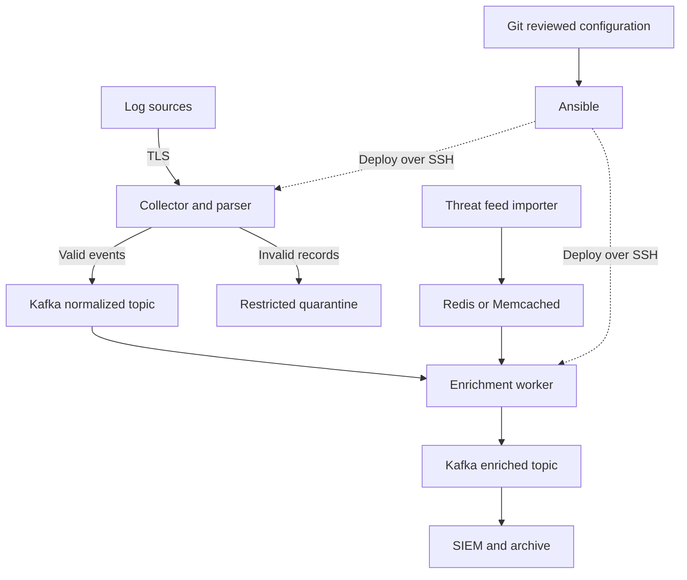

# 🛡️ Secure Data Pipelines & Security Automation

<div align="center">

**Encrypted transport, version-controlled infrastructure, structured telemetry, threat intelligence enrichment, and repeatable deployments**

*TLS • SSH • Git • Log Parsing • Redis • Memcached • Kafka • Ansible*

*Part of the [ULTIMATE CYBERSECURITY MASTER GUIDE](../README.md)*


</div>

---

_Prepared: 2026-09-11. Official documentation reviewed on this date; deployment examples require validation in your environment._

## 🎯 Purpose

Learn to build a secure, understandable, repeatable pipeline that turns raw security logs into useful events. This single-document resource combines foundational concepts, practical exercises, configuration templates, troubleshooting, and an integration project.

## ⚙️ Function

Connect six practical areas of security engineering:

| Capability | Tools / Technologies | What You Will Practice |
| --- | --- | --- |
| 🔐 Secure data in transit | TLS and SSH | Verify endpoint identities and protect network connections |
| 🗃️ Manage code and configuration | Git | Review, version, and restore infrastructure changes |
| 🧹 Structure security telemetry | Python and JSON Lines | Parse logs, validate fields, and quarantine bad records |
| 🧠 Add threat context | Redis and Memcached | Cache intelligence while preserving freshness and uncertainty |
| 📡 Centralize event streams | Kafka | Publish, consume, partition, and replay security events |
| ⚙️ Repeat deployments | Ansible | Apply and validate desired configuration consistently |

## 🏆 Goal

Enable blue team practitioners to trace a security event from its source through parsing, enrichment, transport, and storage—and explain how the system handles trust, errors, replay, and configuration changes.

## 📋 When to Use

- Learning the infrastructure behind security telemetry and SIEM ingestion.
- Building a homelab pipeline before adapting it to an operational environment.
- Replacing manual configuration changes with reviewed, repeatable deployments.
- Troubleshooting missing events, stale intelligence, authentication failures, or duplicate processing.
- Reviewing the failure-handling assumptions behind an existing pipeline.

## 🧰 Audience & Prerequisites

**Audience:** IT practitioners moving into security engineering, detection engineering, and infrastructure automation.

**Prerequisites:** Basic Linux terminal use, files and permissions, IP networking, DNS, and a Linux lab VM. Prior Python experience helps but is not required. The examples explain a small custom event schema rather than assume familiarity with a SIEM (security information and event management platform).

> [!NOTE]
> The local exercises use synthetic data. Commands marked **template** need your hostnames, certificates, accounts, and paths. The Kafka exercise is deliberately isolated and uses plaintext on loopback; it is separate from the TLS deployment guidance. This document is not a one-command production installation.

---

<a id="table-of-contents"></a>

## 📋 Table of Contents

- [🎯 1. Understand the Complete System](#1-understand-the-complete-system)
- [🧪 2. Prepare the Lab](#2-prepare-the-lab)
- [🔐 3. Encrypt and Authenticate with TLS](#3-encrypt-and-authenticate-with-tls)
- [🔑 4. Secure Administration with SSH](#4-secure-administration-with-ssh)
- [🗃️ 5. Manage Code and Configuration with Git](#5-manage-code-and-configuration-with-git)
- [🧹 6. Transform Messy Logs into Structured Events](#6-transform-messy-logs-into-structured-events)
- [🧠 7. Enrich Events with Redis and Memcached](#7-enrich-events-with-redis-and-memcached)
- [📡 8. Stream and Centralize Events with Kafka](#8-stream-and-centralize-events-with-kafka)
- [⚙️ 9. Automate Deployments with Ansible](#9-automate-deployments-with-ansible)
- [🚀 10. Build the Integrated Pipeline](#10-build-the-integrated-pipeline)
- [🛠️ 11. Troubleshooting Reference](#11-troubleshooting-reference)
- [🎓 12. Learning Plan and Self-Check](#12-learning-plan-and-self-check)
- [📤 13. Add This Guide to GitHub](#13-add-this-guide-to-github)
- [✅ Verification Record](#verification-record)
- [🤝 Contributing](#contributing)
- [📚 Resources](#resources)
- [🔗 Quick Links & Related Guides](#see-also)
- [📊 Guide Details](#guide-details)

---

<a id="1-understand-the-complete-system"></a>

## 🎯 1. Understand the complete system

Imagine that several Linux servers emit failed SSH login messages. You want to answer: Which accounts are being targeted? Which sources repeat across hosts? Did a source match a threat feed at the time of analysis? Can you reproduce how these answers were generated?

| Layer | Responsibility | What it does not replace |
| --- | --- | --- |
| TLS | Encrypt network sessions and authenticate certificate identities | Application authorization or disk encryption |
| SSH | Secure administration, file transfer, and controlled tunnels | A durable event transport or message broker |
| Git | Track and review code, schemas, and desired configuration | Secret storage or automatic deployment |
| Parser | Convert source records into validated, consistent events | Detection logic or proof that the source is truthful |
| Redis / Memcached | Quickly retrieve cached intelligence records | A threat feed, authoritative evidence store, or SIEM |
| Kafka | Buffer, retain, partition, and distribute event streams | A search interface or permanent archive by itself |
| Ansible | Apply desired host configuration repeatedly | An assurance that every deployment is safe without verification |

One possible deployed architecture:



The diagram separates the data path from deployment. Encrypt every network hop carrying sensitive events or credentials; the TLS label on the first arrow is not a claim that later hops are automatically protected.

**Design principle:** Make failures visible. A parse failure must not look like a quiet server. A cache outage must not look like a clean threat-intelligence result. A broker acknowledgment must not be confused with a successful SIEM write.

For a homelab, existing Zeek, Suricata, or authentication logs make useful future inputs. Start with synthetic records so parser mistakes cannot destroy your only copy of evidence.

---

<a id="2-prepare-the-lab"></a>

## 🧪 2. Prepare the lab

Use a disposable Linux VM with Python 3.12+, Git, OpenSSH client, OpenSSL 3.x, and a text editor. Docker Engine 28.0.0+ is required for the container-based cache and Kafka exercises; the other exercises do not need Docker. Ansible runs from a separate control environment or Python virtual environment. Package names below target Debian/Ubuntu and require administrator access.

```bash
sudo apt update
sudo apt install git openssh-client openssl python3 python3-venv jq
mkdir -p ~/security-pipeline-lab
cd ~/security-pipeline-lab
mkdir -p certs fixtures out scripts config ansible/templates
umask 077
```

Run subsequent local exercises from this directory. Save each named code block into the specified file. Do not paste the whole document as one shell script. Keep long-running servers in separate terminals.

| Convention | Meaning |
| --- | --- |
| `127.0.0.1` / `localhost` | Same-machine lab endpoint |
| `collector.lab.example` | Placeholder DNS name; replace before remote use |
| `192.0.2.10`, `203.0.113.25` | Documentation-only addresses used as synthetic examples |
| `out/` | Generated events and temporary output; exclude from Git |
| `certs/` | Local lab certificate material; exclude from Git |
| `schema_version` | Your event contract version, independent of tool versions |

Record the versions you actually install. Container tags in the cache lab select a release family and are not immutable; resolve tested image digests before a repeatable deployment. The Kafka lab uses a specific 4.1.2 example to match the cited 4.1 documentation, not a claim that this is the newest or preferred production release. Check the [Ansible Python support matrix](https://docs.ansible.com/projects/ansible-core/devel/reference_appendices/release_and_maintenance.html) before selecting a controller release.

---

<a id="3-encrypt-and-authenticate-with-tls"></a>

## 🔐 3. Encrypt and authenticate with TLS

### 📘 What you need to understand

Transport Layer Security (TLS) protects data while it travels between endpoints. Successful security depends on three distinct checks:

1. **Encryption:** Can an observer read the traffic?
2. **Identity verification:** Is the peer the endpoint you intended to reach?
3. **Authorization:** Is that identity allowed to perform this operation?

An encrypted connection to an impostor does not solve the second problem. A trusted certificate does not automatically solve the third.

The certificate binds a public key to names or identities. The private key proves possession and must remain secret. A certificate authority (CA) signs certificates; the client decides which CAs it trusts. The Subject Alternative Name (SAN) extension must contain the hostname or IP that the client verifies. Server Name Indication (SNI) helps select a certificate on a shared endpoint; it does not itself verify the hostname.

Use TLS 1.3 where supported and TLS 1.2 where compatibility requires it; disable older protocol versions. See the [OWASP TLS guidance](https://cheatsheetseries.owasp.org/cheatsheets/Transport_Layer_Security_Cheat_Sheet.html). Use supported software defaults and organizational policy instead of copying an aging cipher list. For mutual TLS (mTLS), both sides present certificates; map the client identity to actual application permissions.

### 🧪 Lab: create a short-lived localhost certificate

This self-signed certificate is explicitly trusted only by the test client. It is not a public certificate or a production CA. The unencrypted lab private key lets the test server start unattended; protect it with filesystem permissions.

```bash
openssl req -x509 -newkey rsa:3072 -sha256 -noenc \
  -keyout certs/localhost.key -out certs/localhost.crt \
  -days 7 -subj '/CN=localhost' \
  -addext 'subjectAltName=DNS:localhost,IP:127.0.0.1'
chmod 600 certs/localhost.key
openssl x509 -in certs/localhost.crt -noout -dates -ext subjectAltName
```

The certificate-generation switches are documented in [OpenSSL req](https://docs.openssl.org/3.5/man1/openssl-req/).

In a separate terminal, start a demonstration HTTPS server. It serves OpenSSL diagnostic output, not a log collector; see [OpenSSL s_server](https://docs.openssl.org/3.5/man1/openssl-s_server/):

```bash
cd ~/security-pipeline-lab
openssl s_server -accept 127.0.0.1:8443 \
  -cert certs/localhost.crt -key certs/localhost.key -www -tls1_3
```

From the first terminal:

```bash
openssl s_client -connect 127.0.0.1:8443 \
  -servername localhost -verify_hostname localhost \
  -CAfile certs/localhost.crt -verify_return_error </dev/null
```

**Expected:** A successful handshake and certificate verification. Repeat with `-verify_hostname wrong.lab.example`; verification should fail. `-verify_return_error` matters because `s_client` otherwise allows some verification failures while displaying diagnostics. See [OpenSSL s_client](https://docs.openssl.org/3.5/man1/openssl-s_client/).

### ✅ Deployment checklist

- Issue certificates through your managed public or private CA; distribute CA trust separately from server keys.
- Use the actual endpoint name in SANs. Connecting by IP requires the matching IP SAN.
- Include the required intermediate chain. Do not distribute the CA private key to services.
- Alert before expiry and rehearse renewal, reload, and client trust migration.
- Verify certificate identity in each client; do not normalize `verify=false` or `curl -k` into an operational fix.
- Restrict key ownership to the service identity and approved administrators.
- Encrypt stored logs and backups separately when required; TLS ends at the receiving process.

**Checkpoint:** Explain why trusting a CA, sending SNI, and checking a hostname are three different actions.

---

<a id="4-secure-administration-with-ssh"></a>

## 🔑 4. Secure administration with SSH

### 📘 Two identities, two checks

Secure Shell (SSH) authenticates the server using its host key and the user using a key, certificate, or other configured method. Your user key does not prove the server is genuine. A changed host key may be an authorized rebuild or an interception attempt; investigate before replacing trust.

Generate a dedicated administrator key and choose a strong passphrase when prompted:

```bash
ssh-keygen -t ed25519 -a 64 -f ~/.ssh/security-lab-ed25519 \
  -C 'security-lab-admin'
```

The `-a 64` setting increases the private-key passphrase derivation work; it does not change the SSH session cipher. See [OpenSSH ssh-keygen](https://man.openbsd.org/ssh-keygen). Use an algorithm supported by your compliance environment if Ed25519 is unavailable. Copy only the `.pub` file into the intended account's `authorized_keys`, using console access or an already authenticated administrative channel.

Before the first connection, obtain the server fingerprint through its console or another trusted channel:

```bash
sudo ssh-keygen -lf /etc/ssh/ssh_host_ed25519_key.pub
```

Compare that fingerprint during first connection, then use strict checking for routine automation. `ssh-keyscan` collects keys but does not authenticate them by itself.

### ⚙️ Client configuration template

Add an entry to `~/.ssh/config` after replacing the host and account:

```sshconfig
Host security-collector
    HostName collector.lab.example
    User deploy
    IdentityFile ~/.ssh/security-lab-ed25519
    IdentitiesOnly yes
    StrictHostKeyChecking yes
    ForwardAgent no
    ServerAliveInterval 30
    ServerAliveCountMax 3
```

`StrictHostKeyChecking yes` rejects unknown keys as well as changed ones. Complete verified trust enrollment first. Agent forwarding is unnecessary for this lab. The options are described in [OpenSSH client configuration](https://man.openbsd.org/ssh_config).

```bash
ssh security-collector
scp config/pipeline.json security-collector:/tmp/pipeline.json
```

The copy example becomes usable after the configuration exercise creates `config/pipeline.json`; inspect and install files with appropriate ownership instead of running services from `/tmp`.

### ⚙️ Server hardening template

After confirming a second session can authenticate with the intended key, consider:

```sshconfig
PermitRootLogin no
PubkeyAuthentication yes
PasswordAuthentication no
KbdInteractiveAuthentication no
```

Keep keyboard-interactive enabled if your chosen MFA (multi-factor authentication) design requires it. Check included files and `Match` rules before assuming the effective policy. Validate with `sudo sshd -t`; inspect effective settings with `sudo sshd -T`, adding appropriate `-C` connection parameters for `Match` cases. Reload the distribution's SSH service only after validation, keep the existing session open, and test a new connection. See [OpenSSH server configuration](https://man.openbsd.org/sshd_config).

### 📘 Optional temporary tunnel

If an approved remote Redis test instance listens only on that server's loopback:

```bash
ssh -N -o ExitOnForwardFailure=yes \
  -L 127.0.0.1:16379:127.0.0.1:6379 security-collector
```

Your local client can connect to `127.0.0.1:16379`. The SSH portion is encrypted; the connection from the SSH server to the final destination is a separate hop. Here that hop stays on remote loopback. A tunnel is useful for diagnostics but lacks the retry, retention, and consumer coordination of a broker.

**Checkpoint:** Why should an unattended deployment fail when a host key changes?

---

<a id="5-manage-code-and-configuration-with-git"></a>

## 🗃️ 5. Manage code and configuration with Git

### 📘 Central coordination with distributed history

Git is distributed: each full clone has repository history. Your team can designate GitHub as the central place for review and integration without changing that model. A branch isolates work; a commit records a change; a pull request provides a review conversation. See [Git distributed workflows](https://git-scm.com/book/en/v2/Distributed-Git-Distributed-Workflows).

Track parsers, schemas, synthetic fixtures, Ansible playbooks, nonsecret templates, and documentation. Keep operational data and credentials elsewhere.

Save this as `.gitignore`:

```gitignore
.venv/
__pycache__/
.env
certs/
out/
*.key
*.pem
*.p12
*.jks
*.log
ansible/vault-password*
```

This is a starting filter, not a secret detector. `.gitignore` does not remove files already tracked or erase history. Review all staged content, including fixtures, for real customer identifiers and access tokens. If a credential is committed, revoke or rotate it promptly; deleting the current file does not invalidate the secret in old commits. See [Git ignore rules](https://git-scm.com/docs/gitignore).

### 🧪 Lab workflow

For the new standalone lab directory:

```bash
git init -b main
git add .gitignore
git commit -m "Initialize security pipeline lab"
git switch -c feature/ssh-log-parser
```

Set `git config user.name` and `git config user.email` if Git requests identity. Once you create the parser and fixture in the next section:

```bash
git add scripts/parse_ssh.py fixtures/auth.txt
git diff --cached
git commit -m "Normalize synthetic SSH failures into versioned events"
git log --oneline -5
```

For an existing repository, clone it and create a branch instead of running `git init` over it. Before pushing, verify `git remote -v`. `git push -u origin feature/ssh-log-parser` requires an intentionally configured remote and appropriate access.

### 📘 Review and release habits

Keep commits small enough to explain. A parser change should include examples of accepted and rejected records. A configuration change should state the expected operational effect and how to restore the previous state.

Require review and validation before merging into the deployment branch. Pin dependencies and images after testing; a Git commit alone cannot reproduce a deployment that downloads changing packages. Record the deployed commit on each host or release record.

For a shared bad commit, `git revert <commit>` creates an auditable reversing change; see [Git revert](https://git-scm.com/docs/git-revert). It does not automatically undo a running deployment: redeploy the reverted configuration and verify health. Avoid rewriting shared history as a routine rollback mechanism.

**Checkpoint:** If configuration is reverted in Git but Ansible has not run, what is actually running on the server?

---

<a id="6-transform-messy-logs-into-structured-events"></a>

## 🧹 6. Transform messy logs into structured events

### 📘 Build an explicit event contract

A raw string is difficult to query consistently. A structured event gives fields defined types and meanings. Prefer native structured output where available; parse text only when you need to. The following is a deliberately small custom schema, not a claim of Elastic Common Schema or Open Cybersecurity Schema Framework compliance.

| Field | Type | Meaning |
| --- | --- | --- |
| `schema_version` | String | Contract version, initially `1.0` |
| `event_id` | String | Stable identity for this fixture record |
| `timestamp` | UTC timestamp | Source event time |
| `observed_at` | UTC timestamp | Time this parser processed the record |
| `host.name` | String | Host reporting the log |
| `event.action` | String | `ssh_login_failed` |
| `event.outcome` | String | `failure` |
| `source.ip` | String | Validated canonical IP address |
| `source.port` | Integer | Port in the range 1–65535 |
| `user.name` | String | Account named by the record |
| `event.original` | String | Original source text, access restricted downstream |

Keep source time separate from observation time. If a legacy syslog message lacks a year or timezone, you need collector metadata and a documented rollover policy; do not quietly substitute today's date. Python distinguishes timezone-aware timestamps from naive values; use aware values for conversion. See [Python datetime](https://docs.python.org/3/library/datetime.html).

### 🧪 Lab input

Save as `fixtures/auth.txt`:

```text
2026-09-11T12:00:00Z labhost sshd[1234]: Failed password for invalid user admin from 203.0.113.25 port 54321 ssh2
2026-09-11T12:00:01+00:00 labhost sshd[1235]: Failed password for jon from 192.0.2.10 port 54322 ssh2
this line is deliberately malformed
```

### 📘 Runnable parser

Save as `scripts/parse_ssh.py`. This parser accepts only the demonstrated SSH failure format; real logs may have other prefixes, localization, or authentication methods. Its restricted grammar is intentional.

```python
import hashlib
import ipaddress
import json
import re
import sys
from datetime import datetime, timezone
from pathlib import Path

PATTERN = re.compile(
    r"^(?P<ts>\S+)\s+(?P<host>\S+)\s+sshd\[\d+\]:\s+"
    r"Failed password for (?:invalid user )?(?P<user>\S+) "
    r"from (?P<ip>\S+) port (?P<port>\d+) ssh2$"
)


def utc_now():
    return datetime.now(timezone.utc).isoformat().replace("+00:00", "Z")


def parse_record(raw, source_id, line_number):
    match = PATTERN.fullmatch(raw)
    if match is None:
        raise ValueError("unsupported_format")
    fields = match.groupdict()
    when = datetime.fromisoformat(fields["ts"].replace("Z", "+00:00"))
    if when.tzinfo is None:
        raise ValueError("missing_timezone")
    address = str(ipaddress.ip_address(fields["ip"]))
    port = int(fields["port"])
    if not 1 <= port <= 65535:
        raise ValueError("invalid_port")
    identity = f"{source_id}\0{line_number}\0{raw}".encode("utf-8")
    return {
        "schema_version": "1.0",
        "event_id": hashlib.sha256(identity).hexdigest(),
        "timestamp": when.astimezone(timezone.utc).isoformat().replace("+00:00", "Z"),
        "observed_at": utc_now(),
        "host": {"name": fields["host"]},
        "event": {"action": "ssh_login_failed", "outcome": "failure", "original": raw},
        "source": {"ip": address, "port": port},
        "user": {"name": fields["user"]},
    }


def main():
    if len(sys.argv) != 4:
        raise SystemExit("Usage: parse_ssh.py INPUT QUARANTINE SOURCE_ID")
    input_path, quarantine_path, source_id = sys.argv[1:]
    if Path(input_path).resolve() == Path(quarantine_path).resolve():
        raise SystemExit("Input and quarantine must be different files")
    accepted = rejected = 0
    with open(input_path, encoding="utf-8", errors="strict") as source, open(
        quarantine_path, "w", encoding="utf-8"
    ) as quarantine:
        for number, line in enumerate(source, 1):
            raw = line.rstrip("\r\n")
            try:
                if len(raw) > 16384:
                    raise ValueError("record_too_long")
                event = parse_record(raw, source_id, number)
            except ValueError as error:
                failure = {
                    "line": number,
                    "reason": str(error),
                    "raw_preview": raw[:16384],
                    "truncated": len(raw) > 16384,
                }
                quarantine.write(json.dumps(failure) + "\n")
                rejected += 1
            else:
                print(json.dumps(event, separators=(",", ":")))
                accepted += 1
    print(f"accepted={accepted} rejected={rejected}", file=sys.stderr)


if __name__ == "__main__":
    main()
```

JSON serialization escapes control characters and produces consistent objects. Each output line is its own JSON value: JSON Lines / NDJSON. The entire file is not one JSON array. See [Python JSON documentation](https://docs.python.org/3/library/json.html).

Run:

```bash
python3 scripts/parse_ssh.py fixtures/auth.txt out/quarantine.jsonl fixture-auth-v1 \
  > out/events.jsonl
jq -c '{timestamp, source, user}' out/events.jsonl
wc -l out/events.jsonl out/quarantine.jsonl
```

**Expected:** `accepted=2 rejected=1`, two events, and one quarantined record. Output and quarantine files are overwritten on each run; this is a fixture exercise, not an append-only evidence collector.

### 📘 What needs to change for real logs

- **Identity:** The lab hash uses a source ID, line number, and raw text. Production collectors need a stable source identity and record position across rotation/replay; hashing message text alone can merge distinct identical events.
- **Input bounds:** The lab checks length after Python reads a line. A network collector needs bounded framing before allocation, queue limits, and backpressure.
- **Encoding:** Invalid UTF-8 stops this fixture parser. A real collector should retain original bytes in restricted storage and quarantine decoding failures explicitly.
- **Multiline:** Join stack traces at the collector using a tested boundary rule. Arbitrary line splitting loses event structure.
- **Privacy:** Raw records may contain usernames, secrets, or personal information. Restrict originals, redact display copies, and set a retention policy.
- **Compatibility:** Add fields compatibly; version breaking type or meaning changes. Validate required fields before downstream processing.
- **Monitoring:** Count received, accepted, rejected, retried, and dropped events. Alert on changes in rates, not just process uptime.

**Checkpoint:** Add an invalid IP, a port above 65535, and a timestamp without a timezone. Each should be rejected while valid records still parse.

---

<a id="7-enrich-events-with-redis-and-memcached"></a>

## 🧠 7. Enrich events with Redis and Memcached

### 📘 Cache context, preserve uncertainty

Threat intelligence comes from feeds, internal investigations, or other sources. An importer validates and normalizes that data, then writes cache entries. Workers look up indicators while processing events. An indicator of compromise (IOC) match is context for investigation, not proof of compromise.

For example, a failed login from a feed-listed IP can justify additional investigation. It should not automatically establish that the attempted account was compromised.

| Property | Redis | Memcached |
| --- | --- | --- |
| Data model | Strings plus richer data structures | Primarily key/value cache |
| Typical use here | Shared indicator records and metadata | Simple disposable lookup results |
| Retention | Expiry and configurable persistence options | Treat as disposable; design for loss and eviction |
| Access design | ACL users and restricted command/key permissions | Strong network isolation; verify authentication support in the chosen build/client |
| TLS | Available in TLS-enabled builds/configurations | Requires compatible TLS build/configuration and client |
| Selection rule | Choose when richer operations or access controls help | Choose when a simple cache is sufficient |

You do not need both in the same pipeline. Learn the common interface, then choose one.

Use canonical keys such as `ti:ip:203.0.113.25`. Normalize IPs before lookup. For domains, define case, trailing-dot, and internationalized-name handling; for hashes, include the algorithm. Do not send sensitive internal indicators to external services without an approved data-sharing policy.

An entry should contain `provider`, `indicator`, `verdict`, `retrieved_at`, `expires_at`, and a reference or feed revision. Preserve provider-specific confidence separately rather than pretending all scores mean the same thing.

| Result | Meaning | Event treatment |
| --- | --- | --- |
| `match` | Fresh applicable intelligence record exists | Attach source, observation, and validity context |
| `cache_miss` | Cache contains no entry; it may be evicted, expired, or never imported | Consult the authoritative snapshot or return unknown |
| `no_match` | A completed authoritative lookup found no match within defined coverage | Do not equate with benign |
| `expired` | Entry is beyond its validity window | Refresh or record stale status explicitly |
| `unavailable` | Timeout, connection failure, or provider failure | Preserve event and flag incomplete enrichment |

### 🧪 Local cache exercise

Start the two alternative backends for comparison, using Docker on the same lab host:

```bash
docker run -d --name lab-redis -p 127.0.0.1:6379:6379 \
  redis:7-alpine redis-server --save '' --appendonly no
docker run -d --name lab-memcached -p 127.0.0.1:11211:11211 \
  memcached:1.6-alpine memcached -m 64 -U 0
python3 -m venv .venv
. .venv/bin/activate
python -m pip install redis pymemcache
```

These are disposable unauthenticated caches with host ports published only on loopback. Other containers on the same Docker network may still reach them. Use a dedicated lab host/network and do not expose these commands as an organizational service. UDP is explicitly disabled for Memcached. Use Docker Engine 28.0.0 or newer for this loopback-publishing assumption: older versions had a documented same-L2 reachability caveat. See [Docker port publishing](https://docs.docker.com/engine/network/port-publishing/) and [Memcached configuration](https://docs.memcached.org/serverguide/configuring/).

Save as `scripts/enrich.py`:

```python
import ipaddress
import json
import sys
from datetime import datetime, timedelta, timezone


def main():
    backend = sys.argv[1] if len(sys.argv) > 1 else "redis"
    if backend == "redis":
        import redis
        from redis.backoff import NoBackoff
        from redis.retry import Retry
        cache = redis.Redis(host="127.0.0.1", port=6379,
                            socket_timeout=1, socket_connect_timeout=1,
                            retry=Retry(NoBackoff(), 0))
        cache_errors = (redis.exceptions.RedisError, OSError)
        def put(key, value):
            cache.set(key, value, ex=300)
    elif backend == "memcached":
        from pymemcache.client.base import Client
        from pymemcache.exceptions import MemcacheError
        cache = Client(("127.0.0.1", 11211), connect_timeout=1, timeout=1)
        cache_errors = (MemcacheError, OSError)
        def put(key, value):
            cache.set(key, value, expire=300, noreply=False)
    else:
        raise SystemExit("Choose redis or memcached")

    now = datetime.now(timezone.utc)
    fixture = {
        "provider": "synthetic-lab-feed",
        "indicator": "203.0.113.25",
        "verdict": "synthetic-test-match",
        "retrieved_at": now.isoformat(),
        "expires_at": (now + timedelta(seconds=300)).isoformat(),
    }
    try:
        put("ti:ip:203.0.113.25", json.dumps(fixture))
    except cache_errors:
        print("Fixture seed unavailable; processing with lookup status", file=sys.stderr)

    for line in sys.stdin:
        event = json.loads(line)
        address = str(ipaddress.ip_address(event["source"]["ip"]))
        try:
            value = cache.get(f"ti:ip:{address}")
            if value is None:
                context = {"status": "cache_miss"}
            else:
                record = json.loads(value)
                expiry = datetime.fromisoformat(record["expires_at"])
                if expiry.tzinfo is None or record["indicator"] != address:
                    raise ValueError("invalid_cache_record")
                if expiry <= datetime.now(timezone.utc):
                    context = {"status": "expired"}
                else:
                    context = {"status": "match", "record": record}
        except cache_errors:
            context = {"status": "unavailable", "reason": "cache_error"}
        except (ValueError, KeyError, TypeError):
            context = {"status": "unavailable", "reason": "invalid_cache_record"}
        event["threat_intelligence"] = context
        print(json.dumps(event, separators=(",", ":")))
    cache.close()


if __name__ == "__main__":
    main()
```

```bash
python scripts/enrich.py redis < out/events.jsonl > out/enriched-redis.jsonl
python scripts/enrich.py memcached < out/events.jsonl > out/enriched-memcached.jsonl
jq -c '{ip: .source.ip, ti: .threat_intelligence.status}' out/enriched-redis.jsonl
```

**Expected:** `203.0.113.25` matches the synthetic entry; `192.0.2.10` returns `cache_miss`. These addresses are reserved for examples by [RFC 5737](https://www.rfc-editor.org/info/rfc5737/) and are not asserted to be malicious. The script seeds a fixture each run; replace that step with a separate importer for a real pipeline. Input schema failures stop this small script; use quarantine handling at real worker boundaries.

Redis `SET ... EX` sets a value and expiry together. Memcached has its own expiry conventions; values above 30 days are interpreted as Unix timestamps. Short TTLs (time to live) such as 300 seconds avoid that ambiguity. See [Redis SET](https://redis.io/docs/latest/commands/set/) and the [Memcached user guide](https://docs.memcached.org/userguide/).

### 📘 Secure the real cache

For Redis, use network restrictions, ACLs, and separate importer/reader identities. The reader should access only the required key prefix and commands. Authentication without transport encryption can expose credentials. See [Redis security](https://redis.io/docs/latest/operate/oss_and_stack/management/security/).

A Redis server TLS **template**, requiring installed certificate files and a separately managed ACL policy:

```text
port 0
tls-port 6379
tls-cert-file /etc/redis/tls/server.crt
tls-key-file /etc/redis/tls/server.key
tls-ca-cert-file /etc/redis/tls/ca.crt
tls-auth-clients yes
```

This disables the plaintext listener and requires client certificates. Client certificate verification and Redis ACL authorization are distinct controls. Verify your Redis build and client configuration against [Redis TLS](https://redis.io/docs/latest/operate/oss_and_stack/management/security/encryption/).

Memcached TLS similarly requires a compatible server build and client. A compatible startup template is `memcached -Z -o ssl_chain_cert=/path/server.crt,ssl_key=/path/server.key -U 0`; configure both client-side server verification and, if required, server-side client-certificate enforcement before use. Enabling `-Z` alone does not require client certificates; restrict network access as well. The local Python example above uses plaintext and must be adapted for TLS. See [Memcached TLS support](https://docs.memcached.org/features/tls/).

The clients above set connect/read timeouts and disable Redis automatic retries for predictable lab behavior. These are socket-operation limits, not a universal end-to-end deadline. See [redis-py connections](https://redis.readthedocs.io/en/stable/connections.html) and the [pymemcache client API](https://pymemcache.readthedocs.io/en/latest/apidoc/pymemcache.client.base.html).

Keep the authoritative feed snapshot outside the cache. Limit import size, validate indicator types, bound lookup time, and monitor cache hit rate, errors, evictions, feed freshness, and refresh failures. Use short negative caching and rate limits to avoid overwhelming a provider. A cache miss may mean eviction or incomplete ingestion; only label a real feed search `no_match` after checking its coverage assumptions.

**Checkpoint:** Stop the selected cache and rerun enrichment. The events should remain present with `unavailable`, not become “safe.” Use `docker stop lab-redis` or `docker stop lab-memcached` to stop the selected backend. Restart the container afterward with `docker start lab-redis` or `docker start lab-memcached`.

---

<a id="8-stream-and-centralize-events-with-kafka"></a>

## 📡 8. Stream and centralize events with Kafka

### 📘 Understand the broker model

Apache Kafka stores records in topics split into partitions. A producer writes records; consumers read them. An offset identifies a position within a partition. A consumer group coordinates ownership of partitions so workers can divide the work. Separate groups can independently process the same retained records.

Ordering is per partition, not global. A key such as host ID can keep related events together, but a high-volume key can create a hot partition. More consumers than partitions does not create more parallel partition ownership within one group. Retention makes replay possible only while records remain available. See [Kafka design](https://kafka.apache.org/41/design/design/).

| Topic | Intended content | Access pattern |
| --- | --- | --- |
| `security.normalized.v1` | Validated events before intelligence lookup | Parser writes, enrichment group reads |
| `security.enriched.v1` | Events plus intelligence status | Enrichment writes, SIEM/archive groups read |
| `security.quarantine.v1` | Invalid records and reasons | Restricted triage access |

The following lab publishes the enriched file only. The integrated worker design in Section 10 adds the normalized topic and coordinated processing.

### 🧪 Local single-broker exercise

Prerequisite: Docker is installed and available. The official quickstart documents the Apache Kafka image and CLI workflow. This lab fixes the image at `apache/kafka:4.1.2` for an explicit example. See [Kafka 4.1 quickstart](https://kafka.apache.org/41/getting-started/quickstart/).

```bash
docker run -d --name lab-kafka -p 127.0.0.1:9092:9092 apache/kafka:4.1.2
docker logs lab-kafka
```

Wait for startup to complete. This is a single-node KRaft lab: KRaft is Kafka's metadata quorum mechanism. No ZooKeeper instructions are needed for this version. The broker has no production authentication, redundancy, or external persistent volume.

Create a topic using tools inside the container:

```bash
docker exec lab-kafka /opt/kafka/bin/kafka-topics.sh \
  --bootstrap-server localhost:9092 --create \
  --topic security.enriched.v1 --partitions 3 --replication-factor 1
docker exec lab-kafka /opt/kafka/bin/kafka-topics.sh \
  --bootstrap-server localhost:9092 --describe --topic security.enriched.v1
docker exec -i lab-kafka /opt/kafka/bin/kafka-console-producer.sh \
  --bootstrap-server localhost:9092 --topic security.enriched.v1 \
  < out/enriched-redis.jsonl
docker exec lab-kafka /opt/kafka/bin/kafka-console-consumer.sh \
  --bootstrap-server localhost:9092 --topic security.enriched.v1 \
  --group lab-inspect-v1 --from-beginning --max-messages 2
```

**Expected:** Two JSON records appear; their order need not match the input because there are multiple partitions and no key was specified. A reused consumer group may already have offsets. Use a new group name for a fresh replay; `--from-beginning` does not override valid committed offsets.

### ⚙️ Secure client configuration template

For the Kafka Java CLI, save a restricted `client.properties` file appropriate to your secured broker:

```properties
security.protocol=SSL
ssl.truststore.type=PKCS12
ssl.truststore.location=/etc/security-pipeline/kafka-truststore.p12
ssl.truststore.password=REPLACE_USING_SECRET_MANAGEMENT
ssl.keystore.type=PKCS12
ssl.keystore.location=/etc/security-pipeline/kafka-client.p12
ssl.keystore.password=REPLACE_USING_SECRET_MANAGEMENT
ssl.key.password=REPLACE_USING_SECRET_MANAGEMENT
ssl.endpoint.identification.algorithm=https
```

This assumes mTLS and prepared PKCS12 stores; it does not create those stores or secure the broker. Protect the file and never commit actual passwords. The `https` value selects hostname verification behavior; Kafka traffic does not become HTTP.

Use `--producer.config client.properties` for the console producer, `--consumer.config` for the console consumer, and `--command-config` for administrative tools that support it. Python and other client libraries have different property names and certificate formats.

On the broker side, configure TLS listeners, reachable `advertised.listeners`, client authentication, authorizer policy, and separate producer/consumer/admin permissions. Secure inter-broker and controller traffic as well. A successful TLS handshake is not evidence of topic authorization. Listener and authentication settings must be checked against [Kafka broker configuration](https://kafka.apache.org/41/configuration/broker-configs/). See [Kafka security overview](https://kafka.apache.org/41/security/security-overview/).

### 📘 Delivery and scale decisions

For a production producer, explicitly review `acks=all`, `enable.idempotence=true`, delivery timeouts, retries, and batching. Idempotence limits duplicates from producer retries; it does not deduplicate arbitrary replayed input or an external SIEM write. `acks=all` works with the in-sync replica set and broker/topic settings; it is not a promise that every configured replica acknowledged. See [Kafka producer configuration](https://kafka.apache.org/41/configuration/producer-configs/).

An illustrative three-broker durability policy uses replication factor 3 and `min.insync.replicas=2`, with producers requiring all in-sync acknowledgments. This trades write availability for stronger durability during failures; validate it against your failure and capacity requirements. See [Kafka topic configuration](https://kafka.apache.org/41/configuration/topic-configs/).

Commit consumer offsets only after the required output is durably accepted. A crash between output and offset commit can cause duplicates. Use stable event IDs and idempotent sink writes, or use Kafka transactions for Kafka-to-Kafka operations with appropriately configured consumers. External services still require their own consistency strategy. Transaction-aware downstream consumers must use `isolation.level=read_committed` to exclude aborted transactional records. See [Kafka consumer configuration](https://kafka.apache.org/41/configuration/consumer-configs/).

Estimate storage before increasing retention:

```text
10,000 events/second × 1,000 bytes/event × 86,400 seconds/day
= 864 GB/day logical payload, using decimal units

At replication factor 3: about 2.592 TB/day across replicas
before compression, indexes, overhead, and free-space headroom.
```

Measure real compression and record sizes rather than assuming a ratio. Monitor consumer lag, oldest unprocessed event age, disk space, replica health, produce errors, processing latency, and partition skew. Keep a separate archive when evidence must outlive broker retention.

**Checkpoint:** What happens if the SIEM is down longer than Kafka retention? What happens if you commit an offset before the SIEM accepts the event?

---

<a id="9-automate-deployments-with-ansible"></a>

## ⚙️ 9. Automate deployments with Ansible

### 📘 Desired state and idempotence

Ansible uses an inventory to select machines and playbooks to describe tasks. Modules implement actions such as creating directories or installing templates. Idempotence means that applying the same desired state again should avoid unnecessary changes. It is a property you must preserve in task design; arbitrary shell commands are not automatically idempotent.

This exercise deploys a validated configuration file to a lab host. It does not install a Kafka cluster or run the parser as a service. Start with a narrow deployment you can inspect, then expand it.

Install into the activated lab virtual environment:

```bash
python -m pip install ansible-core
ansible --version
```

For reproducibility, record the tested package versions and move to a reviewed lock/pin workflow before repeated deployment.

### ⚙️ Inventory and template

Save as `ansible/inventory.ini`, replacing the DNS name and verifying the SSH host key first:

```ini
[collectors]
collector1 ansible_host=collector.lab.example ansible_user=deploy

[collectors:vars]
ansible_python_interpreter=/usr/bin/python3
```

For a local disposable VM test, substitute `collector1 ansible_connection=local` for the remote host line. This makes the playbook modify the local machine; use it only on your intended lab target.

Save as `ansible/templates/pipeline.json.j2`:

```jinja2
{
  "schema_version": "1.0",
  "environment": {{ pipeline_environment | to_json }},
  "kafka_topic": {{ pipeline_topic | to_json }},
  "retain_original": true
}
```

Save as `ansible/site.yml`:

```yaml
---
- name: Deploy lab pipeline configuration
  hosts: collectors
  become: true
  gather_facts: false
  vars:
    pipeline_environment: lab
    pipeline_topic: security.normalized.v1
  tasks:
    - name: Create restricted configuration directory
      ansible.builtin.file:
        path: /etc/security-pipeline
        state: directory
        owner: root
        group: root
        mode: '0750'

    - name: Render and validate pipeline configuration
      ansible.builtin.template:
        src: pipeline.json.j2
        dest: /etc/security-pipeline/pipeline.json
        owner: root
        group: root
        mode: '0640'
        validate: '/usr/bin/python3 -m json.tool %s'
```

The template module validates a temporary file before replacing the destination. `%s` is the temporary filename; the validation command is not an arbitrary shell pipeline. JSON syntax validation does not validate your application's field meanings. See [Ansible template module](https://docs.ansible.com/projects/ansible/latest/collections/ansible/builtin/template_module.html).

### ✅ Run and verify

```bash
ansible-inventory -i ansible/inventory.ini --graph
ansible collectors -i ansible/inventory.ini -m ansible.builtin.ping
ansible-playbook -i ansible/inventory.ini ansible/site.yml --syntax-check
ansible-playbook -i ansible/inventory.ini ansible/site.yml --check --diff --ask-become-pass
ansible-playbook -i ansible/inventory.ini ansible/site.yml --ask-become-pass
ansible-playbook -i ansible/inventory.ini ansible/site.yml --ask-become-pass
```

`ansible.builtin.ping` tests Ansible connectivity and remote Python execution, not ICMP. The inventory uses `collector.lab.example`, which does not match the earlier SSH alias `security-collector`; do not assume the alias settings apply. Select the key through an SSH agent or add `--private-key ~/.ssh/security-lab-ed25519` to remote Ansible commands. Keep host-key checking enabled and enroll trust for the actual inventory endpoint. See [Ansible connection details](https://docs.ansible.com/projects/ansible/latest/inventory_guide/connection_details.html).

**Expected:** The first application creates the directory and file. The second should report no changes unless something altered the target state. Inspect `/etc/security-pipeline/pipeline.json` on the target. For the earlier `scp` exercise, optionally copy its nonsecret contents into local `config/pipeline.json`.

Check mode is a prediction, not a full deployment test. Some tasks do not support it, and later tasks can depend on changes that check mode did not actually create. Diff output can disclose secrets. See [Ansible check and diff mode](https://docs.ansible.com/projects/ansible/latest/playbook_guide/playbooks_checkmode.html).

### 📘 Expand safely

Once a real service exists, add a handler that reloads or restarts it only when its configuration changes. Use its native config validator before notification. Deploy to a canary host, check health, then proceed with controlled batches. Pin tested package versions and give service accounts only the files and privileges they require.

Use Ansible Vault or a secret manager for sensitive variables. Vault protects stored content; tasks may still reveal decrypted values through logs or diffs. Apply `no_log: true` and `diff: false` to sensitive tasks, and keep the vault password outside the repository. See [Ansible Vault](https://docs.ansible.com/projects/ansible/latest/vault_guide/index.html).

Rollback means selecting a known-good revision, applying it, and checking service behavior. Reversing a config file cannot automatically reverse a database migration or erase events already published.

**Checkpoint:** Why can a playbook report success while the application is still unhealthy?

---

<a id="10-build-the-integrated-pipeline"></a>

## 🚀 10. Build the integrated pipeline

### 🧪 Milestone A: file-based path

After completing the individual exercises, run:

```bash
. .venv/bin/activate
python scripts/parse_ssh.py fixtures/auth.txt out/quarantine.jsonl fixture-auth-v1 \
  > out/events.jsonl
python scripts/enrich.py redis < out/events.jsonl > out/enriched-redis.jsonl
docker exec -i lab-kafka /opt/kafka/bin/kafka-console-producer.sh \
  --bootstrap-server localhost:9092 --topic security.enriched.v1 \
  < out/enriched-redis.jsonl
```

This connects parsing, cache enrichment, and broker ingestion. TLS and SSH were practiced independently, while Git tracks the source and Ansible deploys a sample configuration. Do not describe this milestone as a fully encrypted, continuously deployed pipeline.

### 🧪 Milestone B: continuously processed architecture

Replace file boundaries with durable collection and Kafka consumers. The following is **design pseudocode**, not executable Python:

```text
Collector:
  read a bounded source record and retain its stable source position
  parse and validate
  if valid: publish normalized event and await acknowledgment
  otherwise: durably quarantine the failure and its source reference
  advance collection checkpoint only after the required durable write

Enrichment worker:
  consume normalized event without automatically committing its offset
  validate schema and look up canonical indicator with explicit socket timeouts and a controlled retry budget
  attach match / cache_miss / no_match / expired / unavailable and feed metadata
  publish enriched event and await acknowledgment
  commit the next offset for the processed input partition
  tolerate replay through stable event IDs or an appropriate transaction design

SIEM sink:
  consume enriched event
  persist using event_id as an idempotency key where supported
  commit only after accepted persistence
```

In parallel consumers, commit only the contiguous completed range for a partition. Committing past unfinished work can lose that work after a crash. Define what happens on poison records, retry exhaustion, and quarantine failure; never advance a checkpoint merely because an exception was caught.

### 🧪 Milestone C: secure and repeatable deployment

1. Put parser, schema, fixtures, templates, and playbooks on a reviewed Git branch.
2. Provision service identities, DNS, CA trust, certificates, and host-key trust.
3. Configure Kafka listeners, topic permissions, and client certificates or other approved authentication.
4. Configure the selected cache with restricted access, TLS where networked, and importer/reader separation.
5. Deploy to one lab host using Ansible; verify effective permissions and application health.
6. Send a synthetic event over the actual TLS collector interface and trace its ID through each layer.
7. Reboot a worker, rotate a certificate, simulate an unavailable cache, and replay events.
8. Record tested versions, throughput, loss/duplicate behavior, and rollback instructions before expansion.

You must implement or select the actual TLS log collector and continuous worker for this milestone. OpenSSL's demonstration server is not that collector. This distinction prevents a successful TLS demonstration from being mistaken for a complete ingestion system.

### ✅ Acceptance checks

| Test | Required observation |
| --- | --- |
| Incorrect certificate hostname | Client rejects the connection |
| Unexpected SSH host key | Deployment stops pending verified trust update |
| Malformed input | Quarantine count increases; valid records continue |
| Cache offline | Events retain an explicit unavailable status |
| Feed too old | Freshness alarm or expired status, not silent trust |
| Kafka unavailable | Collector buffers within a defined limit or stops without advancing checkpoints |
| Worker crashes after publish | Replay produces an understood duplicate or is deduplicated |
| Second identical Ansible run | No unnecessary changes |
| Restore previous Git revision | Target configuration and service behavior match the selected revision |
| Retention boundary | Required evidence exists in the archive before Kafka deletes its copy |

### 📘 Cleanup

Stop the OpenSSL server and SSH tunnel with Ctrl+C in their terminals. Remove only the named disposable containers when done:

```bash
docker rm -f lab-redis lab-memcached lab-kafka
```

Removing the Kafka container discards this lab's broker data. Keep fixture code and notes in Git, and handle certificate keys and generated output according to your lab retention needs. The Ansible-created configuration directory remains on its target until you deliberately remove it or apply a different desired state.

---

<a id="11-troubleshooting-reference"></a>

## 🛠️ 11. Troubleshooting reference

| Symptom | Likely explanation | Useful next check |
| --- | --- | --- |
| TLS unknown authority | Missing CA trust or intermediate chain | Inspect the presented chain and intended trust file |
| TLS hostname mismatch | DNS/IP used by client is absent from SAN | Compare exact connection name with certificate SANs |
| TLS certificate time error | Expired certificate or incorrect clock | Check validity interval and time synchronization |
| SSH key denied | Wrong user, identity, permissions, or server policy | Inspect `ssh -v` locally and server auth logs; sanitize before sharing |
| SSH host key changed | Rebuild, wrong DNS target, or interception | Verify fingerprint through console before updating trust |
| Git ignored a fixture | Ignore rule matched the path | Run `git check-ignore -v fixtures/auth.txt` |
| Parser rejects everything | Source format differs from fixture grammar | Compare one sanitized line against the pattern |
| Event time is shifted | Missing/wrong source timezone | Inspect original timestamp and collector time assumptions |
| Cache misses increase | TTL, eviction, importer failure, or key mismatch | Compare canonical keys and feed refresh metrics |
| Cache failure marked clean | Error and negative result were conflated | Keep unavailable separate from no-match |
| Kafka bootstrap succeeds but reads fail | Advertised broker names are unreachable | Resolve and connect to every advertised endpoint |
| Kafka consumer appears idle | Existing group offsets or no assigned partitions | Inspect group offsets, lag, and partition assignments |
| Kafka duplicates appear | Replay or output-before-commit crash window | Trace event IDs and sink idempotency behavior |
| Ansible always changes | Shell tasks, timestamps, unstable templates | Inspect diffs and use state-aware modules |
| Ansible check mode fails initially | Required directory/package was only simulated | Evaluate dependencies; test on a disposable target |

When debugging, establish the last confirmed boundary: source read, parse accepted, cache looked up, broker acknowledged, or sink persisted. “The service is running” does not tell you which boundary failed.

---

<a id="12-learning-plan-and-self-check"></a>

## 🎓 12. Learning plan and self-check

Treat each row as one study session; repeat until you can explain the result without relying on copied commands.

| Session | Practice | Evidence of understanding |
| --- | --- | --- |
| 1 | TLS localhost lab and incorrect-hostname test | Explain encryption versus verified identity |
| 2 | SSH key enrollment and strict host checking | Explain client key versus server host key |
| 3 | Git branch, staged diff, commit, and revert | Identify deployed state versus repository state |
| 4 | Parser fixture plus three invalid records | Explain quarantine, timestamps, and event IDs |
| 5 | Both cache backends and outage test | Explain TTL, stale data, and no-match limitations |
| 6 | Kafka topic, producer, and fresh consumer group | Explain partitions, offsets, groups, and replay |
| 7 | Ansible check/apply/apply again | Explain idempotence and check-mode limitations |
| 8 | Integrated failure drills | Trace one event and account for loss or duplicates |

### 📘 Questions to answer in your own words

1. Why is an encrypted connection without identity verification insufficient?
2. Why does deleting a committed secret not fix credential exposure?
3. Why preserve both source event time and parser observation time?
4. Can an evicted cache entry establish that an indicator is benign?
5. Why might a producer acknowledgment still be followed by a duplicate at the SIEM?
6. Why does increasing consumer count beyond partition count stop improving group parallelism?
7. What does Ansible's second unchanged run prove, and what does it leave unproven?
8. Which data must survive independently of caches and Kafka retention?

**Answer guide:** Verify the intended peer; rotate exposed credentials; separate occurrence from processing delay; absence is not a clean verdict; replay can cross output/commit boundaries; partitions bound concurrent ownership; idempotence is not health verification; preserve authoritative intelligence and required evidence in durable systems with tested recovery.

---

<a id="13-add-this-guide-to-github"></a>

## 📤 13. Add this guide to GitHub

Suggested location in this repository: `Documentation/security-data-pipelines-guide.md`. The guide is self-contained; embedded scripts are copied out only when doing the labs.

From an existing clean clone of your cybersecurity repository:

```bash
git switch -c docs/security-data-pipelines
```

Copy this Markdown file into `Documentation/`, then add the following line to an appropriate documentation section in the root `README.md`:

```markdown
- [Security Data Pipelines](./Documentation/security-data-pipelines-guide.md) — Learn TLS, SSH, Git, structured log parsing, cached threat intelligence, Kafka, and Ansible through practical labs.
```

Review and commit only the intended files:

```bash
git add Documentation/security-data-pipelines-guide.md README.md
git diff --cached --stat
git diff --cached
git commit -m "Add practical security data pipelines learning guide"
git push -u origin docs/security-data-pipelines
```

Open a pull request, confirm rendered navigation and code blocks, and follow the repository's current contribution rules. These are instructions for adding the file; publication is not implied by receiving this document.

---

<a id="verification-record"></a>

## ✅ Verification Record

This review checked the guide against the linked official documentation and performed the following local checks. Source review is not the same as a successful deployment in a reader's environment.

| Area | Verification performed | Limitation |
| --- | --- | --- |
| Markdown and shell examples | Checked code-fence structure, internal section links, and Bash syntax | Repository-relative links assume the suggested `Documentation/` location |
| TLS | Generated the certificate; completed a verified localhost TLS handshake; rejected the wrong hostname | Does not test a production CA, renewal system, or mTLS deployment |
| Parser | Ran the fixture; confirmed two accepted and one quarantined record; rejected invalid IP, port, and missing timezone; checked stable event ID | Restricted fixture format, not broad production log coverage |
| Cache clients | Imported installed Redis and Memcached clients; confirmed both preserve events as unavailable when their backend is absent | Live cache success/expiry and Docker startup were not executed |
| Ansible | Playbook syntax checked successfully | Deployment attempt could not start Ansible's local RPC server in the verification environment; apply/idempotence remain unverified |
| Kafka | Cross-checked image example and CLI/configuration guidance against Apache documentation | Docker was unavailable, so broker startup and produce/consume were not executed |
| SSH | Checked options and trust guidance against OpenSSH manuals | No remote server configuration was modified or tested |

Local checks used Python 3.12.14, OpenSSL 3.0.13, redis-py 8.1.0, pymemcache 4.0.0, and ansible-core 2.21.4. These identify the verification environment; they are not a recommendation to freeze on those versions indefinitely. Revalidate with your selected supported releases before deployment.

---

<a id="contributing"></a>

## 🤝 Contributing

Useful additions include sanitized parser fixtures, clearer explanations, tested configuration examples, and documented failure scenarios.

**Submission Guidelines:**

1. Use synthetic or thoroughly sanitized data; exclude credentials and private keys.
2. State the operating system, tool versions, and prerequisites for changed examples.
3. Describe what you executed, the results observed, and what remains unverified.
4. Preserve the distinction between isolated lab exercises and deployment templates.
5. Submit a pull request explaining the learning or operational benefit.

---

<a id="resources"></a>

## 📚 Resources

The guide cites official documentation beside the relevant instructions. These starting points provide quick access to the main references:

| Area | Official References |
| --- | --- |
| 🔐 TLS | [OpenSSL client diagnostics](https://docs.openssl.org/3.5/man1/openssl-s_client/) · [OWASP TLS guidance](https://cheatsheetseries.owasp.org/cheatsheets/Transport_Layer_Security_Cheat_Sheet.html) |
| 🔑 SSH | [Client configuration](https://man.openbsd.org/ssh_config) · [Server configuration](https://man.openbsd.org/sshd_config) |
| 🗃️ Git | [Distributed workflows](https://git-scm.com/book/en/v2/Distributed-Git-Distributed-Workflows) · [Reverting changes](https://git-scm.com/docs/git-revert) |
| 🧹 Parsing | [Python JSON](https://docs.python.org/3/library/json.html) · [Python timestamps](https://docs.python.org/3/library/datetime.html) |
| 🧠 Caching | [Redis security](https://redis.io/docs/latest/operate/oss_and_stack/management/security/) · [Memcached user guide](https://docs.memcached.org/userguide/) |
| 📡 Kafka | [Quickstart](https://kafka.apache.org/41/getting-started/quickstart/) · [Security overview](https://kafka.apache.org/41/security/security-overview/) |
| ⚙️ Ansible | [Template module](https://docs.ansible.com/projects/ansible/latest/collections/ansible/builtin/template_module.html) · [Check and diff modes](https://docs.ansible.com/projects/ansible/latest/playbook_guide/playbooks_checkmode.html) |

---

<a id="see-also"></a>

## 🔗 Quick Links & Related Guides

- [Repository glossary](../GLOSSARY.md) for broader terminology.
- [Cryptography resources](../Cryptography/) for related foundations.
- [Homelab resources](../Homelab/) for environment-building ideas.
- [Repository style guide](../STYLE_GUIDE.md) for formatting and maintenance conventions.

Official documentation links appear beside the relevant concepts and commands throughout this guide. Consult the documentation matching the versions you deploy, especially for TLS configuration, Kafka tooling, and Ansible module behavior.

---

<a id="guide-details"></a>

## 📊 Guide Details

| Item | Details |
| --- | --- |
| 🎯 Focus | Defensive telemetry, secure transport, and configuration automation |
| 🧰 Core Technologies | TLS, SSH, Git, Python, Redis, Memcached, Kafka, Ansible |
| 📘 Format | One Markdown document with embedded exercises and references |
| 🧪 Validation Status | Documentation reviewed; selected local checks passed; deployment limitations documented above |
| 📁 Suggested Location | `Documentation/security-data-pipelines-guide.md` |
| 🔄 Content Review Date | September 11, 2026 |

---

<div align="center">

**🛡️ Build Visibility. Verify Trust. Automate Carefully.**

*Practice in your lab, preserve evidence, and verify each deployment in its intended environment.*

**Repository:** [ULTIMATE CYBERSECURITY MASTER GUIDE](https://github.com/Pnwcomputers/ULTIMATE-CYBERSECURITY-MASTER-GUIDE)

**Pacific Northwest Computers:** [PNWC on GitHub](https://github.com/Pnwcomputers)

[🏠 Master Index](../README.md) | [🎯 Role Navigation](../START_HERE.md) | [📋 Table of Contents](#table-of-contents) | [📜 Legal Notice](../LEGAL.md)

⭐ **Star the repository if you find it useful!** ⭐

</div>
