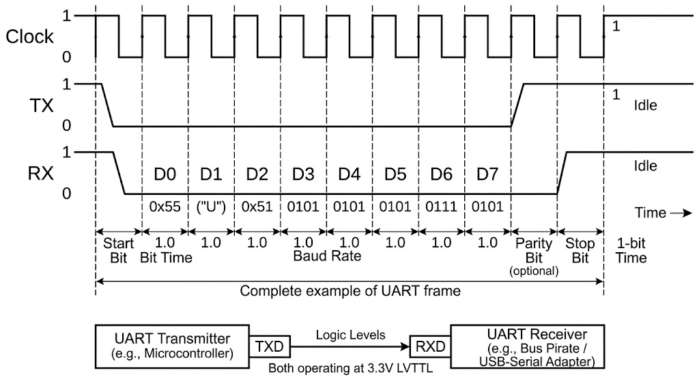
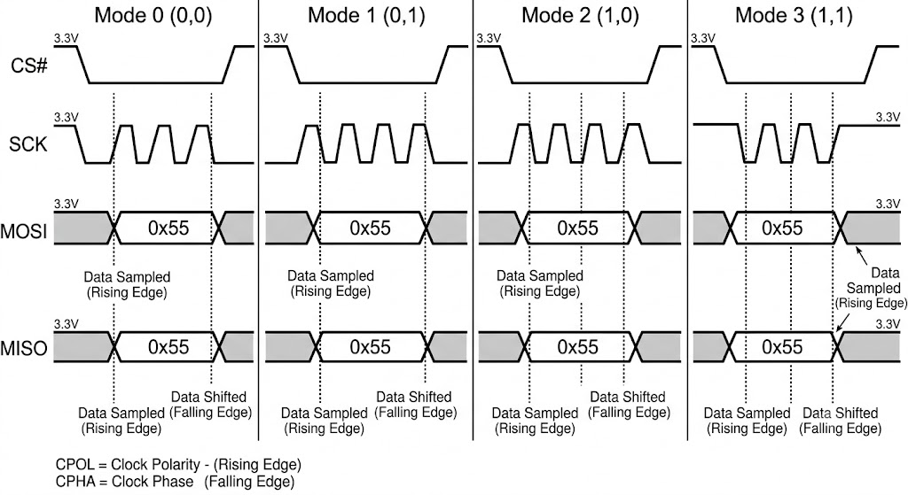
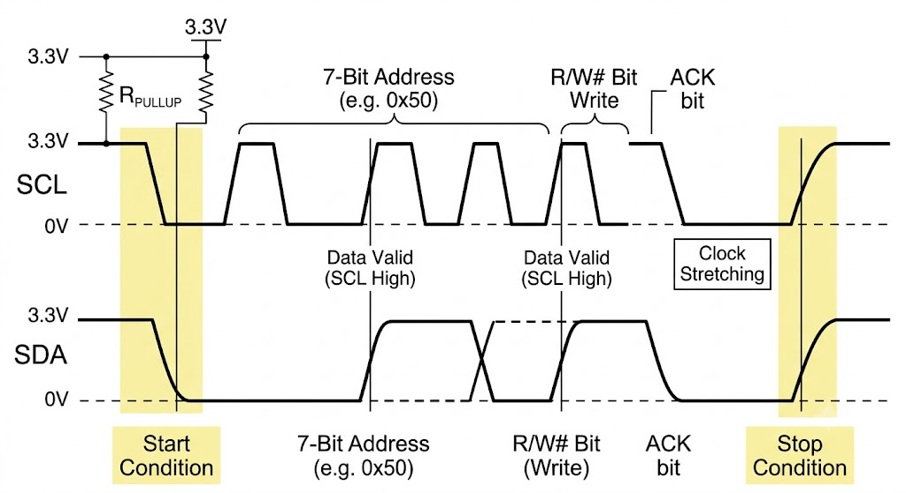
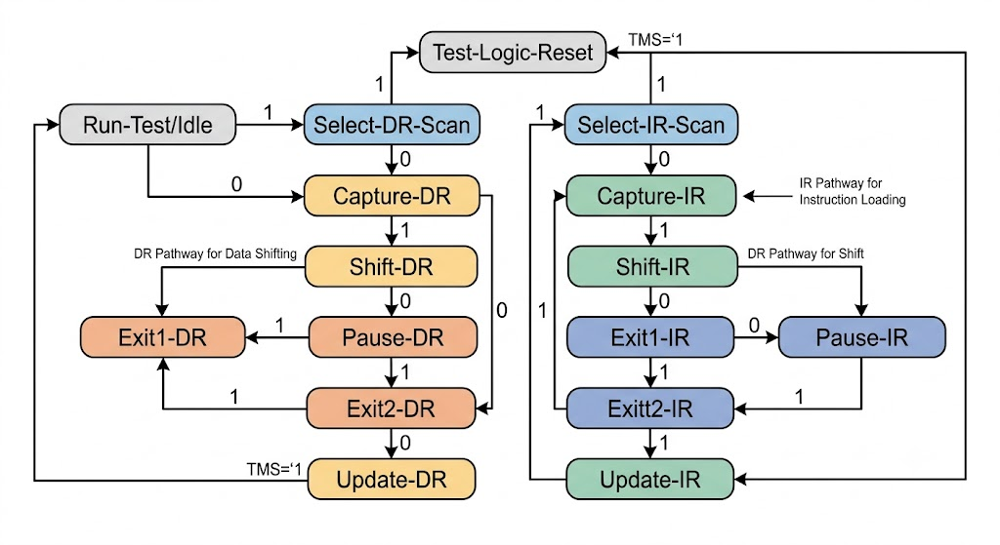
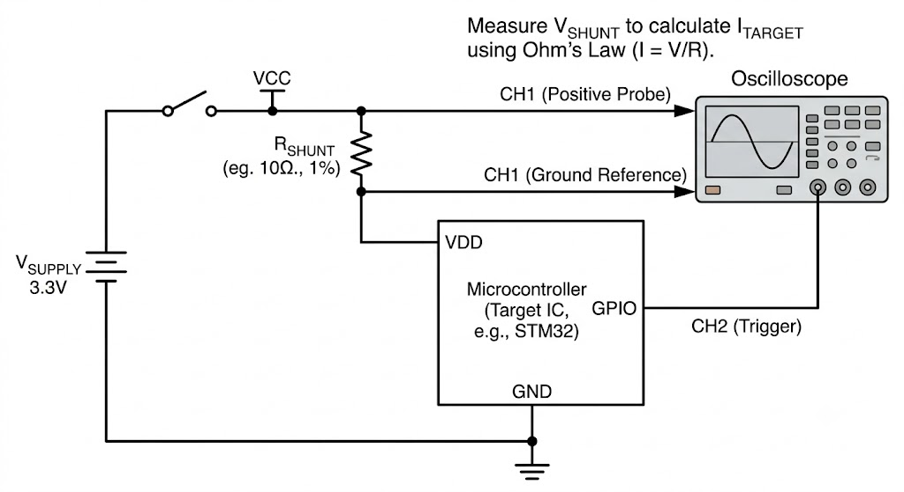

# Chapter 2: Electrical Fundamentals

## 🎯 Purpose
Reference for the electrical concepts underlying hardware hacking - covering voltage/current/power, digital logic levels, bus protocols (UART, SPI, I2C, JTAG), oscilloscope/logic-analyzer measurement, and signal integrity issues that affect hardware security work.

## ⚙️ Function
Covers: V/I/R/P relationships, digital logic levels (CMOS vs TTL, 1.8/3.3/5V), Ohm's law for shunt measurement, UART framing, SPI modes, I2C addressing, JTAG TAP state machine, oscilloscope setup, logic analyzer configuration, and practical probe tips for hardware analysis.

## 🏆 Goal
Provide the minimum electrical knowledge needed to safely connect to, measure, and communicate with an embedded target without damaging it or the test equipment.

## 📋 When to Use
- Before connecting any hardware tool (Bus Pirate, logic analyzer, oscilloscope) to an unknown target
- Reference during fault injection or power analysis setup (shunt calculation, probe loading)
- When interpreting logic analyzer captures and troubleshooting protocol issues

> *Part of the [Hardware Hacking Guide](./README.md) - [ULTIMATE CYBERSECURITY MASTER GUIDE](../README.md)*

---

### Voltage, Current, and Power

Understanding the relationships between electrical quantities is foundational for measurement, probing, and side-channel work.

| Quantity | Symbol | Unit | Relevance to Hardware Hacking |
|----------|--------|------|-------------------------------|
| Voltage | V | Volt (V) | Supply manipulation; signal levels; logic thresholds |
| Current | I | Ampere (A) | Power analysis; shunt resistor measurement |
| Power | P | Watt (W) | P = V × I; target of power analysis attacks |
| Resistance | R | Ohm (Ω) | V = I × R (Ohm's Law); shunt selection |
| Capacitance | C | Farad (F) | Decoupling caps; affects glitch shape propagation |
| Impedance | Z | Ohm (Ω) | AC equivalent of resistance; critical for RF/probing |

**Ohm's Law and Power:**

```
V = I × R        (voltage = current × resistance)
P = V × I        (power = voltage × current)
P = I² × R       (power through a resistor)
P = V²/R         (power across a resistor)
```

**Why it matters:** In power analysis, you insert a small shunt resistor (typically 1–100 Ω) in the power supply path and measure the voltage across it. By Ohm's Law, V_shunt = I × R_shunt - the voltage waveform across the shunt directly represents the instantaneous current draw of the target device.

---

### Logic Levels and Signaling

Different logic families use different voltage levels. Probing or injecting at the wrong level damages hardware or produces no result.

| Logic Family | VCC | Logic High (min) | Logic Low (max) | Notes |
|-------------|-----|-----------------|----------------|-------|
| 5V TTL | 5V | 2.0V | 0.8V | Legacy; common in older embedded |
| 3.3V LVTTL | 3.3V | 2.0V | 0.8V | Most common modern MCU I/O |
| 1.8V | 1.8V | 1.17V | 0.63V | Low-power SoCs, modern ARM |
| 1.2V / 1.0V | 1.2V / 1.0V | ~0.8 × VCC | ~0.2 × VCC | High-speed DDR, advanced nodes |
| CMOS | VCC | 0.7 × VCC | 0.3 × VCC | Rail-to-rail; noise margin = 0.2 × VCC |

**Level shifting:** When probing a 1.8V device with a 3.3V logic analyzer, use a level shifter or verify your tool's input protection. Many cheap logic analyzers assume 3.3V/5V and can be damaged - or silently corrupt captures - on 1.8V signals.

---

### Communication Interfaces

<p align="center">
  
</p>

#### UART (Universal Asynchronous Receiver/Transmitter)

The most commonly found debug interface in embedded systems. Often provides a Linux shell or bootloader prompt.

```
Signal lines: TX, RX, GND (sometimes VCC)
Voltage: 3.3V most common; 5V on older hardware; 1.8V on newer SoCs
Framing: Start bit | 8 data bits | [Parity] | Stop bit(s)
Common baud rates: 9600, 38400, 57600, 115200, 230400, 921600
```

**Identification:**
- Look for 3–4 pin headers (VCC, GND, TX, RX) - often unpopulated in production
- Measure with oscilloscope or logic analyzer for periodic activity at boot
- Use `baudrate.py` or manual baud rate detection against captured transitions
- TX on the device = RX on your adapter (cross the connections)

**Attack value:** Boot logs, root shell access, U-Boot console with `nand read`/`tftp` commands for firmware extraction.

---

<p align="center">
  
</p>

#### SPI (Serial Peripheral Interface)

Synchronous full-duplex bus. Dominant interface for external flash memory (firmware storage), EEPROMs, DACs, ADCs.

```
Signal lines: SCLK, MOSI (Master Out Slave In), MISO (Master In Slave Out), CS (Chip Select, active low)
Modes: CPOL/CPHA (0,0), (0,1), (1,0), (1,1) - set clock polarity and phase
Speed: Up to tens of MHz; typically 1–25 MHz for flash
```

**Flash chip targeting:**

```bash
# Read SPI flash with flashrom (in-circuit or removed)
flashrom -p ch341a_spi -r firmware_dump.bin

# Read with Bus Pirate
# Set SPI mode, correct speed and CPOL/CPHA for target chip
# Use flashrom or manual JEDEC commands (0x9F = Read ID, 0x03 = Read Data)

# Identify chip on board: check silkscreen, use JEDEC ID
# Common chips: W25Q series (Winbond), MX25L series (Macronix), GD25Q (GigaDevice)
```

---

<p align="center">
  
</p>

#### I²C (Inter-Integrated Circuit)

Two-wire synchronous bus. Common for configuration EEPROMs, sensors, real-time clocks, PMICs.

```
Signal lines: SDA (data), SCL (clock) - both open-drain with pull-up resistors
Addressing: 7-bit or 10-bit device address (7-bit = 128 possible addresses)
Speed: Standard (100 kHz), Fast (400 kHz), Fast-Plus (1 MHz), High-Speed (3.4 MHz)
```

**Scanning and reading:**

```bash
# Linux i2ctools
i2cdetect -y 1          # Scan bus 1 for devices
i2cdump -y 1 0x50       # Dump all registers of device at 0x50
i2cget -y 1 0x50 0x00   # Read single register
i2cset -y 1 0x50 0x00 0xFF  # Write register (authorized testing only)
```

**Attack value:** EEPROM at 0x50–0x57 range often stores device configuration, keys, or calibration. PMIC at various addresses can be used for voltage fault injection via I²C commands on systems with software-controlled power rails.

---

<p align="center">
  
</p>

#### JTAG (Joint Test Action Group)

IEEE 1149.1 standard debug and test interface. Provides direct CPU register access, memory read/write, and hardware breakpoints. The most powerful debug interface when accessible.

```
Signal lines: TCK (clock), TMS (mode select), TDI (data in), TDO (data out), TRST (reset, optional)
Protocol: State machine driven by TMS; TAP (Test Access Port) controller
```

**Identification techniques:**
- `JTAGulator` hardware tool - brute-forces JTAG pinout across candidate pins
- `UART-JTAG` combo: many boards expose both in the same header
- `OpenOCD` with probe (J-Link, ST-LINK, FTDI-based): auto-detect TAP chain

```bash
# OpenOCD - connect, halt, dump memory
openocd -f interface/jlink.cfg -f target/stm32f4x.cfg
# In telnet session:
halt
dump_image firmware_extract.bin 0x08000000 0x100000   # Flash base, 1MB

# JTAG boundary scan for hardware testing
# Can toggle GPIO pins, read logic levels without CPU involvement
```

**Security bypass:** On devices that "lock" JTAG via fuse or register, fault injection is sometimes used to skip the fuse-check routine at boot before the lock engages.

---

#### SWD (Serial Wire Debug)

ARM's 2-wire alternative to JTAG (SWDCLK, SWDIO + GND). Functionally equivalent for most purposes - provides full CoreSight debug access on Cortex-M devices.

```bash
# OpenOCD with SWD
openocd -f interface/cmsis-dap.cfg -f target/nrf52.cfg
# Same halt/dump commands as JTAG
```

---

### Measurement Equipment

#### Oscilloscope Selection for Hardware Hacking

| Parameter | Minimum | Recommended | Notes |
|-----------|---------|-------------|-------|
| Bandwidth | 100 MHz | 200–500 MHz | Must exceed target clock × 5 for clean edges |
| Sample rate | 1 GSa/s | 2–5 GSa/s | Nyquist: 2× bandwidth minimum |
| Memory depth | 1M pts | 10M–1G pts | Deep memory essential for long glitch captures |
| Channels | 2 | 4 | Trigger on one channel, measure on others |
| Vertical resolution | 8-bit | 12–14 bit | Critical for power analysis - 8-bit often insufficient |
| Triggering | Edge | Advanced (pattern, pulse width, serial decode) | Complex trigger conditions needed for glitch work |

**Recommended affordable options:**
- **Rigol DS1054Z** (~$350) - 4-channel, 50 MHz (hackable to 100 MHz), good memory depth. Baseline bench scope.
- **Rigol DS1104Z-S** - adds signal gen; useful for clock injection testing
- **Siglent SDS1204X-E** (~$400) - 200 MHz, 14 Mpts; better for RF work
- **PicoScope 6000E** - 12-bit ADC; excellent for power analysis

<p align="center">
  
</p>

#### Shunt Resistors for Power Measurement

The shunt resistor goes **in series** with the target's power supply. Tradeoffs:

| Resistance | Voltage Drop at 50mA | Signal Amplitude | Loading Effect |
|------------|---------------------|-----------------|---------------|
| 1 Ω | 50 mV | Low - needs amplification | Minimal |
| 10 Ω | 500 mV | Good | Moderate - check target still operates |
| 100 Ω | 5V - exceeds supply | Too high | Significant - device won't run |

Rule of thumb: **R_shunt × I_max < 0.1 × V_supply**. For a 3.3V device drawing up to 100 mA, keep shunt below 3.3 Ω.

#### Logic Analyzers

| Tool | Channels | Speed | Notes |
|------|----------|-------|-------|
| Saleae Logic 8 | 8 | 100 MHz | Best software ecosystem; protocol decoders |
| Saleae Logic Pro 16 | 16 | 500 MHz analog | Analog + digital; excellent for mixed-signal |
| DreamSourceLab DSLogic | 16 | 400 MHz | Lower cost; sigrok compatible |
| Bus Pirate 5 | Multi | ~1 MHz | Interactive; SPI/I2C/UART/JTAG all-in-one |
| Glasgow Interface Explorer | Multi | ~100 MHz | FPGA-based; highly scriptable |

---

### Signal Integrity Basics

Poor signal integrity is the most common cause of failed hardware hacking attempts (bad captures, missed glitches, corrupted data).

- **Ground loops:** Always connect probe ground to the target ground at the nearest point. Long ground leads act as antennas and inject noise.
- **Probe loading:** A ×10 scope probe has 10 MΩ input impedance - fine for most digital work. Active probes (1 MΩ or 50 Ω matched) needed for high-frequency or sensitive measurements.
- **Decoupling capacitors:** Target boards place decoupling caps (100nF ceramic) on power pins to suppress noise. For power analysis, you often **remove** the decoupling cap nearest the target IC to improve signal fidelity - the cap averages out the current transients you're trying to measure.
- **50 Ω termination:** For signals above ~100 MHz, use 50 Ω terminated probing to prevent reflections. Scope inputs should be set to 50 Ω mode.

---

## Related Files
- [BusPirate.md](BusPirate.md) - Implements the UART/SPI/I2C protocols described in this chapter
- [HiLetgo.md](HiLetgo.md) - Logic analyzer for capturing the digital signals described in this chapter
- [LA1010.md](LA1010.md) - Higher-speed logic analyzer for protocols requiring >24MHz capture rate
- [Chapter3.md](Chapter3.md) - Fault injection: applies the power/voltage concepts from this chapter to attack scenarios
- [Chapter4.md](Chapter4.md) - Power analysis: extends the shunt measurement and oscilloscope techniques introduced here

---

<div align="center">

**Next:** [Chapter 3 - Fault Injection Attacks →](./Chapter3.md)

[← Chapter 1: Threat Modeling](./Chapter1.md) · [Back to Hardware Hacking README](./README.md)

</div>
